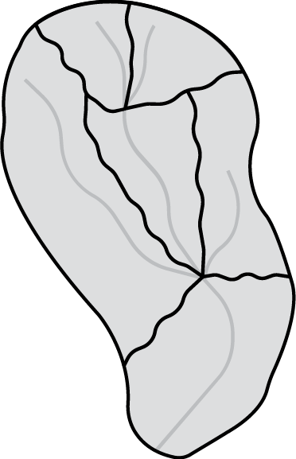
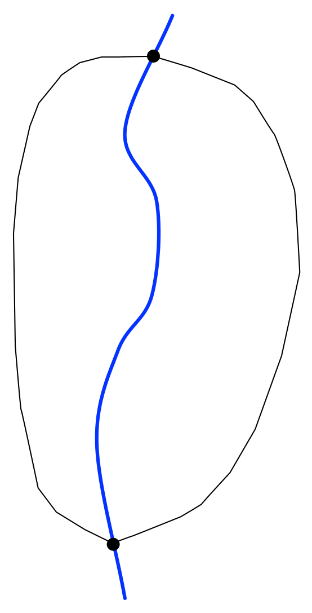
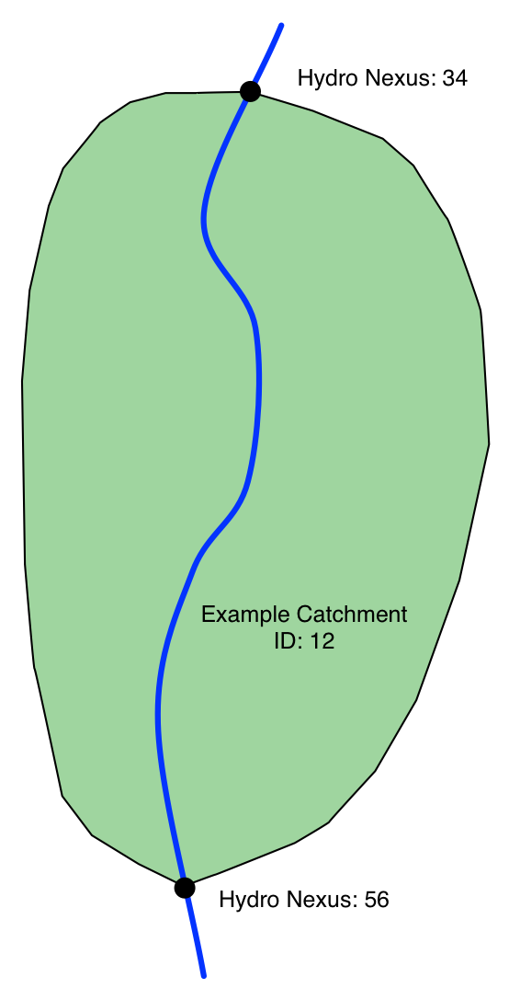
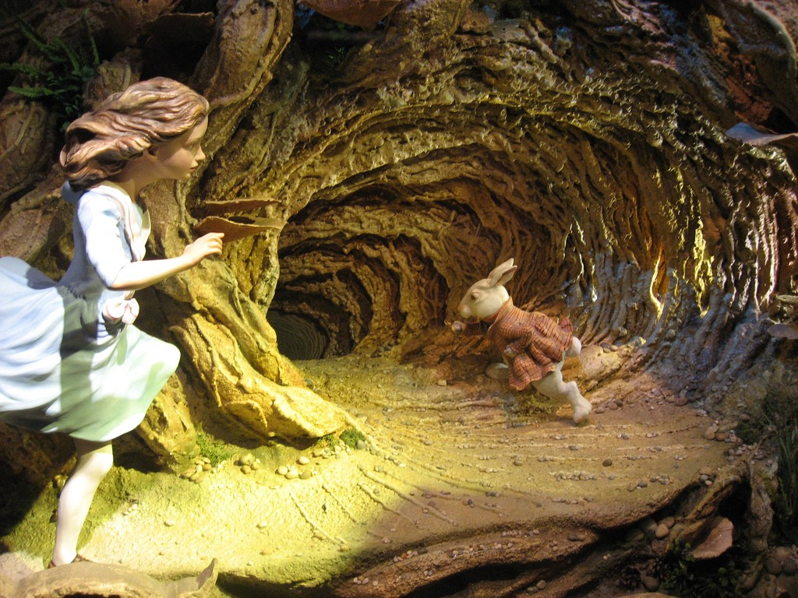
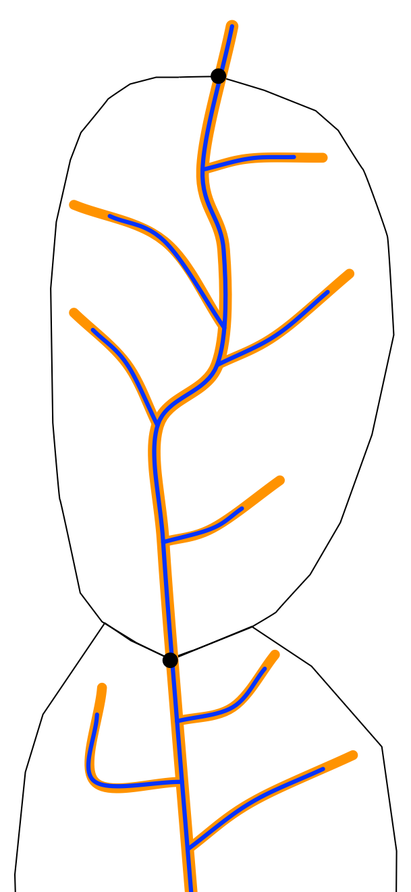

WaterML2 Part 3: Surface Hydrology Features (HY_Features)
========================================================
author: David L. Blodgett
date: 10-2017
width: 1440
height: 900
A conceptual feature model for surface hydrology.

For more info, visit the [SWG home page.](http://www.opengeospatial.org/projects/groups/hydrofeatswg)

Longer version of this [presentation here.](http://opengeospatial.github.io/HY_Features/HY_Features_primer/HY_Features_Primer.html#/)

Google: "HY_Features" and look for **Hydrologic Features SWG**

  </img>

========================================================
left: 60%

# **What is HY_Features?**

1

## HY_Features is a conceptual model describing hydrology features and their relationships

- **catchments, drainage networks, rivers, lakes and waterbodies.**
  
- **Focus is on surface water features and the networks they form.**

***

  </img>

========================================================

# **What is HY_Features for?**

## HY_Features provides a common concepts for hydrologic features.

  </img>

2

========================================================

# **What kinds of features are in HY_Features?**

### HY_Features includes:  
- **hydrologic unit features**,  
- the **junction features** that join them,  
- and the **waterbody features** that drain them.

3

========================================================

# **What is a catchment?**
 
## Catchment is a holistic abstract notion of a hydrologic unit (a feature type).
 
### It is a physiographic unit defined by a common outlet (and potentially an upstream inlet.)

  </img>

4

========================================================

# **What is a Hydro Nexus?**
 
## A place where two or more catchments interact  
 
 
### Could be anywhere, typically confluences, or gages, etc.

  </img>

5

========================================================
left: 70%

6

 
## **Waterbody, Hydro Location, Catchment, and Nexus**
 

1. **waterbody**

***

========================================================
left: 70%

7

 
## **Waterbody, Hydro Location, Catchment, and Nexus**
 

1. **waterbody**
2. **hydrologic locations**

***

========================================================
left: 70%

8

 
## **Waterbody, Hydro Location, Catchment, and Nexus**
 

1. **waterbody**
2. **hydrologic locations**
3. **divide**

***

========================================================
left: 70%

9

 
## **Waterbody, Hydro Location, Catchment, and Nexus**
 

1. **waterbody**
2. **hydrologic locations**
3. **divide** around **area**

***

========================================================
left: 70%

10

 
## **Waterbody, Hydro Location, Catchment, and Nexus**
 

1. **waterbody**
2. **hydrologic locations**
3. **divide** around **area**
4. Given ID: **catchment**

***

========================================================
left: 70%

11

 
## **Waterbody, Hydro Location, Catchment, and Nexus**
 

1. **waterbody**
2. **hydrologic locations**
3. **divide** around **area**
4. Given ID: **catchment**.
5. Identified catchment has **hydrologic nexuses**

***

========================================================
left: 70%

12

 
## **Waterbody, Hydro Location, Catchment, and Nexus**
 

Catchment *12* has inflow hydro nexus *34* and
outflow hydro nexus *56*.

Catchment *12* is realized as a *divide*, *area* and *flowpath*.

Hydro nexuses *34*, and *56* are realized as hydro locations.

***

========================================================
left: 70%

13

 
## **Waterbody, Hydro Location, Catchment, and Nexus**
 
 
### There might be multiple representations for each realization.

***

========================================================
left: 70%

14

 
**Networks of Waterbodies and/or Channels**

Waterbody network - Blue

Channel network - Orange

Hydro nexus hydrologic locations - Black dots

Catchment Boundaries - Black Boundary

   
  HY_Features goes much much deeper...

***

