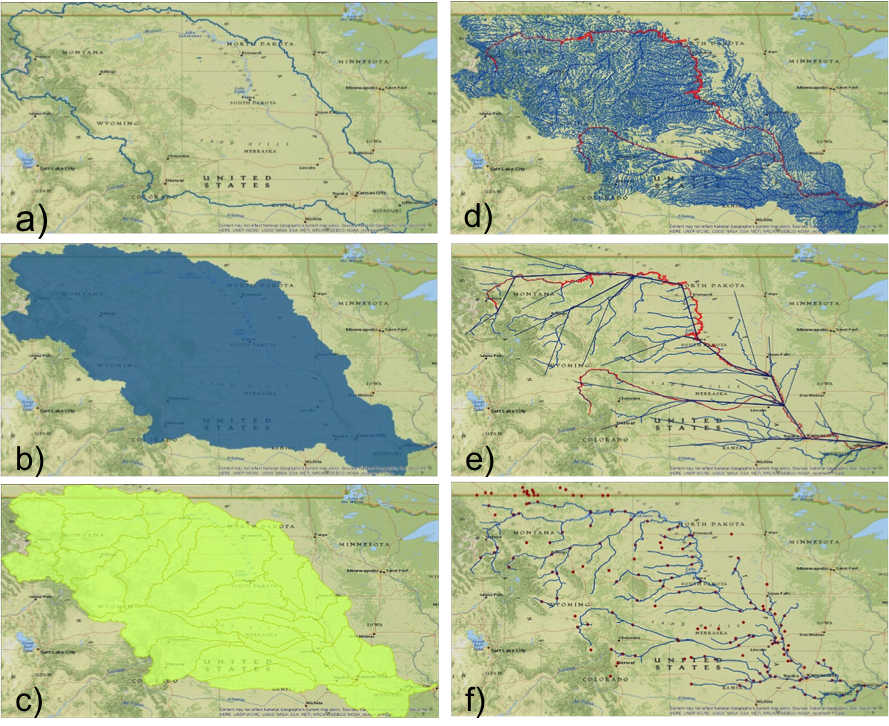
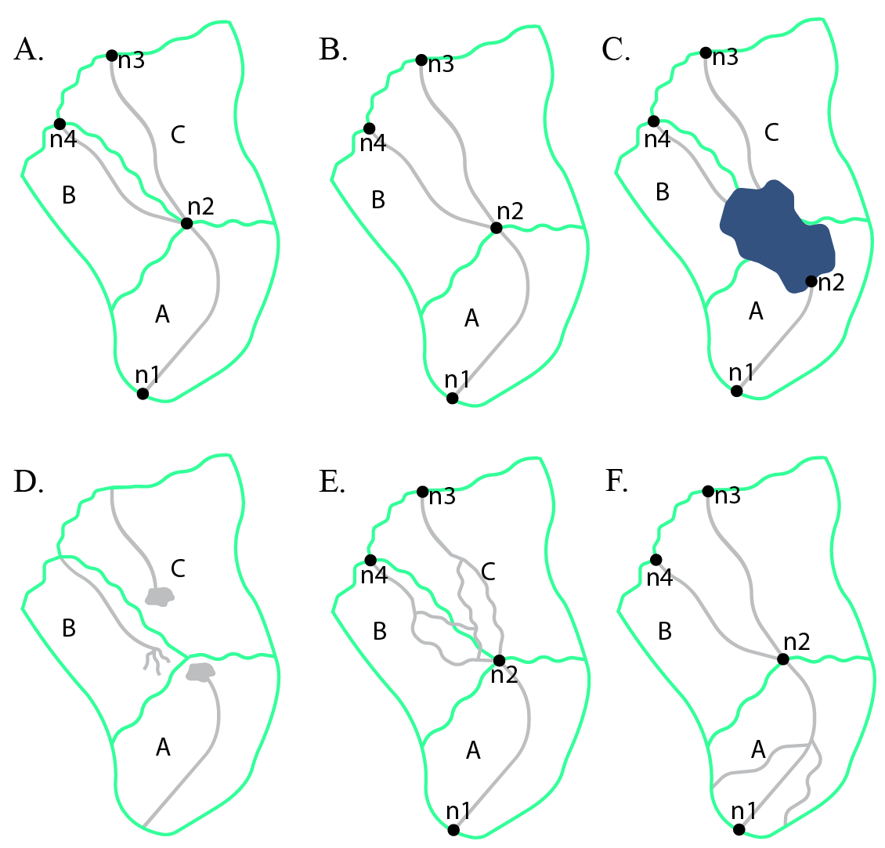
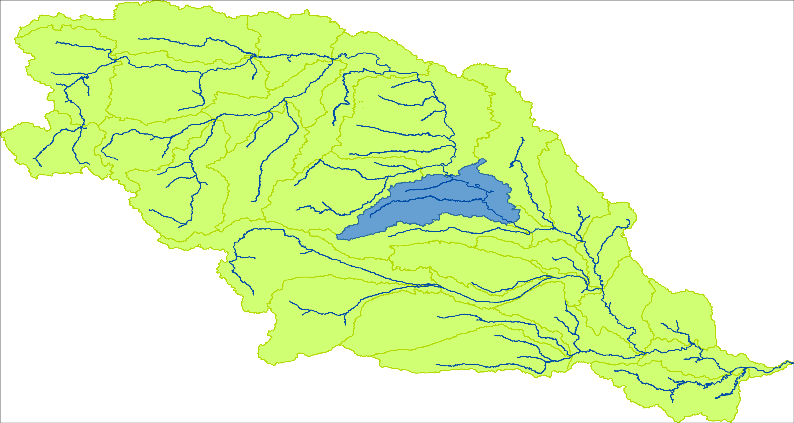
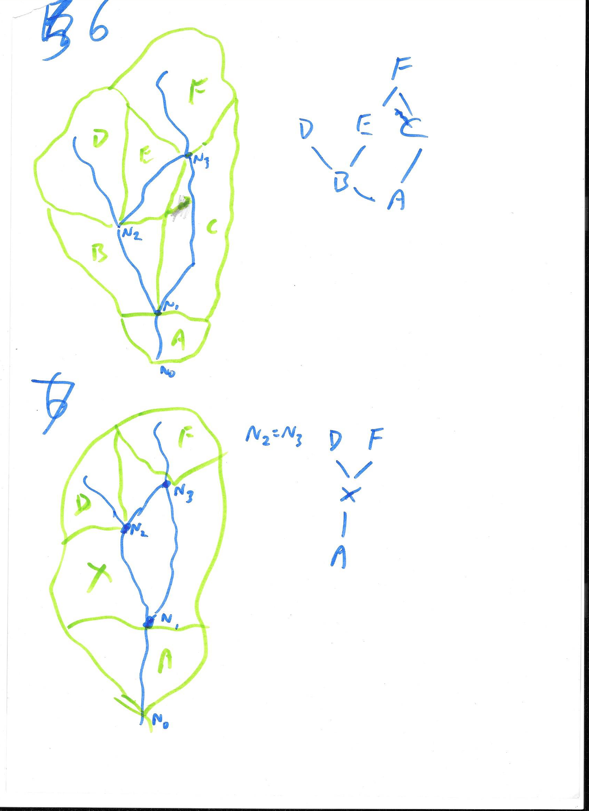
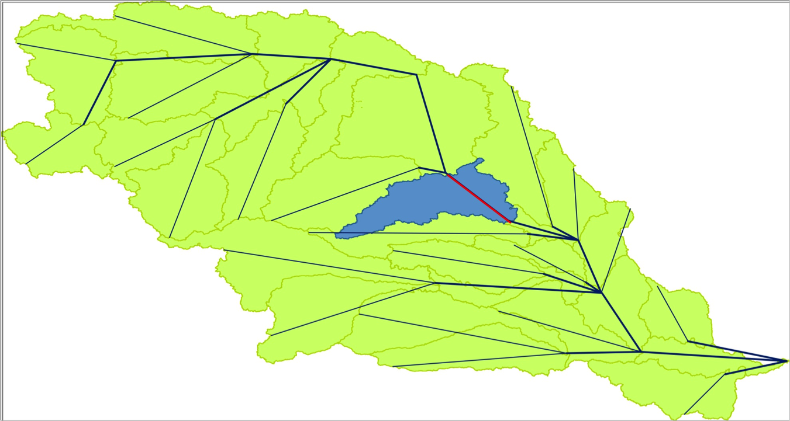
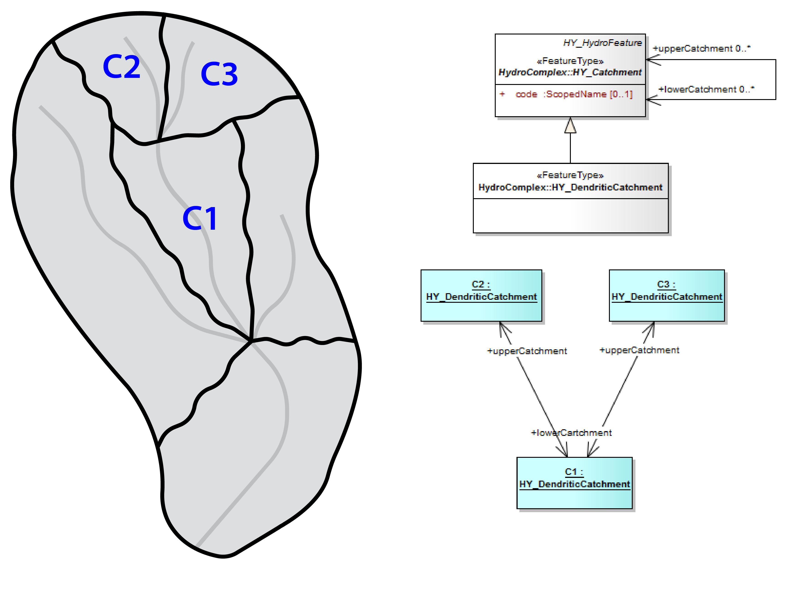
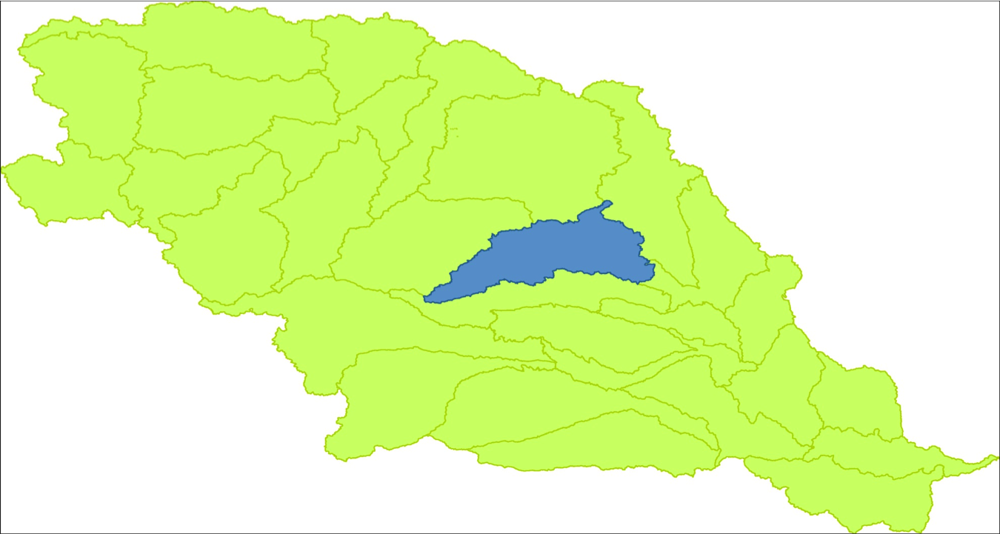
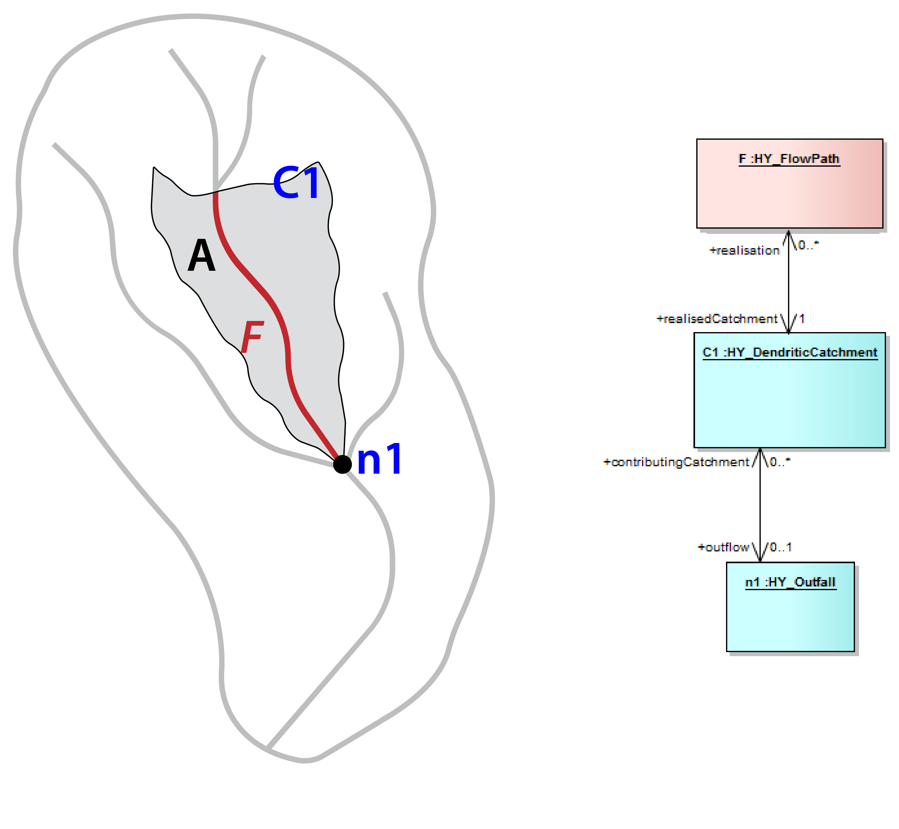
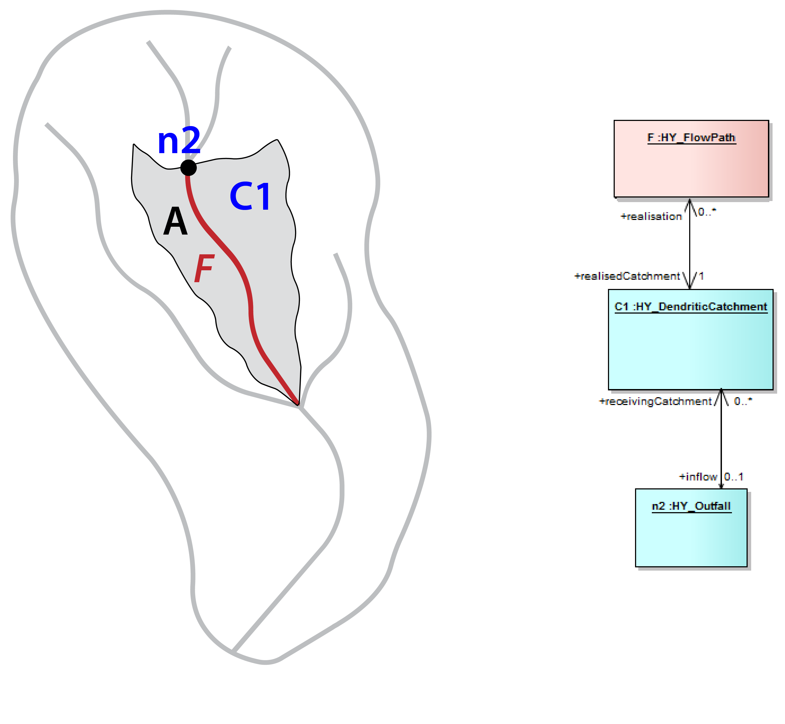

# OGC Hydrologic Features Part 1 Conceptual Model

## i. Abstract

The OGC HY\_Features implementation standard defines a standard information model for the identification of hydrologic features independent from geometric representation and scale. The conceptual model describes hydrologic features by defining the fundamental relationships among major components of the hydrosphere. This includes relationships such as the hierarchy of catchments, the segmentation of watercourses, and the topological connectivity of hydrologic features.

The standard is based on the concept that a given hydrologic feature may have multiple representations. This supports referencing the same feature(s) in different information systems and assists the organization and cataloging of observations, model results, or other studies of a feature. The ability to represent the same watershed, river, or other hydrologic feature in several ways is critical to aggregation of cross-referenced features into integrated datasets and data products on global, regional, or basin scales.

The Hydrologic feature types are defined using the OGC General Feature Model (ISO19109:2006) with reference to definitions within the International Glossary for Hydrology.  The conceptual model is expressed in the Geographic Information Conceptual Schema Language (ISO19103:2005) using the Unified Modeling Language (UML).

## ii. Keywords

The following are keywords to be used by search engines and document catalogues.

ogcdoc, OGC document,  hydrology, feature, identification, conceptual model, ontology, implementation standard

## iii. Preface

This standard defines the HY\_Features common hydrologic feature model for the identification of hydrologic features. It is intended to be used to document and share information about the objects of study and reporting in Hydrology in many applications. This standard was specifically commissioned to link hydrologic information across the scientific and technical programs of the World Meteorological Organization (WMO), and to assist the WMO Members to discover, access and use hydrologic data from different sources.

This standard has been designed to support the need for governance and guidance by national and international authorities. Aspects of the standard that support this end are; 1) its canonical form, 2) its implementation neutrality, 3) conformity to internationally recognized standards of geographic information, and its use of semantics inferred from terminology endorsed by the WMO and the UN Educational, Scientific and Cultural Organization (UNESCO).

Attention is drawn to the possibility that some of the elements of this document may be the subject of patent rights. The Open Geospatial Consortium shall not be held responsible for identifying any or all such patent rights.

_Recipients of this document are requested to submit, with their comments, notification of any relevant patent claims or other intellectual property rights of which they may be aware that might be infringed by any implementation of the standard set forth in this document, and to provide supporting documentation._

## iv. Submitting organizations

The following organizations submitted this Document to the Open Geospatial Consortium (OGC):

a)Federal Institute of Hydrology (BfG), Global Runoff Data Centre of WMO
b)CSIRO, Land and Water
c)USGS

## v. Submitters

All questions regarding this submission should be directed to the editor or the submitters:

| Name | Affiliation |
| --- | --- |
| David Blodgett | USGS |
| Irina Dornblut | Federal Institute of Hydrology (BfG), Germany |
| Robert A. Atkinson | Metalinkage.com.au (2007-2014 with  CSIRO) |
| Bruce Simons | CSIRO |

## 1. Scope

This OGC Implementation Standard defines a common hydrologic feature model for the identification and description of hydrologic features using established models and patterns in use in the Hydrology domain and endorsed by WMO and UNESCO such as those documented in the "International Glossary of Hydrology".

Part 1 (this document) introduces the conceptual model itself. The normative model is a machine-readable UML artefact published by the OGC in conjunction with this document at: [insert URL here].

Part 2 (a future document) is expected to define an OWL and RDF representation of the conceptual model suitable for defining links between features that reference the HY\_Features model, to support documentation and discovery of data as well as data transformation. This work may provide a basis for further work in the wider OGC on a methodology (tooling) to publish ontologies to support their practical use.

The initial scope is defined by the  WMO Commission for Hydrology (WMH-CHy): to facilitate data sharing within the hydrologic community of the WMO Member countries and to improve the quality of data products based on these data by defining hydrologic features to convey the identification of water-objects through the data processing chain "from measurement to hydrological information" [8].

Though standardized transfer routines such as those developed in WaterML2 Part 1 Time Series and Part 2 Ratings and Gagings support the syntactic interoperability of systems and services, the current standard Web services do not sufficiently support a semantic-based retrieval of the data they offer. To enable semantic interoperability of hydrologic data and services, it is necessary to agree on common concepts and methods for machine interpretation of the concepts. To this goal, the HY\_Features model was developed in order to formalize the concepts and relationships of hydrologic features using the WMO/UNESCO "International Glossary of Hydrology" [3] as a starting point.

This standard is meant to support the linkage of data products distributed across differing applications and jurisdictions. To enable this, a holistic and highly general concept of a catchment is defined such that a particular catchment may be represented differently in a wide range of data products while retaining its identity. In addition to unique identification of features in multiple systems, a second objective is to provide a standard terminology and ontology to describe relationships between hydrologic features. This may be useful to building a data transfer formats for specific subsets, particularly catchment hierarchy and river network topology but such data transfer format development is not in scope for this standard.

The HY\_Features model provides a basis for common and stable references to hydrologic features in a wide variety of applications:

- to link hydrologic observations to their feature-of-interest, e.g. link a streamflow observation to the river or catchment being observed,
- to allow aggregation of cross-referenced features into integrated datasets and data products on global, regional, or basin scales,
- to enable information systems to unambiguously link data across distributed systems and domains,
- to enable cross-domain or multi-discipline services to communicate through reference to standard concepts.

This standard defines a set of Application Schemas (normative) containing feature type definitions that conform to the OGC General Feature Model (ISO19101:2002 and ISO19109:2006), expressed in the Geographic Information Conceptual Schema Language (ISO19103:2005) using the Unified Modeling Language (UML).

The GFM is a meta-model developed to serve as the general conceptual model for features and feature properties in the context of geographic information. A feature type is identified by a set of typical characteristics (property type) such as attributes, association, or operations as well as by possible constraints. Each attribute, association or operation is identified on its own by properties and constraints. Conformity to the GFM is assured by instantiating the general feature type as feature classes specific for the application domain.

The HY\_Features conceptual model is intended to realize the GFM by providing a domain-specific instance of the general GF\_FeatureType (aka FeatureType) «metaclass» capturing the Hydrology phenomenon. Since its concern is primarily the issue of feature identification, a basic type HY\_HydroFeature is defined to reflect the overall properties hydrologic features have such as identifier, name and context. Special feature types are defined to reflect different aspects of hydrology by the typical characteristics each specialization carries. Given the complexity of the domain for any defined hydrologic feature type a wide range of possible properties may be relevant.

The HY\_Features model allows the feature-of-interest concept of the O&M model (ISO19156:2011) to be realized for hydrologic observations. Depending on the application, the target of an observation may be aDomain Feature, like a water body, or a Sampling Feature, such as a stream gage, used as a proxy for a Domain Feature. Specifically, observation-centric data models such as the WaterML2.0 implementation profiles of O&M may use the concepts provided in this standard to identify domain-specific relationships between a sampling feature and the ultimate sampled feature.

In addition, the model concepts may be used to describe the relationships of observation results (any data) to the hydrologic feature of interest they are meant to represent and in this way to link numerous spatial as well as non-spatial hydrologic data exposed via Web services. For example, a discovery service such as a catalog of catchments could use the concepts defined here to provide machine interpretable pointers to services that provide differing geospatial representations of the same catchments as well as data from water quality and water quantity observations that characterize some aspects of the catchments.

  
Figure 1: HY_Features in the context of the OGC Abstract Specifications

## 2. Conformance

This standard defines the conceptual model for identification of hydrologic features and their fundamental relationships. The conceptual model may be used in two ways: a) to derive implementation classes for data exchange or b) via reference (referred to here as mapping) from terms used in an implementation to the equivalent terms in the HY\_Features model. The form of such a mapping is not specified in this standard, but in general there is correspondence expected between particular implementations of hydrologic features and realized HY\_Features concepts. There will be an exact correspondence or a correspondence to a specialization of a HY\_Features class with narrower scope. Since no technical semantic mapping standard is supported by the OGC standards baseline at this time, only the expressivity requirements of mappings are specified in relevant conformance clauses.

Requirements for OGC HY\_Features standardization target types are considered:

- Encodings (such as OWL and RDF) of the HY\_Features conceptual UML model described in this standard and
- Application schemas formally mapped to HY\_Features concepts including Feature Type classes and associative relationships.

For brevity, the terminology **implement** is used to indicate either a direct encoding or existence of a formalized mapping that would enable a client, at run-time, to determine that a particular implementation class implements a specific HY\_Features concept.

Parts 2 is intended to provide an OWL encoding of the HY\_Features application schema, whereby the mapping from the implementation to this specification will be formalized through use of encoding rules that allow direct correspondence of schema elements with the UML elements defined.

Conformance with this standard shall be checked using all the relevant tests specified in Annex A (normative) of this document. The framework, concepts, and methodology for testing, and the criteria to be achieved to claim conformance are specified in the OGC Compliance Testing Policies and Procedures and the OGC Compliance Testing web site1.

In order to conform to this OGC™

interface standard, a software implementation shall choose to implement:
a)Any one of the conformance levels specified in Annex A (normative).
b)Any one of the Distributed Computing Platform profiles specified in Annexes TBD through TBD (normative). (\*\*\*Need to revisit this!!!\*\*\*)

All requirements-classes and conformance-classes described in this document are owned by the standard(s) identified.

## 3. References

The following normative documents contain provisions that, through reference in this text, constitute provisions of this document. For dated references, subsequent amendments to, or revisions of, any of these publications do not apply. For undated references, the latest edition of the normative document referred to applies.

ISO 19101:2002, Geographic Information—Reference Model

ISO/TS 19103:2005, Geographic Information — Conceptual schema language

ISO 19107:2003, Geographic Information — Spatial schema

ISO 19108:2006, Geographic Information — Temporal schema

ISO 19109:2006, Geographic Information — Rules for application schemas

ISO 19115:2012, Geographic Information — Metadata – Fundamentals (Draft)

ISO 19156:2011, Geographic Information — Observations and Measurements

## 4. Terms and Definitions

This document uses the terms defined in Sub-clause 5.3 of [OGC 06-121r8], which is based on the ISO/IEC Directives, Part 2, Rules for the structure and drafting of International Standards. In particular, the word "shall" (not "must") is the verb form used to indicate a requirement to be strictly followed to conform to this standard.

For the purposes of this document, the following additional terms and definitions apply.

### 4.1 application schema

Conceptual schema for data required by one or more applications
[ISO 19101].

### 4.2 catchment

A physiographic unit where hydrologic processes take place.  This class denotes a physiographic unit, which is defined by a hydrologically determined outlet to which all waters flow. While a catchment exists, it may or may not be clearly identified for repeated study.

NOTE: This approach considers the catchment concept to be the basic unit of study in hydrology, water resources management, and environmental reporting. The approach is meant to be holistic, referring to the continuous interaction of surface and subsurface waters within a catchment, even if a particular representation of the catchment refers to only surface or subsurface aspects of the catchment. Special subtypes such as drainage basin and groundwater basin may be defined with a particular application.

The synonym use of the terms catchment and catchment area as documented in the WMO-UNESCO International Glossary of Hydrology [3] (which is the key reference for the definitions in the Hydrologic Feature (HY\_Features) model) does not clearly distinguish between the catchment concept and its geometric representations such as catchment area, nor between catchment and its possible specializations like drainage basin and groundwater basin.

The essential logic separation of concerns between a common concept and its representation (interpretable data) is dealt by defining separate features for the catchment and its representation and may be understood as a refinement of the complex, ambiguous definition given in the glossary. See also clause 5.4 of this standard on the use of WMO terminology.

### 4.3 data

documented value of some characteristics of a real-world phenomenon.

### 4.4 data set

data compiled and arranged into a set.

### 4.5 data product

dataset compiled for a specific purpose, e.g. for global dissemination using Web services.

### 4.6 domain feature

Feature of a type defined within a particular application domain.
[ISO19156].

### 4.7 feature

Abstraction of real-world phenomena.
[ISO19101]

### 4.8 hydrographic network

Aggregate of rivers and other permanent or temporary watercourses, and also lakes and reservoirs. [3]

NOTE: Not to be confused with the network of hydrological stations and  observing posts.

### 4.9 hydrography

Science dealing with the description and measurement of open bodies of water. [3]

NOTE: In this context, hydrography refers to the description of water bodies. Its measurement in terms of surveying, e.g. for navigational purposes, is not in the concern of the HY\_Features model.

### 4.10 hydrologic feature

Feature (abstraction of a real-world phenomenon) of a type defined in the hydrology domain. A feature whose identity needs to be maintained and tracked through a processing chain from measurement to distribution of hydrologic information.

### 4.11 hydrology

Science that deals with the waters above and below the land surfaces of the Earth, their occurrence, circulation and distribution, both in time and space, their biological, chemical and physical properties, their reaction with their environment, including their relation to living beings. [3]

### 4.12 hydrometric  feature

Feature (abstraction of a real-world phenomenon) of a type defined in the process of measurement and analysis of hydrology (hydrometry).

NOTE: The hydrometric feature refers to a physical structure intended to observe properties of a hydrologic feature. Used to sample a hydrologic feature, a hydrometric feature may be considered a sampling feature of observation. A sampling feature is described in general in ISO 19156, the special monitoring point of hydrologic observation is described in the _WaterML 2.0_ Specification [5].

### 4.13 hydrometry

Science of the measurement and analysis of water including methods, techniques and instrumentation used in hydrology. [3]

### 4.14 mapping

Establishing a semantic relationship between particular implementations of a common concept and the realized normative concept using a formalism that specifies how elements from a source model may be transformed to a target model.

### 4.15 multilingual keyword

Keyword used in a multilingual context.

NOTE: A keyword is generally described in ISO 19115.

### 4.16 named feature

Feature identified by a name.

NOTE: Hydrologic features and their real-world representations have names within common experience, but may have different names in their cultural, political and historical contexts.

### 4.17 representation

Any processible data, data set, or data product, which can be used in the place of an existing feature concept.

### 4.18** river positioning system

Linear system used to reference indirect positions along a watercourse.

### 4.19 sampling feature

An artifact of an observational strategy or system such as a sensor… intended to sample some feature of interest in an application domain.
[ISO 19156]

### 4.20 storage

Impounding of water in surface or underground reservoirs, for future use. [3]

NOTE: Storage refers to a water body in terms of a usable water resource. The management of the reservoir as human action with the objective to efficient and sustainable use the resource, is not in the scope of the conceptual model. Yet, often an indication is required whether a water body is used for storage.

### 4.21 water body

Mass of water distinct from other masses of water. [3]

NOTE: This refers to water bodies accumulating water on and below the land surface.

## 5. Conventions

This sections provides details and examples for any conventions used in the document. Examples of conventions are symbols, abbreviations, use of XML schema, or special notes regarding how to read the document.

### 5.1 Identifiers

The normative provisions in this specification are denoted by the URI

http://www.opengis.net/spec/{standard}/{m.n}

All requirements and conformance tests that appear in this document are denoted by partial URIs which are relative to this base.

### 5.2 Symbols (and abbreviated terms)

CHy  WMO Commission for Hydrology

GML  Geography Markup Language

GRDC  Global Runoff Data Centre

HDWG OGC Hydrology Domain Working Group

ISO  International Organization for Standardization

OGC  Open Geospatial Consortium

OWL  [Web Ontology Language](http://de.wikipedia.org/wiki/Web_Ontology_Language)

UML  Unified Modeling Language

WaterML 2 WaterML 2.0 – an observation model for hydrology

WIS  WMO Information System

WIGOS WMO Integrated Global Observing System

WMO  World Meteorological Organization

XML  eXtensible Markup Language

### 5.3 UML notation

Most diagrams that appear in this specification are presented using the Unified Modeling Language (UML) static structure diagram, as described in Subclause 5.2 of the OGC Web Services Common Implementation Specification (OGC 04-016r2). UML classes are named in UpperCamelCase and property names in lowerCamelCase.

### 5.4 WMO Terminology

The HY\_Featuresmodel uses as far as possible the terminology recommended for use in the WMO Member countries. The key reference is the "International Glossary of Hydrology" [3], a joint publication of the WMO and the UNESCO. Wherever appropriate, terms from this glossary are applied to the feature concepts to capture meaning and contextual relationships. Differences in terminology were explored through reconciling the definitions documented in the IGH with the aspects reflected in various data sets and products in use, augmenting the accepted definitions having explicit semantics with the relationships inferred from other terminology.

**[fowolling text is intended to replace line 282 to provide a general statement why and how the defs of the wmo glossary are applied]. - 

**[The HY_Features model uses as far as possible a terminology recommended by the WMO Commission for Hydrology for use in the WMO Member countries. The key reference is the "International Glossary of Hydrology" [3], a joint publication of the WMO and the UNESCO. Wherever appropriate, terms from this glossary are applied to the feature concepts in this standard to capture meaning and contextual relationships. The synonym approach widely used in this glossary is interpreted in that way that glossary terms, when explicitly defined as synonyms, were defined as such even if they are not synonymous in every respect. Differences in terminology were explored through reconciling the explicit definitions documented in the glossary with aspects reflected in various data sets and products in use, augmenting the accepted term with the relationships inferred from other terminology, in order to discern complex terms that not clearly distinguish between the logic concept and its geometric representation, or between a term and its conceptual narrowing. The definitions used in the conceptual model described in this standard may be understood as a conceptual refining of the complex definitions given in the WMO-UNESCO"International Glossary of Hydrology". ]**

Some requirements classes defined in this standard refer to the Scoped Name concept of ISO19103. Intended to form a basis for information and data sharing in the community of the WMO member countries, the _Scoped Name_ should reflect a name endorsed by the WMO.

### 5.4 Naming convention

The _HY_-prefix used in the UML model follows the ISO naming conventions for UML elements. There is no explicit requirement to use this name in an implementation for the same semantic elements, but it is required to provide an explicit mapping between terminology used and HY\_Features to unambiguously indicate hydrologic feature concepts to support unambiguous interpretation in cross-domain applications. While there is not a recognized standard method for recording mappings between abstract element names and implementations; it is expected that system interoperability will be facilitated by making such mappings available as part of a dataset's documentation.

The _EXT_-prefix refers to "external", common patterns that are required, but not hydrology-specific, and should be imported when available from an external source.

## 6. Clauses not Containing Normative Material
  
### 6.1 The abstract idea of the hydrology phenomenon

Processes that continuously deplete and replenish water resources cause or result in a wide range of phenomena that are the subject of monitoring, modeling and reporting in hydrology and related sciences. These distinctly named or otherwise uniquely identified real-world hydrologic phenomena are conceptualized and referred to as hydrologic features in this standard. This standard applies to data and data products that represent these hydrologically defined features.
  
  
Figure 2: Processes of the Hydrologic Cycle

Water is moving from the atmosphere to the Earth and back to the atmosphere due to the processes forming the Water Cycle (_1_). Water from precipitation reaching the land surface is accumulated in water bodies occupying empty space on the land surface or in water bearing formations of soil and rock. Excess water overflows these formations and is driven downhill by gravity. Water flowing over soil or rock causes erosion to occur. This erosion tends to concentrate flowing water into water bodies that flow downhill using a connecting system of channels intersecting other water bodies along their way to a common outlet, conceptualized as a potentially complex outfall feature.

Looking back upstream from the outfall, the corresponding catchment feature can be described as a main linear flowpath feature, an areal feature, a boundary feature that encompasses the drained area, as well as a network of water body features, a network of channel features, or a network of hydrometric station features, all representing the catchment. The concepts and terminology used in the preceding sentences form the conceptual and semantic basis for this standard.

As described above, the most general abstraction of the hydrology phenomenon is the catchment. A catchment is a recognized unit of study where hydrologic processes form physiographic features that are represented in various data products. Depending on application and scale, the same catchment may be represented in many different ways. The following describe different examples where this multiple representation concept is important:

- Scaling a map-visualization up or down leads to multiple more or less detailed representations of the same hydrologic feature.
- Some applications require cartographic (visual) representations while others are focused on topological (network connectivity) relationships (_2_).
- A catchment may be described geometrically by streamlines, drainage area or the bounding polygon, or topologically as a graph of nodes and links.
- Analyses and reports of catchments and landscape characteristics are referenced to areas of study or boundaries, while observation with sensors or other methods are referenced to monitoring points forming an hydrometric network.
  
  
Figure 3: Cartographic vs. topological representation

In inter-disciplinary programs, inter-program collaboration and cross-domain research projects, the catchment is addressed as the monitoring and reporting unit whereby monitoring stations are usually placed on a flowline in relation to identified reference points. Across administrative jurisdictions, the catchment is the agreed unit of water resources assessment and management. For example at a national scale "Hydrologic Unit Code" (HUC) catchments are defined by the US Geological Survey for the National Water Information System (NWIS) . [7] Another example are the so-called "River Basin Districts" of the European Water Framework Directive [6] designated not to administrative or political boundaries, but rather to the natural hydrologic unit.

### 6.2 Catchment and multiple representations of the catchment concept
The core concept of the HY_Features model is that a study of the Hydrology phenomenon will reference common conceptual entities of the real world (a water body, stream gaging site, or catchment) through the use of specific modeled features (as per ISO 19109 General Feature Model). Depending on the scientific concern, the specific hydrologic feature may be modeled as one of many potential representations of the conceptual entity being represented.  

Recognized across hydrologic disciplines as the basic unit of study where hydrologic processes (such as flow accumulation) take place, the catchment may be represented in various ways in different sub-hydrology-domain information models. Catchment boundary, catchment area, and linear flowpath, are the most common geometric representations of a catchment, while geographic representations are usually the network structure in its entirety representing a catchment as a set of connected cartographic features. The distinction between cartographic (or geographic) and geoschematic (or geometric) views of a hierarchical network of catchments is very important in HY\_features. Another distinction to note is the difference between a hydrographic network of water bodies (typically blue lines for small rivers and blue polygons for larger rivers and lakes), the network of channels (typically blue lines forming a connected connected network indicating continuity of flow), or a network of hydrometric monitoring stations as cartographic views that represent a catchment in its entirety. To illustrate these ideas, Figure 4 shows different types of geospatial data overlaying the represented Missouri region.

**[\*\*\* start new text for line 320, intended to describe the portrayal of catchment in maps as a typical representation  of a catchment using geometric shapes. – model details will be described in section 7.4.2.1 and with the particular networks .. \*\*\*]**
The core concept of the HY_Features model is that a study of the Hydrology phenomenon will reference common conceptual entities of the real world such as catchment, water body, channel, or stream gaging site, through the use of specific modeled features (as per ISO 19109 General Feature Model). Focused on a particular appearance of the complex hydrology phenomenon, each study portrays in a particular way a multiple represented conceptual entity. Depending on the scientific concern, the specific hydrologic feature is understood as one of many potential representations of the conceptual entity being represented.

Across hydrologic disciplines the catchment is recognized as the conceptual unit of study where hydrologic processes take place. Catchment boundary, catchment area, and linear flowpath, are the most common geometric representations of a catchment, and widely used to create cartographic or topological network views of a catchment. Geographic maps and geoschematic views represent catchment networks through visualisation of the hydrologically determined topology using a set of seemingly connected geometric features. Map layers that separately visualise the hydrographic network of water bodies (typically as blue lines for small rivers and blue polygons for larger rivers and lakes), the network of channels (typically lines displaying a drainage pattern indicating the continuity of flow), or a network of hydrometric monitoring stations are usually combined to portray as a whole the represented catchment. Popularly known as river maps, such cartographic data products are usually exposed in map services, while the water body or channel features are provided with an appropriate geometry and location usually in features services. To illustrate these ideas, Figure 4 shows different types of geospatial data overlaying the represented Missouri region.  
**[\*\*\*end of new text for line 320, re 'How cartographic networks are expressed : #47'\*\*\*]**

  
Figure 4: Multiple representation of the Missouri catchment (Source: USGS and GRDC)  

a) Catchment boundary, b) Catchment area, c) Hydrologic unit containing sub-units, d) Abstract flow line and common outlet, e) Network of flow lines at different level of detail, f) Network of logically connected monitoring stations  

Each of these representations support a different way of looking at the catchment and its interaction with other features. It is generally not possible to inspect a particular representation and understand all characteristics of the catchment that is being represented, because different types of features are often represented using identical data models. For example, a map showing a set of catchment polygons may display an aggregate of sub-catchments, or a collection of catchment polygons that overlap each other occupying the same space. In order to understand what catchment concept is represented, the relationship between them needs to be declared. These relationships may be between a high-order catchment and the catchments generally nested therein, or between a catchment aggregate that encompasses nested catchments without any overlap, or the upstream-downstream direction of flow for a set of catchment polygons.

### 6.3 Catchment hierarchy and network topology
Catchments may be connected in topological networks to represent the continuity of hydrologic processes at the interface between catchments, and to support aggregation of catchments and up- or down-stream tracing. Topological connectivity is typically indicated by adjacent polygon edges, nesting of polygons, or through connection of linear features at nodes. However, since geomteric representation of hydrography serves many purposes and may not be needed at all, it is not appropriate to rely only on geometric representation as the basis for topology. Instead, topology can be expressed as relationship between the conceptual features of a particular type.

#### 6.3.1 Hierarchy of catchments
Any catchment may be nested or aggregated in a larger containing catchment of split into multiple sub units forming a hierarchy of catchments. Two types of catchment hierarchy are supported in HY_Features: basic nesting and dendritic aggregation. 1) Basic nesting allows any catchment to have a reference to a containing catchment (Figure 6). This allows collections of subcatchments to be grouped into larger units, but does not define any particular interconnections between these subcatchments. 2) Dendritic hierarchies are collections of catchments with simple topological relationships that allow determination of contribution of flow to downstream catchments. To reflect the organization of catchments in dendritic hierarchies, a special dendritic catchment is defined that permanently contributes exorheic to a receiving catchment(Figure 7), and an interior catchment of indorheic flow that contributes temporarily to a receiving catchment. 

In a dendritic network, the outflow node that one of more dendritic catchments flow to (which is not necessarily a single geometric point) must contribute to one and only one receiving catchment, unless it is a terminal catchment.  Given that the dendritic is defined as a special type of the more general catchment concept, it inherit the general nesting as defined for the catchment as shown in Figure 6.

  
Figure 6: Catchment hierarchy – Any catchment may be nested within a containingCatchment which is another catchment (dark blue)

  
Figure 7: Catchment hierarchy – A dendritic catchment (blue) may be part of an encompassing catchment aggregate which is another specialized type of catchment (green) 

It is worth noting that non-dendritic networks are often represented as a dendritic catchment network by introducing joint catchments that contain the non-dendritic parts. Figure C6 shows an example of such a non-dendritic topology, where it is not possible to determine to what extent flow from catchment F contributes to catchments E, B or C. Figure C7 shows the same topology where catchments E, B, and C have been aggregated and the nodes N2 amd N3 are treated as a single virtual inflow node, so that all the flow from catchments D and F accumulate in the resulting catchment X. Using this encapsulation approach, catchments can be represented using a simple tree structure where an upstream-downstream relation can be built without the need for complex hydrography between inflow and outflow nodes.
 
  

#### 6.3.2 Topological network of catchments
Given the idea that a non-geospatial schematic representation of a feature can show its connection in a topological network, a catchment can be thought of as a hydrologic unit whose terrain and morphology results in a topological link between inflow and outflow. The red line in Figure 5 illustrates how a single catchment, represented by a boundary, an area, a stream network, and a main flowline, can also be represented using a straight line that is not geospatially representative but is a valid schematic representation of the connection between inflow and outflow.

   
Figure 5: A catchment area (blue) and a flowpath connecting inflow to outflow (red) representing a definable unit where hydrological processes take place. 

In a network of catchments, morphological detail may be specified in many ways. Inflows may be virtual in headwaters, and likewise outflow nodes where waters flow out of a network. As show in Figure C1, C3, C4, and C5 catchments may connect through simple confluences (C1), water bodies or wetlands [C3], intermittent or subsurface flows [C4] or complex braided streams [C5]. Although these cases require different geographic representations, they can be represented using the same node topology. Since all these cases can be specified using geometric node topology, no special treatment is required to handle the variation of flow processes. 

  
Figure C1-5: C1, Typical catchments with one inflow and one outflow each; C2, Joined (conjoint) catchments flowing into a single downstream catchment; C3, catchments joining in a waterbody or wetland with no clear network; C4, catchments joining through intermitent of subsurface flowsl C5, catchments that join through areas of complex or braided channels.  

There are two ways that catchments with multiple inflows can share a common outlet: 1) as separate subcatchments, each represented by a flowpath between a single inflow and the outflow (figure C1) as a non-divided catchment contributing as a whole to the outflow node (figure C2). The latter case, referred to here as a conjoint catchment, may result in several flowpaths. Although it may be hard to determine what part of the contributing catchment each flowpath represents, to determine the main flowpath, or to perform linear referencing (along a flowpath), a conjoint catchment is often easier to delineate and and more convenient. 

In this network of catchments, two or more catchments that flow into another, flow to the same outflow node (Figure 8) which is the inflow node of a receiving downstream catchment (Figure 9); the upstream catchment may be understood as the catchment contributing flow to the inflow node of a receiving catchment. In a network of dendritic catchments, outflow nodes on the network serve only one receiving catchment (Figure 8 and Figure 9).  

  
Figure 8: Catchments contributing to an identified outflow node. Note that some catchments contribute to a common outflow node.

  
Figure 9: Catchments receive inflow via an identified inflow node. Note that nodes are not necessarily geographic features, but are rather nodes in a graph representation of the river network.

Nodes stand alone as points of interaction in the network, in reality they are (potentially complex) watershed outlets, denoted as outfall features. Whether an outfall (node) is referred to as an inflow or outflow node is always in reference to a catchment. This means that a node serves as the outflow node of some contributing catchment(s) and the inflow node of some receiving catchment(s). In this standard, the inflow and outflow role names of the conceptual outfall (node) are used to unambiguously describe the node's role with respect to a catchment.

[Figure: Need a figure here that will show the very basic concept of nodes.]

Being topological nodes, inflow and outflow nodes have no explicit positions. A catchment's outfall will be placed on the network relative to a reference location either expressed absolute as the distance to the identified reference point, or relative or interpolative to this. While confluences are natural locations to assign catchment outfalls, common places to study catchment processes such as stream gage sites, cross-sections, and other on-network locations can be used for reference. The reference location may be any other place identified by co-ordinates, such as a fixed a landmark, a stream section, or bed profile, or a monitoring point.  

### 6.4 River reference system
Considering any location on a network as the outflow node of a contributing catchment, or the inflow node of a receiving catchment, an arbitrary new location can be placed on the network in reference to an existing outfall up- or downstream. Understanding such a placement [placing?] as a positioning "along a river", the linear representation of a catchment can be used to place a new node on the representing flowpath, and to describe its position using a linear, river reference system whose origin is set by that outfall as which the new location to be placed is understood; the shape is determined by the flowpath starting at this origin and ending at that outfall which is marked by the reference location (referent). Each catchment has its own reference system which can be combined as necessary using catchment topology; each river reference system must have one outfall (origin) and one representing flowpath (shape). Applying the linear referencing along a flowpath (representation) to a given network of catchments, a stream network can be built from the sequence of representing flowpathes, and visualised using an appropriate geometric representation. 

Figure 10, 11, 12, and 13 illustrate how a newly introduced location can be located up- or downstream of a reference location.  [\*\*\*check figures\*\*\*] 

Figure 12: Position (yellow dot) upstream of a reference point (red dot)  
Yellow: point of interest (inflowNode of receivingCatchment) - locatedStart (origin) of riverReferenceSystem,  
Red: reference point (referent) - known outflowNode of the (green) encompassingCatchment

Figure 13: Position (yellow dot) downstream of a reference point (red dot)  
Yellow: point of interest (outflowNode of contributingCatchment) - locatedStart (origin) of riverReferenceSystem,  
Red: reference point (referent) – known inflowNode of the (green) encompassingCatchment 

### 6.5 Aggregation and segmentation of watercourses
A watercourse, commonly understood as natural or man-made channel through or along water may flow or not [3], can be conceptually separated into the body of water and the containing channel. This separation references the different scientific concerns of hydrology, studying the occurrence, accumulation and circulation of water, and hydraulic engineering focused on the analysis and design of the water flow regime.

**[start of new text for line 399]** A watercourse is commonly understood as natural or man-made channel through or along water may flow or not [3], the water body generally flowing in a natural (surface) channel, in an open or closed conduit as a stream [3]. Both can be conceptually separated into the body of water and the containing channel. This separation references the different scientific concerns of hydrology, studying the occurrence, accumulation and circulation of water, and hydraulic engineering focused on the analysis and design of the water flow regime. **[end of new text for line 399]**

Following the definitions in the UNESCO-WMO "International Glossary of Hydrology" [3], a water body is understood as the mass of liquid water accumulated on or below the land surface as a body of flowing water, which in some parts may have stagnant water that is not moving or flowing. Water bodies are aggregated into the hydrographic network, and divided into parts confined by vertical cross- or longitudinal sections. With respect to thermal or salinity characteristics, or oxygen or nutrient content, but also into virtual storage zones of a managed reservoir, a water body may be stratified into distinct horizontal layers. Vertical sections identified as permanent reference location can be considered as outfall of a corresponding catchment, adnd may be located in the network of catchments by a typical reference point. 

Water may be stored and managed in surface or underground reservoirs in terms of a resource for future use, regulation or control. Conceptually, each water body accumulating water, or the layers therein, may be managed as a reservoir. Referring to a zone-based reservoir management storage reservoirs are understood as stratified water bodies.  Water bodies are observed using monitoring stations and observing posts. Almost all stations are physical artifacts, or collections of these. Yet, some stations may be fictive ones. Monitoring stations may be connected logically in hydrometric networks which represent a distinct catchment that is the subject of monitoring or reporting at local or regional scale. It is common practice to locate a monitoring station in relation to local landmarks and permanent reference points, or in relation to the extent of the monitored water body.

Considering that the channel network (aka drainage pattern) generally exists independent of whether water flows therein or not, each channel is understood as a containing unit that form the system to potentially connect water bodies, but does not cause their interaction with other water bodies part of the hydrogrgaphic network. Each channel may be further divided into channel parts between vertical bed profiles which may contain flowing or stagnant parts of a water body. For example, normally stagnant waters may be connected to streams during flood events, or streams interrupted to pools of stagnant water in periods of drought. Like water body sections, channel profiles used permanently for reference, may be located in terms of an outfall to a corresponding catchment using a typical reference point.

Referencing in general this definitions, this standard is concerned with water bodies that form the hydrographic network of water bodies on the land surface, including lakes and reservoirs, and with channels on the land surface continuously or periodically contain water. A conceptual model capturing the specifics of bodies of groundwater as well as aquifers containing groundwater will be provided with the GroundwaterML 2.0 under development [\*\*\*see annex ..., insert reference to GWML2\*\*\*]. 

**[start of new section 6.6]**
### 6.6 Discussion 
It is the intended goal of this standard to provide the conceptual basis for an identity-based linkage of hydrologic data and data products, which represent in different ways the same catchment by reference to the shared catchment being studied. Referencing the same requires a scale-free catchment pattern, which can replicated inside of the closed system as which the catchment appears in a particular perspective, and which can be visualised using common geometric shapes to represent the catchment in geographic maps and geoschematic views. Corresponding to the basic understanding of hydrology, catchment topology is hydrologically determined through the common outlet to which all waters may flow inside of a bounding watershed, and not by the geometric representation. Furthermore, catchments are connected to other catchments at the common outlets and shared boundary ridges. 

The hydrologic feature model described in this standard describes the hydrosphere as scale-free hierarchical network of  catchments.  The defined catchment topology follows hydrologic significance governed by physical laws, irrespective of any possible geometric realisation, and can be multiple replicated to build an high-level hierarchal network of hydrologically discrete catchments that is hydrologically discrete. Typically, this high-level hierarchy reflects river system flowing into a sea or an internal sink. Depending on the scientific concern of a study, the hierarchical network of catchments appear in different phenomenologic aspect, but all are visualised using common geometric shapes. 

#### 6.6.1 Catchment topology, comparison with the ISO topology model 
The catchment model in this standard defines the common outlet to which all waters flow as the topological outfall of a corresponding catchment. With respect to the catchment, the topological outfall is defined as the inflow node of receiving catchment or the outflow node of contributing catchment. The catchment is the defined topological link connecting the outfall nodes located on the bounding catchment divide. Determined by the orientation of the outfall, a receiving catchment links inflow nodes to the common outflow node downstream, and a contributing catchment links an outflow node to upstream inflow nodes. Repeating this topological pattern, a network of upper and lower catchments can be built from connecting inflow nodes on divide with the outflow node, which can be traced upstream or downstream. Depending on the perspective of a study, the network of upper and lower catchments may appear as hydrographic or channel network of seemingly connected watercourses, or as network of logically connected stations. Each of such catchment network views forms a closed system wherein the pattern of catchment and outfall (link and node) is multiple replicated as water bodies or channels and associated reference locations or stations. To represent the catchment network, these replicas are visualised using geometric points, lines or polygons. 

The topological concept of outfall node and catchment link applies to all defined special subtypes of a catchment. Specialisations are defined with respect to (catchment) network connectivity. A dendritic catchment is defined, which is connected to other catchments through an identified outflow node which coincides with the inflow node of an associated catchment; an interior catchment is defined which is generally not connected to other catchments, but may temporarily participate in the network. With respect to the aggregation of catchments, the catchment aggregate is defined encompassing dendritic catchments and enveloping interior catchments. 

A general topology model of nodes and edges is defined in ISO19107:Spatial schema. Although geometry-affine, this topology model  is defined separate from the geometric realisation and thus provides a general framework to define the scale-free catchment topology based on the model of nodes and edges which need in parallel to be understood as the linear shape and origin of a river reference system as well as the connecting link and junction to navigate the catchment network upstream or downstream. A catchment may be topologically considered a solid bounded by inflow/outflow faces, a face bounded by inflow/outflow edges, an edge bounded by inflow/outflow nodes; each will be visualised using an appropriate geometry type. Not explicitly (pre)defined in the hydrologic feature model,  any geometric realisation may be supported through  the general comparability of the basic concepts. 

Understanding the topological outfall as TP_Node in terms of ISO 19107, and the catchment link in terms of TP_Edge, as of ISO19107 (or TP_Face or TP_Solid depending on a particular application), the defined catchment topology supports the properties  *boundary* (as the *inflow node* or *outflow node*) and  *spoke* (as the *receiving catchment* or *contributing catchment*) at the catchment level;  the *proxy* property may be supported by the *reference location* relative to which a position to the outfall’s *network location*  *topo* is assigned using a linear river reference system  which carries an axis for *orientation*. Understanding  the phenomenologic appearance of the catchment as a TP_Complex, the *complex* property  is supported by water body, channel or station that carries the typical reference location which marks the outfall of the corresponding catchment.

The domain-specific feature types and properties defined in this standard to model the catchment topology, its phenomenologic appearance in the hydrosphere and basic types of catchment representation common in hydrology, may be used to express catchment topology hidden in linked data and data products, each representing a specific aspect of the hydrosphere or a particular place or time where water occurs or is distributed. Furthermore, special network or routing models may be related to the hierarchical network of catchments. 

#### 6.6.2 Hydrographic network, channel network and station network - different views of catchment topology 
Maps displaying perennial and temporary watercourses are very common in hydrology to display study results representing the catchment being studied. Depending on the scientific concern, different perspective on the hydrology phenomenon are displayed usually using a conventional map symbology. Following the separation of scientific concerns, the hydrologic feature model distinguishes the hydrographic, geomorphologic and hydrometric appearance of a catchment by defining separate network views of the catchment network. 

The common acceptance of the holistic catchment approach in hydrology allows to consider different phenomenologic appearances of a catchment as variations of a basic catchment pattern. Interpreting the hydrographic network (of water bodies generally flowing in a natural surface channel, in an open or closed conduit), or the channel network (of channels through or along which water may flow) as one of many appearances of the same catchment, the typical relationships describing the role of a catchment in a set of catchments can be figuratively transferred to any contextual catchment view, regardless of its geometric representation in a particular data product. 

This standard defines a hydrologically determined topology model of an directed outfall, acting as inflow or outflow nodes, and the catchment acting as the link between them. This catchment network pattern can be transferred to context-related network concepts such as hydrographic network or channel network, as well as to their various representations as (poly)lines and polygons. For example, a fixed landmark on a water body, a section separating a watercourse, or a station placed in the network, are considered to be outfall (outflow node) of a contributing catchment (link); a representing flowpath may be drawn from an (inflow) node to the (outflow) node linked through the represented catchment between both. As for the hydrographic and channel network, the catchment topology model can be applied to any logical or virtual network, e.g. a network of logically connected hydrometric stations. 

Given that topology is hydrologically determined independent from geometric realisation, common geometric shapes may be used to visualise several network views of the catchment topology, whereby the geometric features may be connected at the representation level, or not. Through the defined association of the channel with a contained water body, the watercourse network view is supported. Even if a specific application-specific geometric realisation of the connecting catchment link may be requested, a representation-specific re-definition of the topological connectivity is not necessary. Context-specific views of the catchment topology may use the general catchment representation type for visualisation, or one of the specialisations typical for the hydrology domain defined in this standard. 

#### 6.6.3  River Reference System, comparison with ISO linear referencing model 
It is a very common use case in hydrology to add new features to an existing network, and to place such a feature of along a watercourse. Provided that a particular network view portrays the hierarchical network of catchments, and that these catchments are linearly represented by flowpathes, an arbitrary feature of interest  can be placed along the linear representation of the catchment based on catchment topology. Considering any location on the land surface as outfall of a corresponding catchment, the new location is placed as an outfall in catchment network relative to another outfall used as referent. This concept of an indirect position requires a reference system ‘along a river’.

This standard defines  a simple linear river reference system with the linear flowpath as shape and the feature to be placed as origin. Understanding the feature of interest as outfall of a corresponding catchment, the unknown position of this outfall can be determined relative to a reference location  up or downstream also understood as an (identified) outfall. Each outfall is origin of its own reference system and uses the flowpath  representing the catchment between this origin and the outfall marked by reference location. In terms of  ISO19107,  the flowpath between these outfall nodes is understood as a topological co-boundary of the centred *topo* and the directed  *spoke* edge. If the linear flowpath represents a catchment  contributing to an outflow node, the position of the new outfall is given as distance (length of flowpath) to the upstream inflow node. Vice versa, the flowpath representing a receiving catchment determines the position as distance from origin to a downstream outflow node. Using both, the position can be determined interpolative as percentage of the total length, or expressed verbally using a scoped term. 

Within ISO 19148(2012):LinearReferencing a standard model for linear referencing is described, that defines the position in  as an event located on a linear element, understood as directed edge (in terms of the ISO19107), as distance relative to a referent using a particular referencing method. Basically, the indirect position concept defined in this standard compares to the general concept defined in ISO19148. The linearly represented catchment between the new location and the reference location can be understood in terms of an 'event' as of ISO19148 that associates the inflow/outflow node to be placed with the outflow/inflow node marked by the reference location; in terms of catchment representation, the linear flowpath drawn from the located start at the location to be placed towards the known reference location displays the ‘event’ in terms of ISO19148. 

The ISO model is not ‘imported’ in the hydrologic feature conceptual model with the intention to reference the hydrologically determined catchment topology, to use terms for the origin, referent and linear element typical for hydrology domain, and to include a precision and accuracy statement. 

#### 6.6.4  Catchment Network Navigation, comparison with ISO network (navigation) model 
Provided that a catchment topology of inflow/outflow nodes and catchment links is defined and that the hierarchical network of catchments is expressed in a particular hydrologic view, the upstream-downstream tracking of the catchment network can be transferred to figuratively connected bodies of flowing or stagnant water or channels containing a water body permanently or temporarily, and their visualisation in maps displaying typically coloured points, lines and polygons. 

Understanding the catchment as a topological edge bounded by outfall nodes, a dendritic  network of catchments may be traced upstream from the sea outlet to the inflow nodes if identified, or to the single outflow nodes of (multiple) upper catchments, and from there further ‘upstream’ to the next outfall, up to the outflow node of the headwater catchment. Starting at the spring, the catchment network can be traced in ‘downstream’ direction to the single outflow node to which the catchment contributes flow received at the source, and further downstream up to the inflow node of a branching, estuary or delta. At the representation level, a sequence of linear flowpathes  each representing a catchment connected in the catchment network, may be drawn as streams or watercourses, which may be connected at the representation level or not. For example, water bodies and channel parts of a particular network may be displayed using different geometric shapes and looks connected in the map, even if they are not. 

In ISO19133(2012): Tracking and navigation, a network model is defined as a complex of junctions and links specialising the directed node and directed edge types defined in ISO19107.  Based on a catchment topology comparable with the ISO topology model, understanding the catchment as an topological edge and the outfall as (inflow/outflow) node, the  catchment network as well as its hydrographic, geomorphologic or hydrometric appearances may be navigated from outfall junction to outfall junction along the catchment link, form fixed landmark to fixed landmark along a water body, from section to section along a channel, and from station to station along a strategic line.

The ISO model is not ‘imported’ in the hydrologic feature conceptual model with the intention to reference the hydrologically determined catchment topology, to use terms for the junction and the link that are typically used in hydrology to express the phenomenologic appearances of the catchment network. 

**[end of new section 6.6, re 'add a statement about the intent of the model and the relationship to ISO topology in the text', additional statements on different catchment views, river referecne system and network navigation]**

**[--- END OF SECTION 6 --- END OF SECTION 6 --- END OF SECTION 6 --- END OF SECTION 6 --- END OF SECTION 6 --- END OF SECTION 6 ---]**

