## 6. Clauses not Containing Normative Material
  
### 6.1 The abstract idea of the hydrology phenomenon

Processes that continuously deplete and replenish water resources cause or result in a wide range of phenomena that are the subject of monitoring, modeling and reporting in hydrology and related sciences. These distinctly named or otherwise uniquely identified real-world hydrologic phenomena are conceptualized and referred to as hydrologic features in this standard. This standard applies to data and data products that represent these hydrologically defined features.
  

Figure 2: Processes of the Hydrologic Cycle

Water is moving from the atmosphere to the Earth and back to the atmosphere due to the processes forming the Water Cycle (_1_). Water from precipitation reaching the land surface is accumulated in water bodies occupying empty space on the land surface or in water bearing formations of soil and rock. Excess water overflows these formations and is driven downhill by gravity. Water flowing over soil or rock causes erosion to occur. This erosion tends to concentrate flowing water into water bodies that flow downhill using a connecting system of channels intersecting other water bodies along their way to a common outlet, conceptualized as a potentially complex outfall feature.

Looking back upstream from the outfall, the corresponding catchment feature can be described as a main linear flowpath feature, an areal feature, a boundary feature that encompasses the drained area, as well as a network of water body features, a network of channel features, or a network of hydrometric station features, all representing the catchment. The concepts and terminology used in the preceding sentences form the conceptual and semantic basis for this standard.

As described above, the most general abstraction of the hydrology phenomenon is the catchment. A catchment is a recognized unit of study where hydrologic processes form physiographic features that are realized in various data products. In this specification, the term realization is used to imply that a catchment is recognized and identified for the purpose of referencing it by name or within a topology of other catchments. The term representation is used where geometry is used to represent a catchment's physical features. Using these definitions, we can say that a catchment is an unrealized conceptual feature that can be realized by features for use in topological networks and features with explicit geometry.

Depending on application and scale, the same catchment may be realized in many different ways. The following describe different examples where this multiple realization concept is important:

- The most typical example is that scaling a map-visualization up or down leads to multiple more or less detailed representations of the same realized hydrologic feature.
- Analyses and reports from various disciplines reference differing spatial representations of the same conceptual catchment.
- Some applications require cartographic (visual) representations while others are focused on topological (network connectivity) realizations only (_2_).
- A catchment may be represented geometrically by streamlines, drainage area or the bounding polygon, or realized topologically as a face, edge, and/or nodes.

  
  
Figure 3: Illustration of multiple representations of a catchment. Catchments can be realized as geographic streams and outfalls, simplified geographic stream representations, schematics of streams and outfalls, an aggregate of catchments, simplified representations of catchment aggregates, or schematics showing how catchments relate.

The concept of catchment used in this standard is that it is described physically above. It can also be described as the recognized unit of water resources assessment and management across administrative jurisdictions. In multi-stakeholder collaboration and cross-domain research projects, the catchment is recognized as a shared monitoring and reporting unit in that monitoring stations are usually on a river in a recognized catchment, attributes of the catchment may be in reference to its geometry, and its inflow and outflow are network locations connecting it to other catchments in a topology. Examples of catchments include, "Hydrologic Unit Code" (HUC) catchments defined by the U.S. Geological Survey for research and regulatory data systems to use as a reference [7] and "River Basin Districts" of the European Water Framework Directive. [6]

### 6.2 Catchment and realizations of the catchment concept
The core concept of the HY\_Features model is that a study of the Hydrology phenomenon will reference common conceptual entities of the real world such as catchment, water body, channel, or stream gaging site, through the use of features according to a specific model (as per ISO 19109 General Feature Model). Depending on the field of study or application, complex hydrology phenomenon features may be realized in many ways. This leads to the idea that each study of a catchment may portray it in a particular way leading to multiple realizations of the same conceptual entity. Depending on the scientific concern, the specific hydrologic feature is understood as one of many potential realizations of the conceptual entity being studied.

  
Figure 3.5: Basic idealized catchment. This idealized catchment diagram is used to represent the basic catchment concept with no emphasis on any realization or representation. In the diagrams below, aspects of this diagram are highlighted and additional details are added in order to emphasize particular concepts of the HY\_Features conceptual model.

Across hydrologic disciplines the concept of catchment defined in this standard is the recognized conceptual unit of study where hydrologic processes take place. Catchment boundary, catchment area, and linear flowpath, are the most common geometric realizations of a catchment, and widely used to create cartographic views of a catchment. Geographic maps and geoschematic realizations of catchment networks through visualisation of the hydrologically determined topology using a set of seemingly connected geometric features. Map layers that separately visualise the hydrographic network of water bodies (typically as blue lines for small rivers and blue polygons for larger rivers and lakes) and of channels (typically lines displaying a drainage pattern indicating the path flow may follow), or a network of hydrometric monitoring stations are usually combined to portray the represented catchment as a whole. Such cartographic data products are usually exposed in map services, while the water body or channel features are provided with an appropriate geometry and location usually in features services. To illustrate these ideas, Figure 4 shows an idealized watershed with different graphical representations highlighted.

  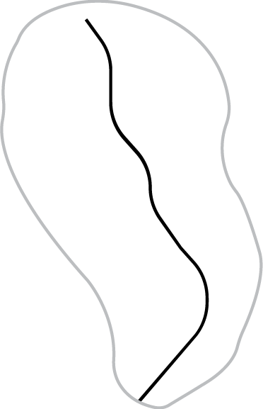   

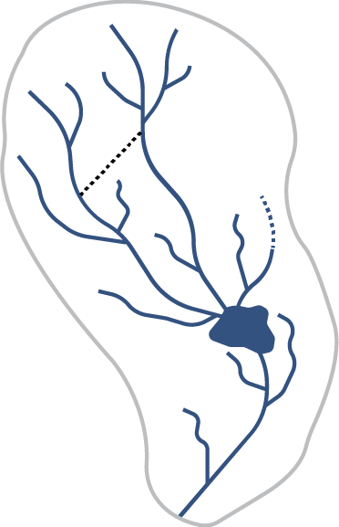 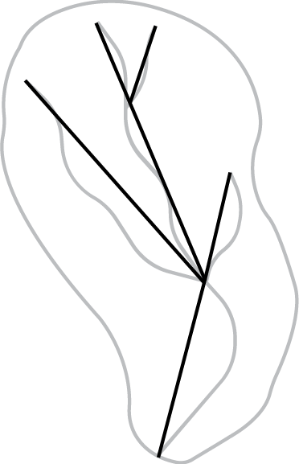 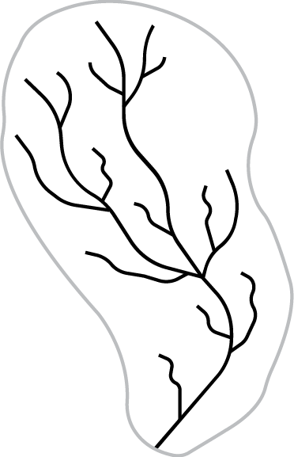   
Figure 4: Multiple graphical realizations representing a catchment: a) Catchment boundary, b) Catchment area, c) flowpath of catchment d) network of sub catchments, e) cartographic view, f) abstract flow paths, g) hydrographic network, h) network of logically connected monitoring stations.  

Each of these graphical realizations are a different way of looking at the catchment and its interaction with other features. It is generally not possible to inspect a particular realization and understand all characteristics of the catchment because different types of features are often realized using identical data models. For example, a map showing a set of catchment polygons may display an aggregate of sub-catchments, or a collection of catchment polygons that overlap each other occupying the same space. In order to understand what catchment concept is being realized, the more detailed information about their type and role in a data model needs to be declared. These relationships and potentially constraints may be declared between a high-order catchment and the catchments generally nested therein, or between a aggregate network of catchments that encompasses nested catchments without any overlap, or the upstream-downstream direction of flow for a set of catchment polygons.

In some cases, a catchment may be realized as an identified feature without specified geometry that takes part in a topological network of catchments. This is common, for example, in data systems supporting hydrologic modeling. Catchment attributes needed to parameterize a model may be generated using various geospatial data sets, but the geometric information is not necessary for the actual modelling. In applications like this, and in data systems supporting such applications, a catchment can be realized by an identifier, attributes, and topological connections that are not necessarily the same as would be implied by geometric representation of a catchment. That is, while a catchment has a geometric representation that is an area, which would imply it is a topological face, the catchment can have a non geometric realization that is a topological edge which conveys flow from inflow to outflow. This flexibility, where a realizationg og a catchment feature does not need to have an explicit geometric representation allows a decoupling of visual and conceptual concerns with the ability to explicitely link data products that would not otherwise be easily related.

### 6.3 Catchment hierarchy and network topology
Catchments may be connected in topological networks provide continuity between catchments, the ability to aggregate catchments, and to trace catchment networks up- or down-stream. Topological connectivity is typically indicated by adjacent polygon edges, nesting of polygons, or through connection of linear features at nodes. However, since geomteric realization of hydrography serves many purposes and may not be needed at all, it is not appropriate to rely only on geometry as the basis for topology. Instead, topology can be expressed as relationships between conceptual features of a particular type which may or may not have explicit geometric realizations.

In a network of catchments, morphological detail may be specified in many ways. Inflows are generally conceptual in headwaters, and outflows are often complex where water flow out of a network. As show in Figure C1, C3, C4, and C5 catchments may connect through simple confluences (C1), water bodies or wetlands [C3], intermittent or subsurface flows [C4] or complex braided streams [C5]. Although these cases require different geographic representations, they can be represented using the same catchment topology. Since all these cases can be specified using simple topology, no special treatment is required to handle the variation of flow processes. 

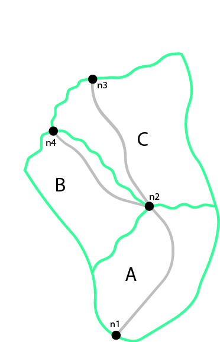  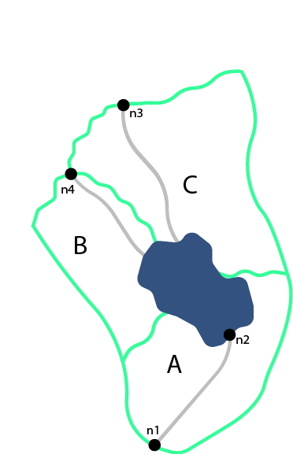 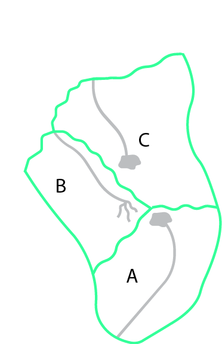  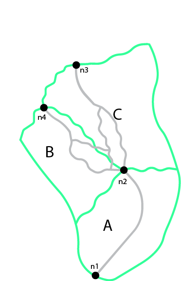  
Figure C1-5: C1, Typical catchments with one inflow and one outflow each; C2, Joined (conjoint) catchments flowing into a single downstream catchment; C3, catchments joining in a waterbody or wetland with no clear network; C4, catchments joining through intermittent of subsurface flows C5, catchments that join through areas of complex or braided channels.  

#### 6.3.1 Hierarchy of catchments
Any catchment may be nested or aggregated in a larger containing catchment or split into multiple sub units forming a hierarchy of catchments. Two types of catchment hierarchy are supported in HY\_Features: basic nesting and dendritic aggregation. 1) Basic nesting allows any catchment to have a reference to a containing catchment (Figure 6). This allows collections of subcatchments to be grouped into larger units, but does not define any particular interconnections between these subcatchments. 2) Dendritic hierarchies are collections of catchments with simple topological relationships that allow determination of contribution of flow to downstream catchments. To reflect the organization of catchments in dendritic networks, a special dendritic catchment is defined that permanently contributes exorheic flow to a receiving catchment(Figure 7), and an interior catchment of endorheic flow that contributes temporarily to a receiving catchment. 

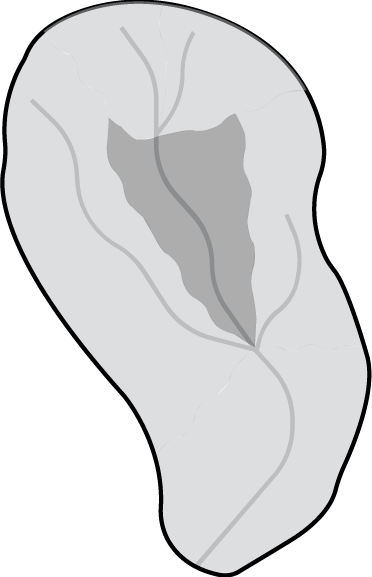  
Figure 6: Catchment hierarchy – A catchment (dark grey) may be nested within a containing catchment which is another catchment (light grey)

  
Figure 7: Catchment hierarchy – A catchment (dark grey) may be part of a simple dendritic network of catchments which is also a catchment. 

#### 6.3.2 Topological network of catchments
Given the idea that a non-geospatial schematic representation of a feature can show its connection in a topological network, a catchment can be thought of as a hydrologic unit whose terrain and morphology results in a topological link between inflow and outflow. The red line in Figure 5 illustrates how a single catchment, represented by a boundary, an area, a stream network, and a main flowline, can also be represented using a straight line that is not geospatially representative but is a valid schematic representation of the connection between inflow and outflow.

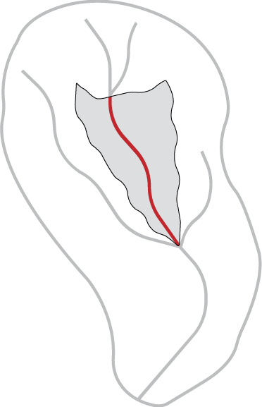  
Figure 5: A catchment area (grey) and a flowpath connecting inflow to outflow (red) depicting a definable unit where hydrological processes take place. 

In this network of catchments, two or more catchments that flow into another, flow to the same outflow node (Figure 8) which is the inflow node of a receiving downstream catchment (Figure 9); the upstream catchment may be understood as the catchment contributing flow to the inflow node of a receiving catchment. In a network of dendritic catchments, outflow nodes on the network serve only one receiving catchment (Figure 8 and Figure 9).  

Nodes stand alone as points of interaction in the network, in reality they are (potentially complex) watershed outlets, denoted as outfall features. Whether an outfall (node) is referred to as an inflow or outflow node is always in reference to a catchment. This means that a node serves as the outflow node of some contributing catchment(s) and the inflow node of some receiving catchment(s). In this standard, the inflow and outflow role names of the conceptual outfall (node) are used to unambiguously describe the node's role with respect to a catchment.

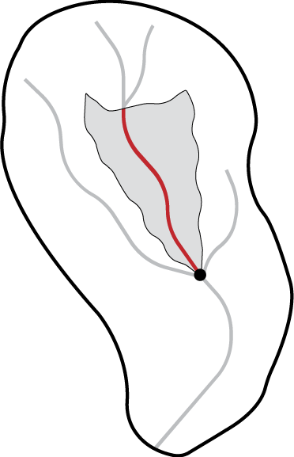
Figure 8: Catchments contributing to an identified outflow node. Note that some catchments contribute to a common outflow node.

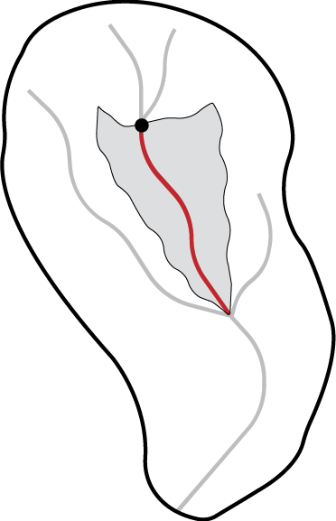  
Figure 9: Catchments receive inflow via an identified inflow node. Note that nodes are not necessarily geographic features, but are rather nodes in a graph representation of the river network.

In a dendritic network, the outflow node that one or more dendritic catchments flow to (which is not necessarily a single geometric point) must contribute to one and only one receiving catchment, unless it is a terminal catchment.  Given that the dendritic catchment is defined as a special type of the more general catchment concept, it inherits the general nesting as defined for the catchment as shown in Figure 6.

Being topological nodes, inflow and outflow nodes have no explicit positions but are potentailly complex watershed outlets. In fact, a node may be represented by a complex geometry with multiple parts. This is important in the case of a catchment that contains a broad river bottom with complex braided channels and two or more primary inflows. There may be no clear way to identify an inflow location, but from a topological perspective each contributing catchment can be said to contribute to the same node and that diffuse inflow can be said to contribute to the catchment in question (figure C6). Note that in this case, the complexity required to support geospatially accurate linear referencing may be lost in the interest of easy network navigation capabilities.

It is worth noting that non-dendritic networks are often represented as a dendritic catchment network by introducing joint catchments that contain the non-dendritic parts. Figure C6 shows an example of such a non-dendritic topology, where it is not possible to determine to what extent flow from catchment F contributes to catchments E, B or C. Figure C7 shows the same topology where catchments E, B, and C have been aggregated and the nodes N2 amd N3 are treated as a single virtual inflow node, so that all the flow from catchments D and F accumulate in the resulting catchment X. Using this encapsulation approach, catchments can be represented using a simple tree structure where an upstream-downstream relation can be built without the need for complex hydrography between inflow and outflow nodes.

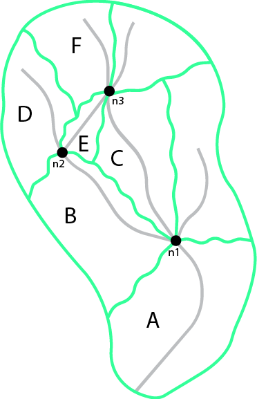 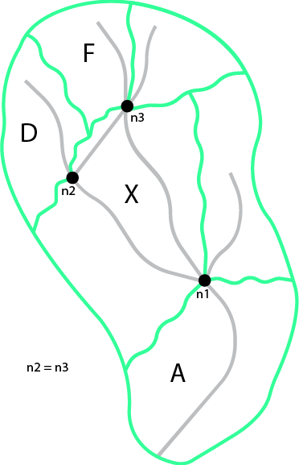   
Figure C6: Non-dendritic topology example.

There are two ways that catchments with multiple inflows can share a common outlet: 1) as separate subcatchments, each represented by a flowpath between a single inflow and the outflow (figure C1) as a non-divided catchment contributing as a whole to the outflow node (figure C2). The latter case, referred to here as a conjoint catchment, may result in several paths which water actually follows. Although it may be hard to determine what part of the contributing catchment each path represents, to determine the main flowpath, or to perform linear referencing (along the main flowpath), a conjoint catchment is often easier to delineate and more convenient. Alternatively, complex hydrography can also be combined into larger watersheds (figure C3) to avoid the complexity of having multiple inflows all together.

### 6.4 River reference system
Considering any identified location on a network as the outflow node of a contributing catchment, or the inflow node of a receiving catchment, an arbitrary new location can be placed on the network in reference to the existing outfall up- or downstream. Understanding such a reference as a positioning "along a river", the linear flowpath representation of a catchment can be used for linear referencing. HY_Features defines the concept of a river reference system which has three components: 1) an origin at an inflow or outflow outfall; 2) a shape defined by the flowpath of a catchment that connects to the origin; and 3) a linear distance or relative (percentage) measurement system. Each catchment has its own reference system which can be combined as necessary using catchment topology; each river reference system must have one outfall (origin) and one representing flowpath (shape). Figure 12, and 13 illustrate how a newly introduced network location can be located upstream of a catchment outflow node or downstream of a catchment inflow node.

  
Figure 12: Position (yellow dot) downstream of a reference point (red dot)  
Red: inflowNode of receivingCatchment - locatedStart (origin) of riverReferenceSystem,  
Yellow: reference point (referent) - outflowNode of the (dark highlighted) catchment

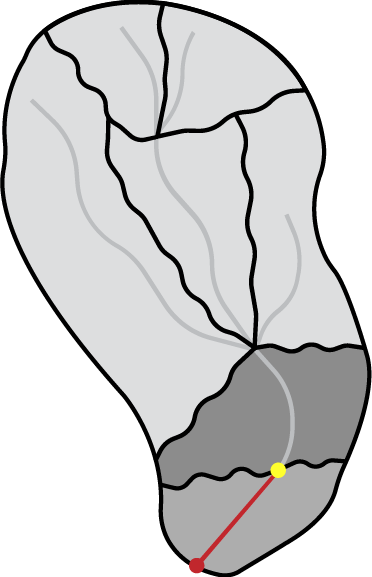  
Figure 13: Position (yellow dot) downstream of a reference point (red dot)  
Red: outflowNode of contributingCatchment - locatedStart (origin) of riverReferenceSystem,  
Yellow: reference point (referent) – inflowNode of the (light highlighted) catchment 

### 6.5 Hydrographic and hydrometric networks
Hydrographic data is commonly organized into networks. HY\_Features includes catchment realizations for the hydrographic network of waterbodies, channel network connected conveyances, and hydrometric network of monitoring stations. The following sections first describe the individual network types uniquely (sections 6.5.1 and 6.5.2) then describe how these networks relate to eachother in the context of the overall HY\_Features model. The main function of these network models is to allow an aggregate of hydrologic features at one scale to act as a single encapsulated entity at another scale.  

### 6.5.1 Hydrographic and channel networks
Following the definitions in the UNESCO-WMO "International Glossary of Hydrology" [3], a water body is understood as the mass of liquid water accumulated on or below the land surface as a body of flowing water, which in some parts may have stagnant water that is not moving or flowing. The water body concept formalized in this specification is consistant with this definition, but focuses on surface water bodies only. A conceptual model capturing the specifics of bodies of groundwater as well as aquifers containing groundwater are provided by the WaterML2 Part 4 GroundwaterML2 specification **REFERENCE**. 

A watercourse is commonly understood as a natural or man-made channel through or along which water may or may not flow [3]. A water body is generally a flowing body of water contained by a natural watercourse, but could also be in a man made open or closed conduit [3]. Given that the channel network (or drainage pattern) exists independent of whether it contains water, HY\_Features conceptually separates natural and man made hydrographic features into the body of water and the unit that contains the water body. This separation is helpful to seperate concerns of hydrology--studying the occurrence, accumulation, and circulation of water--and hydraulics--focused on the analysis and design of watercourses. **Note that flow-through lakes and lakes without outflows are considered to be water bodies whose container, while not typically thought of as a channel is modeled similarly.**

Water bodies with their associated water courses can be aggregated into a hydrographic and channel networks identified as the hydrographic or channel network of the catchment the network drains. Individual waterbodies can be described with vertical cross- or longitudinal sections. A water body may also be stratified into distinct horizontal layers for distinct thermal, salinity, oxygen, nutrient, or storage characteristics. Water may be stored and managed in reservoirs for future use, regulation, or control. Conceptually, each water body accumulating water may be managed as a reservoir. To model reservoir storage at multiple reservoir stages or elevations, HY\_Features includes an association between a reservoir and it's waterbody stratum. **The concept of stratum could also be applied to bathymetric contours of a lake to describe the container of a lake water body. Need to reconcile waterbody of type impoundment and the class reservoir.**

To place waterbodies topologically or geographically in a network, the HY\_Features model provides a mechanism to associate waterbodies with a realization of a catchment outfall. In the case of a hydrographic network that realizes an entire catchment, the HY\_Features catchment relationships can be used for both the larger catchment realized by the whole hydrographic network and the catchment(s) whose outfalls are used to locate waterbodies within the hydrographic network. This builds the idea outlined in section 6.3 in that every identified waterbody has a conceptual catchment that can be arranged topologically within a catchment network and is described in greater detail in section 6.5.3.

### 6.5.2 Hydrometric networks
Water bodies are observed using monitoring stations which are typically physical locations with a well established cross section they monitor. It is common practice to locate a monitoring station in relation to local landmarks and permanent reference points along a stream or in relation to the outlet of the monitored water body. The river reference system, described in section 6.4, gives a mechanism to locate such points in relation to establish catchment outfall locations such as confluences. When aggregated into a network, monitoring stations within a catchment can be said to make up a logically connected hydrometric network which monitors a catchment.  

The purpose of HY\_Features hydrometric stations and network is meant to support linking identified monitoring stations, (thought to be the sampling feature in terms of the observations and measurements standard) and a river or other hydrologic feature (thought to be the domain or sampled feature in terms of observations and measurements). The monitoring feature role of hydrometric features is unique in contrast to all other outfall realizations in HY\Features, which would be used as observed domain features in observations and measurements.

#### 6.5.3 HydroNetwork: hydrographic network, channel network and station network - different views of catchment topology 
Maps displaying a representation of a catchment are very common in hydrology research and engineering. Depending on the scientific concern, different aspects of the hydrology phenomenon are represented using a application specific map symbology. Respecting the separation of scientific concerns, this standard distinguishes the hydrographic, geomorphologic and hydrometric appearance of a catchment by defining separate realizations of the hydro-network. 

The holistic idea of catchment, where a conceptual catchment has many real-world realizations, allows us to consider realizations of a catchment that correspond to different phenomena as variations of a common catchment pattern. Using this, typical catchment relationships can be transferred to an entire detailed realization or contained network encapsulating of a catchment's complexity and allowing simple association with other catchments. Using this approach, the role of a catchment in a set of catchments can be transferred to any representation, regardless of the geometric representation in a particular data product. For example, an entire hydrographic network representation of a catchment can have simple relationships to the hydrographic network of it's up and downstream catchments if the network it's self is understood to adopt basic catchment characteristics.  

This standard defines a hydrologically determined topology model of directed outfalls, acting as inflow or outflow nodes, and the catchment which can act as the link between them. This topological catchment network pattern can be transferred to context-specific network realizations such as hydrographic networks of water bodies or channel networks that may convey water, as well as to their various representations as (poly)lines and polygons. For example, a fixed landmark on a water body, a cross-section separating a watercourse, or a station along the network, can be considered to be outfalls (outflow nodes) of a contributing catchment (link); a flowpath representing a catchment may be drawn from an (inflow) node to the (outflow) node linking the nodes through the represented catchment. As with the hydrographic (water body) and channel (conveyance) network, the abstract catchment topology model can be applied to any logical or virtual network, e.g. a network of logically connected hydrometric stations.  

Given that topology is ultimately determined hydrologically and not solely from geometric representation, common geometric shapes may be used to visualize the catchment topology. In this case, geometries (flowlines) may be connected in the geometric representation, but do not have to be. If an application-specific geometric representation of the connecting catchment link is needed, a representation-specific re-definition of the topological connectivity would not be needed. Context-specific views of the catchment topology may use the general catchment representation types for visualization or make use of one of the specializations typical for the hydrology domain defined in this standard. 

### 6.6 Discussion of purpose and relation to ISO standards baselines.
The intention of this standard is to provide the conceptual basis for linkage of identified hydrologic features (catchments) encoded in data products. Given that the same real world hydrologic entity can be subject of study over time, between organizations, and across disciplines, the same identified feature is often represented in many ways in differing data products. The ability to reference such features between data products requires a scale-independent nestable catchment model that can be visualized using common geometric shapes to represent the catchment in geographic maps and geoschematic views. In correspondence with the fundamentals of hydrology, catchment topology is determined through the common outlet to which all waters flow from within a bounding watershed. This is in contrast to use of geometric representation for determination of catchment topology. ~~Furthermore, catchments are connected to other catchments at the common outlets and shared boundary ridges.~~

The hydrologic feature model described in this standard describes the hydrosphere as scale-independent hierarchical network of catchments. The defined catchment topology follows hydrologic patterns governed by physical laws in a way that is independent of any possible geometric realization. The pattern can be replicated multiple times to build hierarchal networks of hydrologically discrete catchments. In practice, the highest-level of this hierarchy reflects a river system flowing into a sea or an internal sink and the lowest level is the smallest defined unit of study. Depending on the scientific concern of a study, the hierarchical network of catchments will be used to describe differing phenomena, but are typically visualized using common geometric shapes. 

#### 6.6.1 Catchment topology, comparison with the ISO topology model 
The catchment model in this standard defines the common outlet to which all waters flow as the topological outfall of a corresponding catchment. With respect to the catchment, the topological outfall is defined as the inflow node of a receiving catchment or the outflow node of contributing catchment. The catchment is the defined topological link connecting the outfall nodes located on the bounding catchment divide. Determined by the orientation of the outfall, a receiving catchment links inflow nodes to the common outflow node downstream, and a contributing catchment links an outflow node to upstream inflow nodes. Repeating this topological pattern, a network of upper and lower catchments can be built from connecting inflow nodes on a divide with the outflow node, which can be traced upstream or downstream. Depending on the perspective of a study, the network of upper and lower catchments may appear as hydrographic or channel network of seemingly connected watercourses, or as a network of logically connected stations. Each of such catchment network views forms a closed system wherein the pattern of catchment and outfall (link and node) is replicated as water bodies or channels and associated reference locations or stations. To represent the catchment network, these replicas are visualized using geometric points, lines or polygons. 

The topological concept of outfall node and catchment link applies to all defined special subtypes of a catchment. Specializations are defined with respect to (catchment) network connectivity. A dendritic catchment is defined, which is connected to other catchments through an identified outflow node which coincides with the inflow node of an associated catchment; an interior catchment is defined which is generally not connected to other catchments, but may temporarily participate in the network. With respect to the aggregation of catchments, the catchment aggregate is defined encompassing dendritic catchments and enveloping interior catchments. 

A general topology model of nodes and edges is defined in ISO19107:Spatial schema. Although geometry-affine, this topology model is defined separate from the geometric realization and thus provides a general framework to define the scale-free catchment topology based on the model of nodes and edges which need in parallel to be understood as the linear shape and origin of a river reference system as well as the connecting link and junction to navigate the catchment network upstream or downstream. A catchment may be topologically considered a solid bounded by inflow/outflow faces, a face bounded by inflow/outflow edges, an edge bounded by inflow/outflow nodes; each will be visualized using an appropriate geometry type. Not explicitly (pre)defined in the hydrologic feature model, any geometric realization may be supported through the general comparability of the basic concepts. 

Understanding the topological outfall as TP_Node in terms of ISO 19107, and the catchment link in terms of TP_Edge, as of ISO19107 (or TP_Face or TP_Solid depending on a particular application), the defined catchment topology supports the properties  *boundary* (as the *inflow node* or *outflow node*) and  *spoke* (as the *receiving catchment* or *contributing catchment*) at the catchment level;  the *proxy* property may be supported by the *reference location* relative to which a position to the outfall’s *network location* *topo* is assigned using a linear river reference system  which carries an axis for *orientation*. Understanding the phenomenologic appearance of the catchment as a TP_Complex, the *complex* property is supported by water body, channel or station that carries the typical reference location which marks the outfall of the corresponding catchment.

The domain-specific feature types and properties defined in this standard to model the catchment topology, its phenomenologic appearance in the hydrosphere and basic types of catchment representation common in hydrology, may be used to express catchment topology stored in linked data and data products, each representing a specific aspect of the hydrosphere or a particular place or time where water occurs or is distributed. Furthermore, special network or routing models may be related to the hierarchical network of catchments. 

#### 6.6.3  River Reference System, comparison with ISO linear referencing model 
It is common practice in hydrology to add new features (typically observation stations, but also designated reaches, or flood plane zones) to an existing network of such features, and to reference such features along a netwrok of watercourses. Provided that the hierarchical network of catchments is represented, and that the represented catchments have linear representations, any feature can be referenced along the linear representation of the catchment based on catchment topology alone. This is possible considering that any location on the land surface can be an outfall of a catchment. In this case, the new location is placed as an outfall in an existing catchment network relative to an already established outfall used as a referent. This concept of an indirect position requires a reference system ‘along a river’.

This standard defines a simple linear river reference system with the linear flowpath as its shape and the already established outfall as its origin. Understanding the feature of interest as outfall of a corresponding catchment, the unknown position of this outfall can be determined relative to a reference outfall up or downstream. Each outfall is potentially the origin of its own river reference system and uses the flowpath representing a catchment between this origin and another outfall as its shape. In terms of  ISO19107, the flowpath between these outfall nodes is understood as a topological co-boundary of the centered *topo* and the directed  *spoke* edge. If the linear flowpath represents a catchment  contributing to an outflow node, the position of the new outfall is given as distance (length of flowpath) to the upstream inflow node. **I don't think I disagree with the material here, but want to discuss to make sure I'm following and we write it up correctly** Vice versa, the flowpath representing a receiving catchment determines the position as distance from origin to a downstream outflow node. Using both, the position can be determined interpolative as percentage of the total length, or expressed verbally using a scoped term. 

Within ISO 19148(2012):LinearReferencing a standard model for linear referencing is described. It defines the position of an event, or referenced feature, located on a linear element (understood as directed edge in terms of the ISO19107) as a distance relative to a referent using a particular referencing method. The indirect position concept defined in this standard is comparable to the general concept defined in ISO19148. In the terms used by ISO19148, a linear representation of a catchment can be understood as the _linear element_, the already established outfall can be thought of as the _referent_, and the newly referenced in terms of an _event_. In order to use an interpolative (percentage along a reach) linear referencing method, the linear catchment representation used as the river reference system's shape must be bounded by an inflow and outflow node.

The ISO model is not ‘imported’ in the hydrologic feature conceptual model with the intention to reference the hydrologically determined catchment topology, to use terms for the origin, referent and linear element from the hydrology domain, and to include a precision and accuracy statement. 

#### 6.6.4  Catchment Network Navigation, comparison with ISO network (navigation) model 
Provided that a catchment topology of inflow/outflow nodes and catchment links is defined and that the hierarchical network of catchments is expressed in a particular hydrologic dataset, the upstream-downstream tracking of the catchment network can be transferred to related bodies water bodies. This is true for any visual or data representation of flowing or stagnant water or channels containing a water body permanently or temporarily.

Thinking about catchments as topological edges bounded by outfall nodes, a dendritic network of catchments may be traced upstream from the sea or a sink to the inflow nodes, and to the single outflow nodes of (multiple) upper catchments. From there, one can navigate further ‘upstream’ eventually arriving at the outflow node of the headwater catchments. Starting at a spring, the catchment network can be traced in the ‘downstream’ direction, first to the single outflow node to which the catchment contributes then further downstream eventually arriving at the inflow node of a branching (non-dendritic), estuary or delta. In a given representation, a sequence of linear flowpaths, each representing a catchment connected in the catchment network, may be drawn as streams or watercourses, which may be geometrically connected in the representation or not. For example, water bodies and channel parts of a particular network may be displayed using different geometric shapes and may look connected on a map, even if they are not. 

In ISO19133(2012): Tracking and navigation, a network model is defined as a complex of junctions and links specializing the directed node and directed edge types defined in ISO19107.  Based on a catchment topology comparable with the ISO topology model, understanding the catchment as a topological edge and the outfall as a (inflow/outflow) node, the catchment network (as well as its hydrographic, geomorphologic or hydrometric representations) may be navigated from outfall junction to outfall junction along the catchment link, from fixed landmark to fixed landmark along a water body, from section to section along a channel, and from station to station along a line.

The ISO model is not ‘imported’ in the hydrologic feature conceptual model with the intention to reference the hydrologically determined catchment topology, to use terms for the junction and the link from the hydrology domain to express the representations of the catchment network. 

