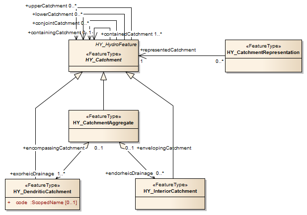
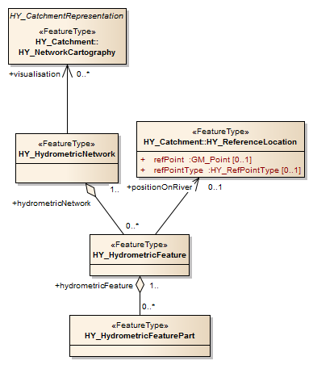
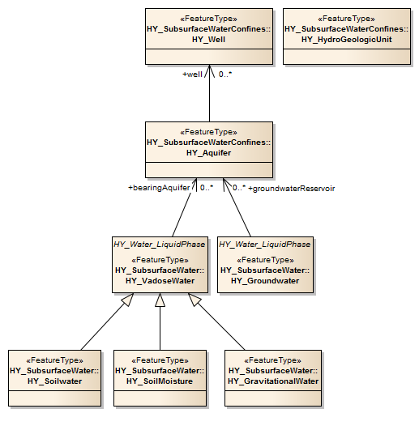

## 7. The HY_Features common hydrologic feature model (normative)

### 7.1 The HY_Features conceptual model

This standard defines the HY_Features conceptual model as a standard for the identification and description of hydrologic features reflecting both hydrologic significance as well as topological connectivity of hydrologic features. The fundamental relationships between the major components of the hydrosphere are conceptualised to formally describe the hydrosphere as an hierarchical network of hydrologically connected catchments, and the appearing network phenomena to be visualised, irrespective of the various spatial or temporal representations available for these phenomena. 

Core concepts are that of a multiple represented catchment, of catchment topology and hierarchy, of aggregation and segmentation of watercourses, and the simple river positioning. A topological concept is provided to consider any location on, or projected onto, the land surface as the inflow or outflow node of a corresponding catchment. Located in the catchment network, alternative representations may reference that identifiable location. A simple river reference system is provided to support the positioning of features based on catchment topology. It can be used to place an arbitrary location considered to be inflow or outflow node of a catchment along the linear catchment representation.

Module identification aims to simplify the scope of each part of the conceptual model in order to improve its accessibility and to provide scope for testing. It is intended that implementations need to consider only those parts of the common model implicated by its scope. Table 1 lists the applications schema, the leaf packages included and the concepts reflected therein. An (informative) utilities package contains common concepts required by the hydrologic feature model but which are not hydrology-specific. It is expected that future evolution of the ISO standards will provide a replacement for these components. At that point this module can be replaced with references to the more general concept.

Table 1: HY_Features modules, packages and concepts reflected

|Application schema | Concepts reflected | Leaf packages included |
| --- | --- | --- |
| HY_HydroFeature  | fundamental properties and relationships between features governed by the physical laws of Hydrology, naming and context of hydrologic features, location of hydrologic feature along a line | HY_Catchment, HY_HydrographicNetwork, HY_NamedFeature, HY_RiverPositioningSystem, HY_Storage |
| HY_AtmosphericFeature (informative) | hydrologic features  above the Earth’s land surface without complexity and detail of a rainfall-runoff model | --- |
| HY_SubsurfaceHydroFeature (informative) | hydrologic features below the Earth’s land surface without complexity and detail of a groundwater or soil moisture model | --- |
| HY_SurfaceHydroFeature | hydrlogic fetaures on the Earth’s land surface without complexity and detail of hydrologic and hydraulic models | HY_SurfaceWater, HY_SurfaceWaterConfines |
| HY_HydrometricNetwork | hydrometric network as an aggregate of logically connected hydrometric features located on or along a hydrologic feature | --- |
| HY_Utilities | common concepts required by the domain model that are not hydrology-specific such as naming and contextual relations | --- |

The conceptual model is expressed in the Geographic Information Conceptual Schema Language (ISO 19103:2005) based on the Unified Modeling Language (UML). The organization into packages and package dependencies are shown in Figure 16. The following sections describe requirements classes for each application schema, whereby each feature addressed in the requirements shall be understood as an instance of the GF_FeatureType (aka FeatureType) «metaclass». 

  
Figure 16: HY_Features modules and packages  
**[\*\*\*!!! Dave, fig16 updated\*\*\*]**

### 7.2	The HY_Features conceptual conformance (mapping)

Conceptual conformance to the HY_Features model is a matter of being able to unambiguously identify what elements of an implementation schema map to the HY_Features model, and the ability to populate all mandatory elements of the Feature Types present in such mappings. 

The HY_Features conceptual model provides the basis for determining whether two references to hydrologic features are references to the same feature, i.e. to determine with what object types the identifiers and names may be assigned, and how to distinguish between the reference concept (e.g. a catchment) and its representation (e.g. flowpath, catchment area or boundary). 

Disparate systems describing hydrologic features may be mapped to the equivalent HY_Features definitions to disambiguate the local usage of terminology and specific implementation choices made. Equivalence here aims to the compatibility of concepts, i.e. the logical similarity which is usually an assessment based on text analyses whereby the referenced concept is considered to be the "lowest common ancestor" of the implementation concept in such a way that the essential properties are met but may be specialized in the relevant context.

An implementation schema conforming to HY_Features shall provide a formal mapping from one or more Feature Types present in the implementation schema to Feature Types defined in this standard specification, including all mandatory properties defined by the realized HY_Features concept. Default values to be assumed must be specified in this mapping. Note that use of a formal encoding of HY_Features, in conjunction with conformance to */req/hy_features_conceptual_model/encoding* constitutes such a formal mapping. **[ \*\*\* ?? remove last sentence, since GML encoding is not longer in scope \*\*\*]** 

| **Requirements Class** | [/req/hy_features_conceptual_model](/req/hy_features_conceptual_model) |
| --- | --- |
| Target type | Implementation Schema |
| Name | HY_Features Conceptual Conformance |
| Dependency | [/iso/19109/] (https://inspire-twg.jrc.it/svn/iso) |
| Requirement | [/req/ hy_features_conceptual_model/mapping] (/req/ hy_features_conceptual_model/mapping) |

### 7.3	The HY_Features data conformance (encoding) 

Conformance to the HY_Features model with respect to the data refers to the encoding of the HY_Features concepts.  Designed conform to the General Feature Model - GFM (ISO19109:2006), the conceptual model defines hydrologic features representing the general “FeatureType” as of GFM. Consequently, each feature addressed in the requirements shall be understood as an instance of the GF_FeatureType (aka FeatureType) «metaclass». 

An implementation schema using Feature Types defined using the namespace of a formal encoding of HY_Features shall conform to the requirements specified by that encoding, as defined by the relevant part of HY_Features specification (e.g. HY_Features Part 2: GML encoding) **[(\*\*\* !!! Rob: please review, if still useable to describe conceptual conformance target \*\*\*]** - 

| **Requirements Class** | [/req/hy_features_conceptual_model](/req/hy_features_conceptual_model) |
| --- | --- |
| Target type | Implementation Schema |
| Name | HY_Features Conceptual Conformance |
| Dependency | [/iso/19109/] (https://inspire-twg.jrc.it/svn/iso) |
| Requirement | [/req/ hy_features_conceptual_model/encoding] (/req/ hy_features_conceptual_model/encoding) |

Feature **identifiers** present in data encoded using a HY\_Features conformant implementation schema shall be identical wherever the same Feature instance is being encoded or referenced. This specifically applies to data available in multiple related datasets or exposed by multiple service interfaces.

Regarding **completeness**, all mandatory properties defined by a Feature Type defined in HY\_Features shall be present for each Feature instance encoded by a conformant implementation schema.

| **Requirements Class** | [/req/hy_features_content] (/req/hy_features_content) |
| --- | --- |
| Target type	| Dataset |
| Name | HY_Features Data Conformance |
| Dependency | [/req/hy_features_conceptual_model](/req/hy_features_conceptual_model) |
| Dependency | [/iso/19109/](https://inspire-twg.jrc.it/svn/iso) |
| Dependency | [/iso/19150/](https://inspire-twg.jrc.it/svn/iso) |
| Dependency | [/iso/19136/](https://inspire-twg.jrc.it/svn/iso) |
| Requirement	| [/req/ hy_features_conceptual_model/identifiers] (/req/ hy_features_conceptual_model/identifiers) |
| Requirement	| [/req/ hy_features_conceptual_model/completeness] (/req/ hy_features_conceptual_model/completeness) |

**[\*\*\* !!! Rob, review, whether an encoding requirement is still in scope !!! \*\*\*]**
**[\*\*\* !!! Rob, review this comment from an earlier version: How to handle default values – in-schema??? \*\*\* is this till valid ?]**

### 7.4 The Hydro Feature application schema

The Hydro Feature schema conceptualize the abstraction of the complex Hydrology phenomenon through definition of domain-specific feature instances of the general Feature type, each describing separate aspects of the hydrology phenomenon. This includes related phenomena that participate in hydrologic systems but have specific characteristics. Figure 18 shows the special features types describing separate aspects of the hydrology phenomenon. Given the complexity of the domain, and the nature of real-world physical phenomena, for any given feature further specialisations may be relevant. 

Figure 17: Feature types describing separate aspects of the hydrology phenomenon (UML class diagram)
**[\*\*\*!!! Dave, fig17 updated\*\*\*]**

The Hydro Feature schema provides a model to identify hydrologic features by topology and hydrologic significance, expressed in typical relationships, and propose a pattern to assign to hydrologically determines features names given in international and multilingual contexts. Making the relationships between identified features expressible in a standard form allows the hydrosphere to be divided into a hierarchy of hydrologically connected catchments, and the appearing network phenomena to be visualised, irrespective of the various spatial or temporal representations available for these phenomena. 

The Hydro Feature schema models the multiple representation of a catchment unit of study shared across sub-domains (see section 6.2 of this standard), even if a particular representation refer only to one or the other. Catchment area, catchment boundary, and linear flowpath as well as the cartographic visualisation of different network views are defined to reflect the most common concepts in use to represent of catchment. 

The Hydro Feature schema provides a model for the positioning of features 'on river' referencing an identified location, and propose a (linear) river reference system based on catchment topology and linear geometric representation of a catchment. The referencing along the linear flowpath in a given network of catchments, supports to build hydrographic or channel networks portraying this catchment, and to   visualise these network views using an appropriate geometric representation. 

The Hydro Feature schema contains five leaf packages: HY_NamedFeature, HY_Catchment, HY_HydrographicNetwork, HY_RiverPositioning, HY_Storage. Informative packages outlining atmospheric hydrologic features and subsurface hydrologic features are provided in Annex AAA  as a simple means to take such features in account in respect of the hydrosphere complex. A conceptual model capturing the specifics of features associated with the groundwater domain will be provided with the GroundwaterML 2.0 under development. **[\*\*\* insert reference to GWML2\*\*\*]**

| **Requirements Class** | [/req/hy_abstract/*] (/req/hy_abstract/*) |
| --- | --- |
| Target type	| Implementation schema |
| Name | HY_HydroFeature (abstract) |
| Dependency | [/req/hy_utilities/](/req/hy_utilities/) |
| Requirement	| [/req/hy_abstract/hy_namedfeature/*](/req/hy_abstract/hy_namedfeature/*) |
| Requirement	| [/req/hy_abstract/hy_catchment/*](/req/hy_abstract/hy_catchment/*) |
| Requirement	| [/req/hy_abstract/hy_network/*](/req/hy_abstract/hy_network/*) |
| Requirement	| [/req/hy_abstract/hy_positioning/*](/req/hy_abstract/hy_positioning/*) |
| Requirement	| [/req/hy_abstract/hy_storage/*](/req/hy_abstract/hy_storage/*) |

#### 7.4.1	The Named Feature model

The Named Feature model defines the hydrologic feature basically as a feature to which names are given through common usage (Figure 17). It provides a flexible approach to record multiple names and identifiers that may be assigned to an identified feature without necessarily have a formal naming model by providing a means to localize names in a cultural, political or historical context. Each  special hydrologic feature type (Figure 18) inherits the general relationships defined for the HY_HydroFeature class. The HY_HydroFeature class carries the properties: *identifier*, *name*, and *context*.

Figure 18: Named Feature model (UML class diagram) 
**[\*\*\*!!! Dave, fig18 updated\*\*\*]**

The **identifier** attribute provides a means to assign to the hydrologic feature an (external) identifier in a given context. If required, an instance of HY_HydroFeature shall contain an identifier that may be used as a persistent reference to this feature. An implementation may use the EXT_IdentificationCode type as defined in the Utilities package (section 7.4. ... ) **[include reference]**.

The **name** association provides an abstract pattern to handle names given to the hydrologic feature in cultural, political or historical contexts. This allows to assign a localized name for all or part of a hydrologic feature without necessarily have a formal model. If required, this association shall be used where names are assigned to a feature instance through common usage, of cultural, political and historical variability that may occur with trans-boundary features. An implementation may use the EXT_LocalisedNameCode type as defined in the Utilities package (section 7.4. ... ) **[include reference]**. 

The **context** association provides a general pattern to handle various forms of contextualization of hydrologic features. This allows to define in which context typical properties are attached, without having to specify every possible value or to standardise the property name. If required, this associations shall be used to assign generally applicable characteristics to a feature instance in a spatial, temporal or classification context. It may be specified using one or more instances of the associated context property. An implementation may use the EXT_SpatialContext, EXT_TemporalContext or EXT_ClassificationContext types defined in the Utilities package (section 7.4. ... ) **[include reference]**.  

| **Requirements Class** | [/req/hy_namedFeature/hydrofeature] (/req/hy_namedFeature/hydrofeature) |
| --- | --- |
| Target type	| Implementation Schema |
| Name | HY_HydroFeature |
| Dependency | [/req/hy_namedFeature/hydrofeaturename] (/req/hy_namedFeature/hydrofeaturename) | 
| Dependency | [/req/hy_namedFeature/hydrofeaturecontext] (/req/hy_namedFeature/hydrofeaturecontext) | 
| Requirement |	[/req/hy_namedFeature/hydrofeature.identifier] (/req/hy_namedFeature/hydrofeature.identifier) | 
| Requirement	| [/req/hy_namedFeature/hydrofeature.name] (/req/hy_namedFeature/hydrofeature.name) | 
| Requirement	| [/req/hy_namedFeature/hydrofeature.context] (/req/hy_namedFeature/hydrofeature.context) | 

#### 7.4.2	The Catchment model

The catchment model (Figure 19) defines a logical network of catchments each intentionally represented by a geometric shape or by networks displayed using these. The catchment model supports the multiple representation of a catchment and allows for the existence of catchments to be recognized, and identifiers assigned based on inflow or outflow nodes. This is sufficient to define a simple hierarchy (see section 6.3.1) and a topological network of catchments (see section 6.3.2), allowing to establish topological relationships between hydrometric stations located in the catchment network, without the details of stream network.

The catchment model provides the topological concept to consider any location on, or projected onto, the land surface as the inflow or outflow node of a corresponding catchment. Located in the catchment network, alternative representations may refer to that identifiable reference location. Using a linear river reference system (as defined in section 7.4.4) an arbitrary location can be placed along the flowpath representation relative to such a referent. This allows to create a flowline network from a sequence of catchment representations 'drawn' between inflow and outflow nodes. Special types of one- and two-dimensional geometric representations in common use in hydrology are defined to support this. 

Figure 19: Catchment model (UML class diagram)
**[\*\*\*!!! Dave, fig19 updated\*\*\*]**

##### 7.4.2.1	Catchment representation
The HY_CatchmentRepresentation class conceptualize the multiple representation of a catchment in typical data products using single geometric shapes, or by visualisation of typical networks the catchment may appear depending on the concern of the undertaken study. Catchment representation refers to the common recognition of a catchment as the unit of study shared across sub-domains, even if a particular representation refer only to one or the other. With respect to 1D-and 2D-geometry, special types of catchment representation are defined: HY_Flowpath (line-shaped),  HY_CatchmentArea (area-shaped), and HY_CatchmentBoundary (polygon shape). The HY_NetworkCartography class is defined with respect to networks in which hydrologic features may participate, and that in its entirety represent, separately or as set of layers, the catchment. This will allow hydrologic features that are logically connected in the hydrographic network, a network of channels, a network of hydrometric stations to be portrayed in thematic map layers, which is common use to cartographically represent a catchment through overlaying a series of layers displaying such networks.

In other contexts other types of catchment representation may exist.  Data products that not conforms to the special types defined in this standard, for instance representations in more-dimensional perspectives, or in time, may use the general HY_CatchmentRepresentation class. If present, all sub-types of catchment representation shall support the inherent representedCatchment property whereby each representation may be realised with an appropriate geometry type. HY_CatchmentRepresentation carries one association: representedCatchment. 

Figure 20: Catchment representation (UML class diagram)
**[\*\*\*!!! Dave, fig20 updated\*\*\*]**

The *representedCatchment* association defines the relationship to exactly the catchment that is represented in the data set or product.  If required, this association shall be used to identify the unit wherein the hydrologic processes under study take place. 

| **Requirements Class** | [/req/hy_catchment/catchmentrepresentation] (/req/hy_catchment/catchmentrepresentation) | 
| --- | --- |
| Target type	| Implementation schema |
| Name | HY_CatchmentRepresentation | 
| Dependency | [/req/hy_catchment/catchment](/req/hy_catchment/catchment) | 
| Requirement	| [/req/hy_catchment/catchmentrepresentation.representedcatchment](/req/hy_catchment/catchmentrepresentation.representedcatchment) | 

##### 7.4.2.2	Catchment
The HY_Catchment class defines the catchment and its basic relationships such as catchment hierarchy (figure 21) and network topology (figure 22) as described in section 6.3. 

**[\*\*\* ???, figures showing hierarchy and topology relationships at top of the section vs. figures showing the properties of each class in front of the tables listing the props \*\*\*]**

Figure 21: Catchment hierarchy (UML class diagram)
**[\*\*\*!!! Dave, fig21 updated\*\*\*]**

Figure 22: Catchment topology (UML class diagram)
**[\*\*\*!!! Dave, fig22 updated\*\*\*]**

HY_Catchment specializes the general HY_HydroFeature class; from this generalization it inherits *identifier*, *name* and *context* properties. HY_Catchment carries the associations: *containing Catchment*, *conjointCatchment*, *upperCatchment*,  *lowerCatchment*, *outflowNode*, *inflowNode*, *boundaryLine*.

The **containingCatchment** association describes the nesting of catchments in a simple “is-in” containment hierarchy as typically used for high-order organization of management and reporting units. If required, this association shall be used to identify a catchment wherein the catchment is nested.

The **outflowNode** association describes the topological place where water flows out of a contributing catchment. This allows to identify an inflow location that coincides with this outflow node, and to describe an upstream-downstream relation. If required, this association shall be used to identify the location to which the catchment contributes flow, and from where a downstream catchment receives flow from upstream. 

The **inflowNode** association describes the topological place where water flows into a receiving catchment. This allows to identify an outflow location that coincides with this inflow node, and to describe an downstream-upstream relation. If required, this association shall be used to identify the location from where the catchment receives flow, and to which an upstream catchment contributes flow. 

The **conjointCatchment** association describes the interaction of a catchment with another catchment crossing an internal boundary line. This line may be a divide separating adjacent catchments, or a diffuse divide between non-delineated sub-catchments within an encompassing catchment, or a fictive line between distant catchments. If required, this association shall be used to identify the interacting catchments. 

The **upperCatchment** association connects the catchment to the adjacent catchment above sharing a common (virtual) boundary line. This allows to describe connected catchments independent from identified inflow or outflow nodes. If required, this association may be used to trace the catchment network in upstream direction from mouth to source. In a dendritic network of catchments, where a catchment is determined by its single outflow node, this association may be used to identify inflow into the catchment when a particular inflow location is not known, for eaxmaple in headwater and tributary catchments. 

The **lowerCatchment** association connects the catchment to the adjacent catchment below sharing a common (virtual) boundary line. This allows to describe connected catchments independent from identified inflow or outflow nodes. If required, this association may be used to trace the catchment network in downstream direction from source to mouth. 

The **boundaryLine** association relates a conceptual line bounding the catchment, which carries an infinite number of nodes on line each to be located in the catchment network as an outfall of corresponding catchment. If required, this association shall be used to identify a boundary line on whose lowest point an outfall may be placed when a particular outflow location is not known. 

| **Requirements Class** | [/req/hy_catchment/catchment] (/req/hy_catchment/catchment) | 
| --- | --- |
| Target type	| Implementation schema |
| Name | HY_Catchment | 
| Dependency | [/req/hy_namedFeature/hydrofeature] (/req/hy_namedFeature/hydrofeature) |
| Dependency | [/req/hy_catchment/catchment](/req/hy_catchment/catchment) | 
| Dependency | [/req/hy_catchment/catchment](/req/hy_catchment/catchment) | 
| Dependency | [/req/hy_catchment/outfall](/req/hy_catchment/outfall) | 
| Dependency | [/req/hy_catchment/divide](/req/hy_catchment/divide) | 
| Requirement	| [/req/hy_catchment/catchment.containingcatchment](/req/hy_catchment/catchment.containingcatchment) | 
| Requirement	| [/req/hy_catchment/catchment.jointcatchment](/req/hy_catchment/catchment.jointcatchment) | 
| Requirement	| [/req/hy_catchment/catchment.upstreamcatchment](/req/hy_catchment/catchment.upstreamcatchment) |
| Requirement	| [/req/hy_catchment/catchment.outflownode](/req/hy_catchment/catchment.outflownode) |
| Requirement	| [/req/hy_catchment/catchment.inflownode](/req/hy_catchment/catchment.inflownode) |
| Requirement	| [/req/hy_catchment/catchment.boundaryline](/req/hy_catchment/catchment.divide) |

##### 7.4.2.3	CatchmentAggregate
The HY_CatchmentAggregate class specializes the HY_Catchment class with respect to a set of dendritic catchments, arranged in an encompassing catchment at the next upper hierarchy level without any spatial overlap. This allows to describe multiple inflows into a catchment aggregate through several hydrologically discrete sub-catchments having a single inflow, and contributing to the common outflow of the catchment aggregate. 

A catchment aggregate may be part of a containing catchment at the next higher hierarchy level, which consists of many of those neighbouring catchments. This does not necessarily implies a series of containing catchments, but allows jumping to the 'highest' upper-level system as typically used for reporting purposes. The HY_CatchmentAggregate class inherits from generalization the *containingCatchment*, *upstreamCatchment*, *jointCatchment*, *outflowNode*, *inflowNode* and *boundaryLine* properties, and carries two properties: *exorheicDrainage* and *endorheicDrainage*.

The **exorheicDrainage** association references an exorheic drained catchment. The **endorheicDrainage** association references an endorheic drained catchment, temporarily connected to the enveloping aggregate. If required, these asscoations shall be used to identify the aggregated parts permanently or temporarily interacting with other catchments joined in the encompassing aggregate. 

| **Requirements Class** | [/req/hy_catchment/catchmentaggregate] (/req/hy_catchment/catchmentaggregate) | 
| --- | --- |
| Target type	| Implementation schema |
| Name | HY_CatchmentAggregate | 
| Dependency | [/req/hy_catchment/catchment] (/req/hy_catchment/catchment) |
| Dependency | [/req/hy_catchment/dendriticcatchment](/req/hy_catchment/dendriticcatchment) | 
| Dependency | [/req/hy_catchment/interiorcatchment](/req/hy_catchment/interiorcatchment) | 
| Requirement	| [/req/hy_catchment/catchmentaggregate.exorheicdrainage](/req/hy_catchment/catchmentaggregate.exorheicdrainage) | 
| Requirement	| [/req/hy_catchment/catchmentaggregate.endorheicdrainage](/req/hy_catchment/catchmentaggregate.endorheicdrainage) | 

##### 7.4.2.4	DendriticCatchment
The HY_DendriticCatchment class specializes the general HY_Catchment class with respect to a hydrologically discrete catchment, which is determined by a single common outlet to which all waters flow. This class denotes the catchment as the topological link between an inflow node and an outflow node allowing catchments to be connected in a dendritic network by upstream-downstream relationships, without knowing the complex hydrology between inflow and outflow nodes. This concept requires a stable identifier that is not merely a function of an arbitrary delineation of the surface, and that catchments are delineated within a simple tree hierarchy. The HY_DendriticCatchment class inherits from generalization the *containingCatchment*, *upstreamCatchment*, *conjointCatchment*, *outflowNode*, *inflowNode* and *boundaryLine* properties, and carries two properties: *code* and *encompassingCatchment*. 

The **code** attribute may be used to assign to the dendritic a unique identifier in given context. If required, the code shall be implemented using a controlled classification or coding system. Example: WMO Basin Codes.  

The **encompassingCatchment** association relates to the dendritic catchment the aggregate encompassing the catchment. If required, this association shall be used to identify the catchment encompassing one or more exorheic drained catchments contributing flow to the common outlet, either from a single identified inflow, or in join with other sub-catchments crossing a divide intern of the encompassing aggregate.

| **Requirements Class** | [/req/hy_catchment/dendriticcatchment] (/req/hy_catchment/dendriticcatchment) |
| --- | --- |
| Target type	| Implementation Schema |
| Name | HY_DendriticCatchment |
| Dependency | [/req/hy_catchment/catchment] (/req/hy_catchment/catchment) | 
| Dependency | [/req/hy_catchment/catchmentaggregate] (/req/hy_catchment/catchmentaggregate) | 
| Requirement |	[/req/hy_catchment/dendriticcatchment.code] (/req/hy_catchment/dendriticcatchment.code)
| Requirement |	[/req/hy_catchment/dendriticcatchment.encompassingcatchment] (/req/hy_catchment/dendriticcatchment.encompassingcatchment) 

##### 7.4.2.5	InteriorCatchment
The HY_InteriorCatchment class specializes the general HY_Catchment class with respect to a hydrologically discrete catchment, which is generally not connected to other catchments. This class describes the interior catchment as catchment enveloped by other catchments to which it may temporary contribute. The HY_InteriorCatchment class inherits from generalization the *containingCatchment*, *upstreamCatchment*, *conjointCatchment*, *outflowNode*, *inflowNode* and *boundaryLine* properties, and carries one association: *envelopingCatchment*. 

The **envelopingCatchment** association relates to the interior catchment the aggregate surrounding the catchment. If required, this association shall be used to identify the catchment enveloping one or more endorheic drained catchments contributing temporarily flow to the common outlet. 

| **Requirements Class** | [/req/hy_catchment/interiorcatchment] (/req/hy_catchment/interiorcatchment) | 
| --- | --- |
| Target type	| Implementation schema |
| Name | HY_InteriorCatchment | 
| Dependency | [/req/hy_catchment/catchment] (/req/hy_catchment/catchment) |
| Dependency | [/req/hy_catchment/catchmentaggregate](/req/hy_catchment/catchmentaggregate) | 
| Requirement	| [/req/hy_catchment/interiorcatchment.envelopingcatchment](/req/hy_catchment/interiorcatchment.envelopingcatchment) |

##### 7.4.2.6	Outfall
The HY_Outfall class conceptualize the common outlet of a catchment as the topological node where catchments interact (see section 6.3.2). The outfall marks the place where the outflow node of a contributing catchment meets the inflow node of a receiving catchment. In terms of an outflow node, the outfall identifies the location to which upstream catchments contribute flow due to gravitational forces or pumping; in terms of an inflow node that location is identified from where catchments downstream receive flow collected upstream. 

Topologically placed in the network of catchments, geometric shape and position of the outfall are not explicitly defined. The outfall may get assigned a position relative to a reference location of a particular geometric shape using a linear reference system. The reference location may be a geometric point identified by co-ordinates, or any other feature carrying such a reference point. A fixed landmark, a monitoring station, a spring where groundwater enters the surface, may be a reference point but also a point projected onto the surface or created from merging disjoint locations; vertically arranged points may be aggregated and projected onto surface, a delta of a river system merged to virtual mouth, diffuse groundwater discharge placed on rivers or lakes.  The HY_Outfall class carries four associations: *contributingCatchment*, *receivingCatchment*, *summitLine* and *relativePosition*. 

The **contributingCatchment** association relates a catchment to its outflow node. This allows to describe an arbitrary location on the land surface as the topological outfall to which a catchment contributes flow, received from an upstream inflow node. If required, this association shall be used to identify the catchment contributing to the outflow node as the connecting link between inflow node and outflow node, and thus connecting an upstream catchment (at its outflow node) and a downstream catchment (at its inflow node).  

The **receivingCatchment** association relates a catchment to its inflow node. This allows to describe an arbitrary location on the land surface as the topological outfall where a catchment receives flow from upstream and contributes this to an outflow node. If required, this association shall be used to identify the catchment receiving flow as the connecting link between inflow node and outflow node, and thus connecting an upstream catchment (at its outflow node) and a downstream catchment (at its inflow node).

The **summitLine** association relates a summit line on which the outfall marks the lowest point, associating an infinite number of nodes on line each to be located in the catchment network. If required, this association may be used to identify a summit line on which an outfall may be placed when a particular inflow location is not known.

The **relativePosition** association assigns to the outfall a position relative to a reference location located in the network and identified or fixed by coordinates. If required, this association shall be used to assign a position, either expressed as the distance to a reference location, or relative or interpolative to this.   

| **Requirements Class** | [/req/hy_catchment/outfall] (/req/hy_catchment/outfall) | 
| --- | --- |
| Target type	| Implementation schema |
| Name | HY_Outfall | 
| Dependency | [/req/hy_catchment/catchment] (/req/hy_catchment/catchment) |
| Dependency | [/req/hy_catchment/divide](/req/hy_catchment/divide) | 
| Dependency | [/req/hy_catchment/indirectposition](/req/hy_catchment/indirectposition) | 
| Requirement	| [/req/hy_catchment/outfall.contributingcatchment](/req/hy_catchment/outfall.contributingcatchment) |
| Requirement	| [/req/hy_catchment/outfall.receivingcatchment](/req/hy_catchment/outfall.receivingcatchment) |
| Requirement	| [/req/hy_catchment/outfall.summitline](/req/hy_catchment/outfall.summitline) |
| Requirement	| [/req/hy_catchment/outfall.relativeposition](/req/hy_catchment/outfall.relativeposition) |

##### 7.4.2.7	Divide
The HY_Divide class describes the boundary line separating adjacent catchments understood as a summit line on which several nodes may be located of which the outfall marks the lowest place. The HY_Divide class carries one association: *nodeOnDivide*. 

The **nodeOnDivide** association relates to the divide a node located on this. This allows an arbitrary node on divide, considered as a permanent reference location, to be located in the network of catchments in terms of an outfall. If required, this association shall be used to identify on the divide a permanent (reference) location identified by co-ordinates.

| **Requirements Class** | [/req/hy_catchment/divide] (/req/hy_catchment/divide) | 
| --- | --- |
| Target type	| Implementation schema |
| Name | HY_Divide | 
| Dependency | [/req/hy_catchment/referencelocation](/req/hy_catchment/referencelocation) | 
| Requirement	| [/req/hy_catchment/divide.nodeondivide](/req/hy_catchment/outfall.nodeondivide) |

##### 7.4.2.8	ReferenceLocation
The HY_ReferenceLocation class describes a permanent, stable reference location such as a landmark fixed and referenced by coordinates.
Placed in the catchment network in terms of an outfall, the reference location will be the referent of the (linear) river reference system; a hydrologic feature associated with a reference location can be considered to be carrier of the referent relative to which a distance may be determined. The HY_ReferenceLocation class carries three properties: *refPoint*, *refPointType*, *networkLocation*. 

The **refPoint** and **refPointType** attributes describes the reference location as point of a particular geometry. Given that a single point may have several reported locations depending on its nature and the precision of measurement, these attributes describe an accepted common point. If required, the reference point shall be identified using the GM_Point type, or the HY_RefPointType codelist described in Annex ... , table ... . **[insert reference]**  

The **networkLocation** association locates the reference location in a given network of catchments. If required, this association shall be used to determine a referent topologically as inflow to a receiving or outflow of a contributing catchment.

| **Requirements Class** | [/req/hy_catchment/referencelocation] (/req/hy_catchment/referencelocation) | 
| --- | --- |
| Target type	| Implementation schema |
| Name | HY_ReferenceLocation | 
| Dependency | [/iso/19107/](https://inspire-twg.jrc.it/svn/iso) |
| Dependency | [/req/hy_catchment/refpointtype](/req/hy_catchment/refpointtype) |
| Dependency | [/req/hy_catchment/outfall](/req/hy_catchment/outfall) |
| Requirement	| [/req/hy_catchment/referencelocation.refpoint](/req/hy_catchment/outfall.refpoint) |
| Requirement	| [/req/hy_catchment/referencelocation.refpointtype](/req/hy_catchment/outfall.refpointtype) |
| Requirement	| [/req/hy_catchment/referencelocation.networklocation](/req/hy_catchment/outfall.networklocation) |

#### 7.4.3	The Hydrographic Network model
The hydrographic network model (figure 23) defines a logical network of water bodies. Conceptually, the aggregate of water bodies is understood as the hydrographic appearance of the catchment of study in the perspective of the undertaken study, and the visualisation of the hydrographic network as a cartographic representation of the catchment. Given that a topological upstream-downstream relationship is defined between catchments (see section 6.4.2), a water body has no other role than being part of the network that mirrors the network of contributing and receiving catchments. This means that the connectivity between water bodies appearing in the hydrographic network is virtual, and that water bodies can be aggregated in the hydrographic network irrespective of whether the accumulated water is flowing or not. This allows to aggregate permanent and temporary water bodies of flowing or stagnant water in a network view portraying a catchment, and to visualise the represented the catchment. To supports this concept of a virtual connectivity, parts in the hydrographic network associate typical reference points which can be located topologically as outfall of a corresponding catchment.

Following the conceptual separation of a watercourse into water body and containing channel (see section 6.5), the hydrographic network is defined independent of the network of containing channels. This approach allows to separately visualise the hydrographic network of 'blue' lines or polygons, whereby the logically connected water bodies may or may not be connected at the representation level. 

The hydrographic network model defines the major elements describing the hydrographic network and the relationships between them. A network water body may be segmented at vertical cross- or longitudinal sections in succeeding parts, each part in horizontal strata. A water body part associates a typical reference location, allowing to place another feature relative to this using the (linear) river reference system described in section 7.4.5. 

Figure 23: Hydrographic Network model (UML class diagram)
**[\*\*\*!!! Dave, fig23 updated\*\*\*]**

##### 7.4.3.1	HydrographicNetwork
The HY_HydrographicNetwork class describes the aggregate of permanent and temporary bodies of flowing or stagnant water, as what the catchment under study appears, and that may be visualised in map layers to cartographically represent this catchment. The HY_HydrographicNetwork class carries one association: *visualisation*. 

The **visualisation** association relates to the hydrographic network its cartographic visualisation, either as a separate map, or one of many thematic layers. If required, this association shall be used to identify a map or geoschematic view displaying the hydrographic network that in its entirety, separately or as set of layers, represents the catchment without describing the displayed network parts in detail.

| **Requirements Class** | [/req/hy_hydrographicnetwork/hydrographicnetwork] (/req/hy_hydrographicnetwork/hydrographicnetwork) |
| --- | --- |
| Target type	| Implementation Schema |
| Name | HY_HydrographicNetwork |
| Dependency | [/req/hy_catchment/networkcartography] (/req/hy_catchment/networkcartography) | 
| Requirement |	[/req/hy_hydrographicnetwork/hydrographicnetwork.visualisation]  (/req/hy_hydrographicnetwork/hydrographicnetwork.visualization) |

##### 7.4.3.2	WaterBody, WaterBodyPart and WaterBodyStratum
The HY_WaterBody and HY_WaterBodyPart class define a water body, or part of this, participating in the hydrographic network. The HY_WaterBodyStratum class describes a horizontal layer in a stratified water body determined by differences in thermal or salinity characteristics or by oxygen or nutrient content, or by virtual storage zones of a reservoir. 

The water body concept refers to an accumulated mass of liquid water, distinct from other masses of water. Its shape is determined by the occupied landform, the hosting hydrogeologic unit, a man made container, or another confining structure, and in case of on open waterbody bound to atmospheric pressure exerted on its surface. Each water body, or part of this, may be described in terms of a reservoir storing water for future use. In the context of hydrometric observation, a water bod may be understood as the feature of interest sampled by a hydrometric (sampling) feature. A water body is defined as special type of the named hydrologic feature (see section 7.4.1), because of names usually given to a water body in common experience varying whithin context or for some parts. Special types of water bodies occurring on the land surface are described in the 'Surface Hydro Feature' application schema in section ... . **[\*\*\* insert reference\*\*\*]**. A separate conceptual model capturing the specifics of features associated with the groundwater domain will be provided within the GroundwaterML 2.0 specification (under development). **[\*\*\* insert reference\*\*\*]** 

**[\*\*\*  HY_Glacier is removed from the model. -- it's an issue similar to atmospheric and groundwater features, and since no relationship to a (glacier fed) catchment is defined. the accumulation of ice from atmospheric origin is subject of specific glacier models not in scope (see line 365) -- it's sufficient here (I think) to have the WaterSolidPhase feature which is still needed with respect to ice cover, is in soil, snowmelt discharging in water body, ..., to reflect snow and ice as parts in the hydrographic network \*\*\*]**

HY_WaterBody and HY_WaterBodyPart inherit from the generalization the *identifier*, *name* and *context* properties. HY_WaterBody, HY_WaterBodyPart and HY_WaterBodyStratum each associate the aggregate in which they participate. The *hydrographicNetwork* association relates to a water body the network, *waterBody* to a water body its parts, and *stratifiedWaterBody* to the stratified water body part its strata. If required, these associations shall be used to identify the aggregates the water body, water body part or statum are parts of. HY_WaterBodyPart carries five properties: *fixedLandmark*, *upstreamSegment*,  *downstreamSegment*, *streamCrossSection*, and *streamLongitudinalSection*. HY_WaterBodyStratum has two properties: *storage* and *stratumType*.

The **fixedLandmark** associates to the water body part a permanent landmark referenced by co-ordinates. If required, this shall be used to identify on a water body (part) a permanent reference location which can be located in the network of catchment as outfall. This supports to place a water body part relative to this using the (linear) river reference system described in section 7.4.5. 

The **upstreamSegment** and **downstreamSegment** associations relate to a water body (part) parts up or downstream. If required, these associations shall be used to identify upstream or downstream segments connected with the water body (part).

The **streamCrossSection** and **longitudinalCrossSection** associations relate to a water body (part) vertical sections confining them.  If required, this association shall be used to identify sections either at right angles to the main (average) direction of flow, or along the stream (centre) line.

The **storage** association describes a zone in a stratified water body, part of the network, terms of storing water as a resource for future use. If required, this association shall be used to describe the reservoir used for storage, regulation and control of water resources. The **stratumType** attribute may be used to specify the type of the stratum or zone using a term from a controlled vocabulary.

| **Requirements Class** | [/req/hy_hydrographicnetwork/waterbody] (/req/hy_hydrographicnetwork/waterbody) |
| --- | --- |
| Target type	| Implementation Schema |
| Name | HY_WaterBody |
| Dependency | [/req/hy_namedFeature/hydrofeature] (/req/hy_namedFeature/hydrofeature) |
| Dependency | [/req/hy_hydrographicnetwork/hydrographicnetwork] (/req/hy_hydrographicnetwork/hydrographicnetwork) | 
| Requirement |	[/req/hy_hydrographicnetwork/waterbody.hydrographicnetwork]  (/req/hy_hydrographicnetwork/waterbody.hydrographicnetwork) |

| **Requirements Class** | [/req/hy_hydrographicnetwork/waterbodypart] (/req/hy_hydrographicnetwork/waterbodypart) |
| --- | --- |
| Target type	| Implementation Schema |
| Name | HY_WaterBodyPart |
| Dependency | [/req/hy_namedFeature/hydrofeature] (/req/hy_namedFeature/hydrofeature) |
| Dependency | [/req/hy_catchment/referencelocation] (/req/hy_catchment/referencelocation) |
| Dependency | [/req/hy_hydrographicnetwork/waterbody] (/req/hy_hydrographicnetwork/waterbody) | 
| Dependency | [/req/hy_hydrographicnetwork/waterbodypart] (/req/hy_hydrographicnetwork/waterbodypart) | 
| Dependency | [/req/hy_hydrographicnetwork/crosssection] (/req/hy_hydrographicnetwork/crosssection) | 
| Dependency | [/req/hy_hydrographicnetwork/longitudinalsection] (/req/hy_hydrographicnetwork/longitudinalsection) | 
| Requirement |	[/req/hy_hydrographicnetwork/waterbody.waterbody]  (/req/hy_hydrographicnetwork/waterbody.waterbody) |
| Requirement |	[/req/hy_hydrographicnetwork/waterbody.fixedlandmark]  (/req/hy_hydrographicnetwork/waterbody.fixedlandmark) |
| Requirement |	[/req/hy_hydrographicnetwork/waterbody.upstreamsegment]  (/req/hy_hydrographicnetwork/waterbody.upstreamsegment) |
| Requirement |	[/req/hy_hydrographicnetwork/waterbody.downstreamsegment]  (/req/hy_hydrographicnetwork/waterbody.downstreamsegment) |
| Requirement |	[/req/hy_hydrographicnetwork/waterbody.streamcrosssection]  (/req/hy_hydrographicnetwork/waterbody.streamcrosssection) |
| Requirement |	[/req/hy_hydrographicnetwork/waterbody.streamlongitudinalsection]  (/req/hy_hydrographicnetwork/waterbody.streamlongitudinalsection) |

| **Requirements Class** | [/req/hy_hydrographicnetwork/waterbodystratum] (/req/hy_hydrographicnetwork/waterbodystratum) |
| --- | --- |
| Target type	| Implementation Schema |
| Name | HY_WaterBodyStratum |
| Dependency | [/iso/19103/](https://inspire-twg.jrc.it/svn/iso) |
| Dependency | [/req/hy_hydrographicnetwork/waterbodypart] (/req/hy_hydrographicnetwork/waterbodypart) | 
| Dependency | [/req/hy_storage/reservoir] (/req/hy_storage/reservoir) | 
| Requirement |	[/req/hy_hydrographicnetwork/waterbodystratum.stratifiedwaterbody]  (/req/hy_hydrographicnetwork/waterbodystratum.stratifiedwaterbody) |
| Requirement |	[/req/hy_hydrographicnetwork/waterbodystratum.stratumtype]  (/req/hy_hydrographicnetwork/waterbodystratum.stratumtype) |
| Requirement |	[/req/hy_hydrographicnetwork/waterbodystratum.storage]  (/req/hy_hydrographicnetwork/waterbodystratum.storage) |

##### 7.4.3.3	Water Liquid Phase and Water Solid Phase 
The HY_Water_LiquidPhase and HY_Water_SolidPhase define a simple concept of the accumulation of water in water bodies. This definition refers to the matter accumulated to a mass of water. In its liquid form water is considered accumulated in water bodies; in its solid phase water may be accumulated after melting, or as a layer of ice or snow on an open water body. The accumulation of water in the atmosphere or below the land surface, e.g. rain, soil moisture or groundwater, is not in scope of this standard, as well as the accumulation of snow and ice in glaciers which is subject of glaciology science. Informative packages describing a simple model to take into account water from atmospheric origin, particularly from precipitation, or water occurring below the land surface without the complexity and detail of rainfall-runoff or groundwater models, are provided in Annex ... . **[\*\*\* insert reference \*\*\*]**. A conceptual model capturing the specifics of features associated with the groundwater domain will be provided with the GroundwaterML 2.0 under development. **[\*\*\* insert reference to GWML2\*\*\*]**

HY_Water_LiquidPhase carries the association *accumulatingWaterBody*; HY_Water_SolidPhase associates two properties: *snowmelt* and *coveredWaterBody*. If required, these associations shall be used to identify the water body, part of the network, where liquid water as a material is accumulated. 

| **Requirements Class** | [/req/hy_hydrographicnetwork/waterliquidphase] (/req/hy_hydrographicnetwork/waterliquidphase) |
| --- | --- |
| Target type	| Implementation Schema |
| Name | HY_WaterLiquidPhase |
| Dependency | [/req/hy_hydrographicnetwork/waterbodystratum] (/req/hy_hydrographicnetwork/waterbodystratum) | 
| Requirement |	[/req/hy_hydrographicnetwork/waterliquidphase.accumulatingwaterbody]  (/req/hy_hydrographicnetwork/waterliquidphase.accumulatingwaterbody) |

| **Requirements Class** | [/req/hy_hydrographicnetwork/watersolidphase] (/req/hy_hydrographicnetwork/watersolidphase) |
| --- | --- |
| Target type	| Implementation Schema |
| Name | HY_WaterSolidPhase |
| Dependency | [/req/hy_hydrographicnetwork/waterliquidphase] (/req/hy_hydrographicnetwork/waterliquidphase) | 
| Dependency | [/req/hy_hydrographicnetwork/waterbodypart] (/req/hy_hydrographicnetwork/waterbodypart) | 
| Requirement |	[/req/hy_hydrographicnetwork/watersolidphase.snowmelt]  (/req/hy_hydrographicnetwork/watersolidphase.snowmelt)
| Requirement |	[/req/hy_hydrographicnetwork/watersolidphase.coveredwaterbody]  (/req/hy_hydrographicnetwork/watersolidphase.coveredwaterbody) |

##### 7.4.3.4	Cross-Section and Longitudinal Section
The HY_CrossSection and HY_LongitudinalSection conceptualize the segmentation of a water body or a containing channel through vertical sections. Taking into account the conceptual separation of a watercourse (see section 6.5) into a water body and the containing channel, the cross section concept refers to both the cross section of a water body orthogonal to the direction of flow, and to the transversal profile of a channel; the longitudinal section concept refers to centre, stream or contour lines such a thalweg, shore or bank lines. 
 
HY_CrossSection and HY_LongitudinalSection each associate to a vertical section typical reference points: *crossSectionPoint* and *longitudalinalSectionPoint*. Located in the network of catchments, vertical sections allow to place a feature of interest relative to this using the (linear) river reference system described in section 7.4.5. If required, these associations shall be used to identify at a vertical section the permanent reference location located in the network of catchments as outfall. 

| **Requirements Class** | [/req/hy_hydrographicnetwork/crosssection] (/req/hy_hydrographicnetwork/crosssection) |
| --- | --- |
| Target type	| Implementation Schema |
| Name | HY_CrossSection |
| Dependency | [/req/hy_catchment/referencelocation] (/req/hy_catchment/referencelocation) | 
| Requirement |	[/req/hy_hydrographicnetwork/crosssection.crosssectionpoint]  (/req/hy_hydrographicnetwork/crosssection.crosssectionpoint)

| **Requirements Class** | [/req/hy_hydrographicnetwork/longitudinalsection] (/req/hy_hydrographicnetwork/longitudinalsection) |
| --- | --- |
| Target type	| Implementation Schema |
| Name | HY_CrossSection |
| Dependency | [/req/hy_catchment/referencelocation] (/req/hy_catchment/referencelocation) | 
| Requirement |	[/req/hy_hydrographicnetwork/longitudinalsection.longitudinalsectionpoint]  (/req/hy_hydrographicnetwork/longitudinalsection.longitudinalsectionpoint) |

#### 7.4.4	The Storage model

The Storage model (figure 24) provides a concept to describe any water body, or a part/stratum of this, in terms of a reservoir storing water for future use. The separate storage model allows to describe the hydrographic network without the details of storage capacities that a water body may have, and vice versa storage reservoirs to be referenced independent of their role within a network. To virtually connect a reservoir (defined as special water body) with other water bodies in the hydrographic network, a typical reference point on reservoir is defined allowing to place a feature of interest relative to this using the (linear) river reference system described in section 7.4.5. Details of connectivity may be designed with a particular application. 

Special concepts of surface or underground reservoirs may be defined with application. The storage concept can be applied to surface and subsurface reservoirs, whereby underground reservoirs should not be confused with the groundwater reservoir which usually refers to the containing aquifer. A conceptual model capturing the specifics of features associated with the groundwater domain will be provided with the GroundwaterML 2.0 under development. **[\*\*\* insert reference to GWML2\*\*\*]** 

Figure 24: Storage model (UML class diagram)
**[\*\*\*!!! Dave, fig24 updated\*\*\*]**

The HY_Reservoir class specializes the water body, either natural or man-made, used for storage, regulation and control of water resources. The reservoir concept refers to a mass of water managed in zones between operating levels. Being a specialization of the HY_WaterBody class, the reservoir inherits from the general HY_HydroFeature class the name and context properties which allows to describe the reservoirs in a related context, e.g. flood control or water supply. 

HY_Reservoir associates to a reservoir a typical reference point: *barrierePoint*. Located in the network of catchments, a barrier point allows to place a feature of interest relative to this using the (linear) river reference system described in section 7.4.5. If required, these associations shall be used to identify on reservoir a permanent reference location located in the network of catchments as outfall. 

| **Requirements Class** | [/req/hy_storage/reservoir] (/req/hy_storage/reservoir) |
| --- | --- |
| Target type	| Implementation Schema |
| Name | HY_Reservoir |
| Dependency | [/req/hy_hydrographicnetwork/waterbody] (/req/hy_hydrographicnetwork/waterbody) | 
| Dependency | [/req/hy_catchment/referencelocation] (/req/hy_catchment/referencelocation) | 
| Requirement |	[/req/hy_storage/reservoir.barrierpoint]  (/req/hy_storage/reservoir.barrierpoint) |

#### 7.4.5	The River Positioning system

The River Positioning model (figure 25) provides a simple model to place a feature of interest 'along a river' via topology and geometry (see section 6.4). River Positioning introduces the concept of Indirect Position where a position is determined on the linear representation of the catchment linking the feature of interest and an identified reference location either as absolute distance, relative or interpolative to the referent. This concept uses a (linear) river reference system whose origin is set at the outfall of the catchment that corresponds to the feature of interest, and whose linear shape is given by the flowpath representing the catchment linking the outfall (origin) with the outfall marked by the reference location. Each catchment has its own reference system which can be combined as necessary using catchment topology. Applying the linear referencing along flowpath to a given network of catchments, a hydrographic or channel network can be thought as a sequence of catchments visualised using an appropriate geometric representation. 

Figure 25: River Positioning System (UML class diagram)
**[\*\*\*!!! Dave, fig25 updated\*\*\*]**

The HY_IndirectPosition class provides a pattern to assign a position to a particular location relative to an identified reference location using a river referencing system based on catchment topology and (linear) catchment representation.  Understanding the newly placed location topologically as inflow node to a receiving (lower) catchment, and a (downstream) reference location as the identified outflow node of this catchment, the length of the flowpath representing this catchment between inflow and outflow determines the position; or vice versa the length of the flowpath representing a (upper) catchment which receives flow from an identified inflow node and contributes to the new place. This allows at the representation level to place a feature of interest interpolative on a flowpath between identified reference locations each understood as inflow or outflow nodes of a catchment, even if this is not explicitly delineated. 

This type may use ISO 19148(2012):LinearReferencing understanding the (linearly represented) catchment between the new location and the reference location as the 'event' in terms of ISO19148 that associates the inflow/outflow node to be placed with the outflow/inflow node marked by the reference location; in terms of catchment representation, the flowpath starting at the location to be placed and drawn towards the known reference location may be understood as an event in terms of ISO19148. HY_IndirectPosition associates four properties: *absolute*, *relative*, *referenceLocation*, *riverReferenceSystem*.

**[\*\*\* does ISO19148 needs to be listed as a normative document 'that constitutes provisions' in the hyf standard? - I think NO, since we not use ISO19148, we simply note (in line 440) that 19148 is supported by hyf. \*\*\*]**

The **absolute** and **relative** attributes provide an absolute or relative value for the distance to the identified reference point, including an indication of accuracy and precision of the absolute value. If required, an implementation should use the HY_DistanceToRefPoint type to provide the absolute value, and HY_RelativePosition type for the relative or interpolative value. Both types are defined here using basic types defined in ISO19103: Conceptual Schema. To express the relative position verbally, a term from the  HY_RelativePositionDescription codelist of general terms commonly used in hydrology to describe a spatial relationship between two locations may be used.

The *referenceLocation* association describes the reference location located in the network of catchments (referent in terms of ISO 19148). This supports to place an arbitrary feature of interest relative to inflow and outflow nodes using catchment topology. If required, this association shall be used to identify the permanent location relative to which a position is assigned to the outfall, or a feature of interest understood as such.

The *riverReferenceSystem* association describes the linear river reference system applied. This supports to place a feature of interest using the linear flowpath representing a catchment whose outfall marks the located start of the flowpath directed towards an identified reference location. If required, this association shall be used to identify the river reference system applied to assign a position to an outfall, or a feature of interest understood as such; an implementation may use the HY_RiverReferenceSystem type defined in this standard.

| **Requirements Class** | [/req/hy_riverpositioningsystem/indirectposition] (/req/hy_riverpositioningsystem/indirectposition) |
| --- | --- |
| Target type	| Implementation Schema |
| Name | HY_IndirectPosition |
| Dependency | [/req/hy_catchment/referencelocation] (/req/hy_catchment/referencelocation) | 
| Dependency | [/req/hy_riverpositioningsystem/distancetorefpoint] (/req/hy_riverpositioningsystem/distancetorefpoint) | 
| Dependency | [/req/hy_riverpositioningsystem/relativeposition] (/req/hy_riverpositioningsystem/relativeposition) | 
| Dependency | [/req/hy_riverpositioningsystem/riverreferencesystem] (/req/hy_riverpositioningsystem/riverreferencesystem) | 
| Requirement |	[/req/hy_riverpositioningsystem/indirectposition.absolut]  (/req/hy_riverpositioningsystem/indirectposition.absolut)
| Requirement |	[/req/hy_riverpositioningsystem/indirectposition.relative]  (/req/hy_riverpositioningsystem/indirectposition.relative)
| Requirement |	[/req/hy_riverpositioningsystem/indirectposition.referencelocation]  (/req/hy_riverpositioningsystem/indirectposition.referencelocation) |
| Requirement |	[/req/hy_riverpositioningsystem/indirectposition.riverreferencesystem]  (/req/hy_riverpositioningsystem/indirectposition.riverreferencesystem) |

The HY_RiverReferenceSystem class provides a topology-based reference system to simply assign a position 'along a river' using its geometric representation. The origin of the river reference system is set at the location to be placed, understood as outfall of a catchment. The geometric shape is defined by the linear flowpath representing the catchment between the origin and an identified reference location upstream or downstream of the origin. The position on flowpath is provided as distance from the located start of the flowpath at origin and end at reference location towards the flowpath is directed.  Requiring an origin, a shape and an axis, HY_RiverReferenceSystem carries three associations: *locatedStart*, *linearElement*, *axis*. 

The **locatedStart** association locates the origin of the river reference system at the start of the linear flowpath, i.e. at the inflow or outflow node of the represented catchment. The **linearElement** association defines the flowpath representing the catchment between origin and reference location as the linear shape used in the river reference system. The **axis** association describes the axis orientation from the located start (origin) directed towards the referent (reference point). If required, these associations shall be applied to assign a position to an outfall, or a feature of interest understood as such.

| **Requirements Class** | [/req/hy_riverpositioningsystem/indirectposition.riverreferencesystem] (/req/hy_riverpositioningsystem/indirectposition.riverreferencesystem) |
| --- | --- |
| Target type	| Implementation Schema |
| Name | HY_RiverReferenceSystem |
| Dependency | [/req/hy_catchment/outfall] (/req/hy_catchment/outfall) | 
| Dependency | [/req/hy_catchment/flowpath] (/req/hy_catchment/flowpath) |
| Dependency | [/req/hy_riverpositioningsystem/riverreferencesystemaxis] (/req/hy_riverpositioningsystem/riverreferencesystemaxis) | 
| Requirement |	[/req/hy_riverpositioningsystem/riverreferencesystem.locatedstart]  (/req/hy_riverpositioningsystem/indirectposition.locatedstart) |
| Requirement |	[/req/hy_riverpositioningsystem/riverreferencesystem.linearelement]  (/req/hy_riverpositioningsystem/riverreferencesystem.linearelement) |
| Requirement |	[/req/hy_riverpositioningsystem/riverreferencesystem.referencelocation]  (/req/hy_riverpositioningsystem/riverreferencesystem.referencelocation) |
| Requirement |	[/req/hy_riverpositioningsystem/riverreferencesystem.axis]  (/req/hy_riverpositioningsystem/riverreferencesystem.axis) |

### 7.5 The Surface Hydro Feature application schema

The Surface Hydro Feature application schema provides concepts of hydrologic features occurring on the land surface to enable contextually related information models to build relationships to the catchment model and the hydrographic network model described in this standard (sections 7.4.2 and 7.4.3).  An informative surface water  model defines the most common types of a water body accumulating water on the land surface, each special by origin, size, or the phase of the contained water, by the property to move, or their interaction with other bodies of water. Taking into account the conceptual separation of a watercourses (see section 6.5) into a water body and its containing channel, the concepts of surface water bodies are provided separately from those of the confining structures. The surface water confines model conceptualize common structures confining a water body on the land surface, including their aggregation into a network of channels, to formalise relationships to the hydrographic network model and the catchment model. The Surface Hydro Feature application schema contains the packages: HY_SurfaceWater and HY_SurfaceWaterConfines. 

Figure 26: The surface water and surface water confines model (UML class diagram)

#### 7.5.1 The Surface Water model 

The Surface Water model defines typical specialisations of the water body defined in section 7.4.3 of this standard. Being a specialization of the HY_WaterBody class, each subtype inherits from the general HY_HydroFeature class the name and context properties which allows to handle names given in cross-jurisdiction and multi-lingual contexts to a river, canal, lake, lagoon, estuary, or impoundment, as well as to describe them in related contexts, e.g. water resources assessment. 

The HY_River subtype defines the existence of body of surface water, participating in a hydrographic network, special due to its property to permanently or temporarily flow. 

The HY_Canal subtype defines the existence of body of surface water, participating in a hydrographic network, special due to its artificial origin (man-made).

The HY_Lake subtype defines the existence of body of surface water, participating in a hydrographic network, special due to its considerable size.  

The HY_Impoundment subtype defines the existence of body of surface water, participating in a hydrographic network, special due to be formed by collecting water, as by a dam. 

The HY_Lagoon subtype defines the existence of body of surface water, participating in a hydrographic network, special due to its shallow depth and interaction with the open sea.

The HY_Estuary subtype defines the existence of body of surface water, participating in a hydrographic network, special due to branching and its interaction with the open sea.

Each water body specialisation is understood to be part of the hydrographic network, and may generally consist of several parts, may be stratified or used as reservoir. In other contexts other specialisations, or a typical segmentation may exist, that not conform to the types defined in this standard may use the general water body or water body part types.

#### 7.5.2 The Surface Water Confines model 

The Surface Water Confines model (figure 26) defines a logical network of channels. Conceptually, the aggregate of channels is understood as the geomorphologic appearance of the catchment of study in the perspective of the undertaken study, and its visualisation as a cartographic representation of the catchment. Such as for the hydrographic network, network parts are virtually connected based on catchment topology, allowing channels to be aggregated irrespective of containing a perennial, intermittent or ephemeral water body. 

Following the conceptual separation of a watercourse into water body and containing channel (see section 6.5), the channel network is defined independent of the network of water bodies. This approach allows to separately visualize the drainage pattern, whereby the logically connected channels may or may not be connected at the representation level. 

The channel network model defines the major elements of channel network, and the relationships between them. A network water body may be segmented at vertical cross- or longitudinal sections in succeeding parts. To support the concept of a virtual connectivity, channel parts associate typical reference points which can be located topologically as outfall of a corresponding catchment. This allows to place a feature of interest relative to this using the (linear) river reference system described in section 7.4.5. 

Figure 27: Channel network model, incl. relation to the hydrogaphic network model (UML class diagram)

##### 7.5.2.1	ChannelNetwork
The HY_ChannelNetwork class describes the aggregate of channels, as what the cachment under study appears, and that may be visualized in map layers to cartographically represent this catchment. The HY_ChannelNetwork class carries twoi properties: *drainagepattern*, *visualization*. 

The **drainagePattern** attribute describes in general the drainage pattern. If required, an implementation may use a term from the HY_DrainagePattern codelist described in Annex ... , table ... . **[insert reference]**  

The **visualisation** association relates to the channel network its cartographic visualisation, either as a separate map, or one of many thematic layers. If required, this association shall be used to identify a map or geoschematic view displaying the channel network that in its entirety, separately or as set of layers, represents the catchment without describing the displayed network parts in detail.

| **Requirements Class** | [/req/hy_channelnetwork/channelnetwork] (/req/hy_channelnetwork/channelnetwork) |
| --- | --- |
| Target type	| Implementation Schema |
| Name | HY_ChannelNetwork |
| Dependency | [/req/hy_catchment/networkcartography] (/req/hy_catchment/networkcartography) | 
| Dependency | [[/req/hy_channelnetwork/drainagepattern] (/req/hy_channelnetwork/drainagepattern) |
| Requirement |	[/req/hy_channelnetwork/channelnetwork.visualisation]  (/req/hy_channelnetwork/channelnetwork.visualisation) | 
| Requirement |	[/req/hy_channelnetwork/channelnetwork.drainagepattern]  (/req/hy_channelnetwork/channelnetwork.drainagepattern) |

##### 7.5.2.2	Channel and channel part
The HY_Channel and HY_ChannelPart class define a channel, or part of this between vertical sections, participating in the channel network. The concept refers to natural or man-made, open or closed channels through or along which water may flow, or not.  

HY_Channel and HY_ChannelPart each associate the aggregate in which they participate. The *channelNetwork* association relates to a network channel the channel network, and *channelPart* to a channel its parts. If required, these associations shall be used to identify the aggregates the channel and the channel part are parts of. HY_ChannelPart carries three properties: *containedWaterBody*, *profileTransversal*,  *profileLongitudinal*. 

The **containedWaterBody** association relates to the channel part a water body part. Associating the contained water body allows to describe a watercourse as the channel through or along which water may flow [3]. If required, this association shall be used to identify the water body part (mass of water) contained in the channel part. 

The **profileTransversal** and  **profileLongitudinal** associations relate to the channel the separating transversal or longitudinal profile. If required, this association shall be used to identify the vertical section either at right angles to the main (average) direction of flow, or along a line. 

| **Requirements Class** | [/req/hy_channelnetwork/channel] (/req/hy_channelnetwork/channel) |
| --- | --- |
| Target type	| Implementation Schema |
| Name | HY_Channel |
| Dependency | [/req/hy_channelnetwork/channelnetwork] (/req/hy_channelnetwork/channelnetwork) |
| Requirement |	[/req/hy_channelnetwork/channel.channelnetwork]  (/req/hy_channelnetwork/channel.channelnetwork) |

| **Requirements Class** | [/req/hy_channelnetwork/channelpart] (/req/hy_channelnetwork/channelpart) |
| --- | --- |
| Target type	| Implementation Schema |
| Name | HY_ChannelPart |
| Dependency | [/req/hy_channelnetwork/channel] (/req/hy_channelnetwork/channel) |
| Dependency | [/req/hy_hydrographicnetwork/waterbodypart] (/req/hy_hydrographicnetwork/waterbodypart) | 
| Dependency | [/req/hy_hydrographicnetwork/crosssection] (/req/hy_hydrographicnetwork/crosssection) | 
| Dependency | [/req/hy_hydrographicnetwork/longitudinalsection] (/req/hy_hydrographicnetwork/longitudinalsection) | 
| Requirement |	[/req/hy_channelnetwork/channelpart.channel]  (/req/hy_channelnetwork/channelpart.channel) |
| Requirement |	[/req/hy_channelnetwork/channelpart.containedwaterbody]  (/req/hy_channelnetwork/channelpart.containedwaterbody) |
| Requirement |	[/req/hy_channelnetwork/channelpart.profiletransversal]  (/req/hy_channelnetwork/channelpart.profiletransversal) |
| Requirement |	[/req/hy_channelnetwork/channelpart.profilelongitudinal]  (/req/hy_channelnetwork/channelpart.profilelongitudinal) |

**[\*\*\* RiverBed and RiverBank classes removed from the model (orphans from the initial model version) to not pre-define issues that are subject of specific channel feature model, maybe  RiverML; since there are no relationships to the catchment and hydrographic network model, this will not affect the core model of surface water confines\*\*\*]**

### 7.6 The Hydrometric Network application schema

The Hydrometric Network schema (figure 29) defines a logical model to take into account a network of hydrometric stations as a specific appearance of the catchment of study in the perspective of an hydrologic observation, without the detail of the observation strategy. The core concept is that of a network of logically connected hydrometric stations situated in the catchment that is represented with the cartographic visualisation of the network. This enables contextually related information models to relate monitoring stations and observing posts to the hydrologic features, finally to the represented catchment, as usually required in the context of environmental reporting or when interpreting, comprising and processing results of preceding observations into a new set of data. 

Figure 28: Hydrometric network model (UML class diagram)
**[\*\*\*insert class diagram\*\*\*]**

The hydrometric network model introduces the concept of 'position on river' which allows an arbitrary hydrologic station, even free from position, to be located in the network of catchments to establish upstream-downstream relationships, and to assign a position releative to a reference location, or to place another feature of interest relative to a network station using the (linear) river reference system described in section 7.4.5. 

The HY_HydrometricNetwork class defines the network aggregate consisting of hydrometric features which may be separated into several hydrometric feature parts. To support the concept of a virtual connectivity, a hydrometric feature associate typical reference points which can be located topologically as outfall of a corresponding catchment. HY_HydrometricFeature and HY_HydrometricFeaturePart classes associate the aggregate in which they participate. HY_HydrometricFeature associates a *positionOnRiver*. 

| **Requirements Class** | [/req/hy_hydrometricnetwork/hydrometricnetwork] (/req/hy_hydrometricnetwork/hydrometricnetwork) |
| --- | --- |
| Target type	| Implementation Schema |
| Name | HY_HydrometricNetwork |
| Dependency | [/req/hy_catchment/networkcartography] (/req/hy_catchment/networkcartography) | 
| Requirement |	[/req/hy_hydrometricnetwork/hydrometricnetwork.visualisation]  (/req/hy_hydrometricnetwork/hydrometricnetwork.visualisation)| 

| **Requirements Class** | [/req/hy_hydrometricnetwork/hydrometricfeature] (/req/hy_hydrometricnetwork/hydrometricfeature) |
| --- | --- |
| Target type	| Implementation Schema |
| Name | HY_HydrometricFeature |
| Dependency | [/req/hy_hydrometricnetwork/hydrometricnetwork] (/req/hy_hydrometricnetwork/hydrometricnetwork) |
| Dependency | [/req/hy_catchment/referencelocation] (/req/hy_catchment/referencelocation) | 
| Requirement |	[/req/hy_hydrometricnetwork/hydrometricfeature.hydrometricnetwork]  (/req/hy_hydrometricnetwork/hydrometricfeature.hydrometricnetwork)| 
| Requirement |	[/req/hy_hydrometricnetwork/hydrometricfeature.positiononriver]  (/req/hy_hydrometricnetwork/hydrometricfeature.positiononriver)| 

| **Requirements Class** | [/req/hy_hydrometricnetwork/hydrometricfeaturepart] (/req/hy_hydrometricnetwork/hydrometricfeaturepart) |
| --- | --- |
| Target type	| Implementation Schema |
| Name | HY_HydrometricFeaturePart |
| Dependency | [/req/hy_hydrometricnetwork/hydrometricfeature] (/req/hy_hydrometricnetwork/hydrometricfeature) |
| Requirement |	[/req/hy_hydrometricnetwork/hydrometricfeaturepart.hydrometricfeature]  (/req/hy_hydrometricnetwork/hydrometricfeaturepart.hydrometricfeature)| 

** END OF SECTION 7 --- END OF SECTION 7 --- END OF SECTION 7 --- END OF SECTION 7 --- END OF SECTION 7 --- END OF SECTION 7 **

**[7.7 The Utilities application schema is moved to annex B]**

**[ANNEX A -- to be moved in separate file --- ANNEX A -- to be moved in separate file --- ANNEX A -- to be moved in separate file]** 

## ANNEX A - Abstract Test Suite (normative)

### A.1 Introduction
These test suites ascertain the compliance of the conformance targets for the HY_Features specification with the specification itself. Each instance of hydrologic feature data is encoded according to a specific interchange schema, so the role of conformance with the abstract specification is that such an implementation schema can be related to the common definitions of HY_Features.

### A.2 Conformance class: HY_HydroFeature application schema equivalence

| **Conformance Class** | [/spec/hydrology/hydrofeature/1.0/conf/hy_ hydrofeature] (/spec/hydrology/hydrofeature/1.0/conf/hy_ hydrofeature) | 
| --- | --- | 
| Test | [/conf/uml_hydrofeature/namedfeature/*] (/conf/uml_hydrofeature/namedfeature/*) | |
| Test | [/conf/uml_hydrofeature/catchment/*] (/conf/uml_hydrofeature/catchment/*) | |
| Test | [/conf/uml_hydrofeature/network/*] (/conf/uml_hydrofeature/network/*) | |
| Test | [/conf/uml_hydrofeature/positioning/*] (//conf/uml_hydrofeature/positioning/*) | |
| Test | [/conf/uml_hydrofeature/storage/*] (/conf/uml_hydrofeature/storage/*) | |
| Requirement | All relevant elements of a data exchange schema including hydrologic features are mapped to equivalent HY_Features elements. |
| Test purpose | All relevant elements of a data exchange schema including hydrologic features are mapped to equivalent HY_Features elements. |
| Test method | Inspect the mapping between the data exchange schema and the HY_Features model to determine that all relevant schema elements are mapped to HY_Features equivalents. |
| Test type | Capability | 

### A.3 Conformance class: HY_SurfaceHydroFeature application schema equivalence

| **Conformance Class** | [/ spec/hydrology/surfacehydrofeature/1.0/conf/hy_ surfacehydrofeature] (/ spec/hydrology/surfacehydrofeature/1.0/conf/hy_ surfacehydrofeature) | 
| --- | --- |
| Test | [/conf/uml_surfacehydrofeature/surfacewater/*] (/conf/uml_surfacehydrofeature/surfacewater/*) |
| Test | [/conf/uml_surfacehydrofeature/surfacewaterconfines/*] (/conf/uml_surfacehydrofeature/surfacewaterconfines/*) |
| Requirement | All relevant elements of a data exchange schema including hydrologic features are mapped to equivalent HY_Features elements. |
| Test purpose | All relevant elements of a data exchange schema including hydrologic features are mapped to equivalent HY_Features elements. |
| Test method | Inspect the mapping between the data exchange schema and the HY_Features model to determine that all relevant schema elements are mapped to HY_Features equivalents. |
| Test type | Capability | 

### A.4 Conformance class: HY_HydrometricFeature application schema equivalence

| **Conformance Class** | [/ spec/hydrology/hydrometricfeature/1.0/conf/hy_ hydrometricfeature] (/ spec/hydrology/hydrometricfeature/1.0/conf/hy_ hydrometricfeature) | 
| --- | --- |
| Test | [/conf/uml_ hydrometricfeature /surfacewater/*] (/conf/uml_hydrometricfeature /surfacewater/*) |
| Requirement | All relevant elements of a data exchange schema including hydrologic features are mapped to equivalent HY_Features elements. |
| Test purpose | All relevant elements of a data exchange schema including hydrologic features are mapped to equivalent HY_Features elements. |
| Test method | Inspect the mapping between the data exchange schema and the HY_Features model to determine that all relevant schema elements are mapped to HY_Features equivalents. |
| Test type | Capability | 

**[ANNEX B -- to be moved in separate file --- ANNEX B -- to be moved in separate file --- ANNEX B -- to be moved in separate file]** 

## ANNEX B - The Utilities application schema (informative)

**[ANNEX C -- to be moved in separate file --- ANNEX C -- to be moved in separate file --- ANNEX C -- to be moved in separate file]** 

## ANNEX C - The Subsurface Hydro Feature application schema (informative)

### C.1 – The Subsurface Hydro Feature model 

The informative Subsurface Hydro Feature schema introduces a simple model to take into account water occurring below the land surface in formations of rock or soil as a catchment contribution to a common outlet, without the complexity and detail of a groundwater model.  This concept refers to the holistic approach of the catchment as the unit wherein surface and subsurface water continuously interact in the hydrologic cycle, and all water ultimately is flowing to an identified outlet. It is intended that contextually related information models may use the concepts defined here, to build relationships to hydrologic features, finally to a catchment represented in data describing the properties of subsurface water and typcial data products derived from these to display the occurence and distribution of groundwater and water in soil.

The Subsurface Hydro Feature model introduces a concept of subsurface water accumulated in water bodies which participate in the hydrographic network. This allows groundwater and water in soil to be related to a permanent reference location which can be located in the catchment network, and finally to add places where water enters the surface or disappears underground to the hierachical network of catchments in terms of an inflow or outflow node of a corresponding catchment. This supports special hydrogeological appearances of the catchment network, which may be displayed using particular geometric shapes and symbology. 

The Subsurface Hydro Feature model is introduced with respect to that branch of hydrology which deals with groundwater, applied to all types of subsurface water. Information models focused on a special type of subsurface water may use the defined feature types to relate groundwater or water in soil as inflow or outflow to a catchment, without modeling in detail the interaction of groundwater and surface water.  A conceptual model capturing the specifics of features associated with the groundwater domain will be provided with the GroundwaterML 2.0 under development. 

Following the conceptual separation of watercourses, the subsurface hydro feature schema contains the packages: HY_SubsurfaceWater and HY_SubsurfaceWaterConfines. 

 
Figure 15: Subsurface Hydro Feature model (UML class diagram) 
**[\*\*\*update figure\*\*\*]**

### C.2 The Subsurface Water model 

The Subsurface Water model defines the most popular types of water occuring in the satured and non-satured zone of the lithosphere with respect to pressure head or the property to move due to gravity and capillary action. Specialising the liquid water type defined in the hydrogaphic network schema, groundwater and vadose water accumulated in a water body is considered to be part of a hydrographic network.  

The HY_Groundwater class specializes HY_Water_LiquidPhase with respect to the existence of water occupying the saturated zone. It inherits the *accumulatingWaterBody* association from generalisation, which allows to relate groundwater to the hydrographic network aggregate of water bodies. 

The HY_VadoseWater class specializes HY_Water_LiquidPhase with respect to the existence of water occupying the unsaturated zone. It inherits the *accumulatingWaterBody* association from generalisation, which allows to relate subsurface water to the hydrographic network aggregate of water bodies. This type is further specialised to HY_SoilWater, HY_SoilMoisture and HY_GravitationalWater.

#### C.3 The Subsurface Water Confines model
The Subsurface Water confines model defines basic types of hydrogeologic units containing groundwater or vadose water. Conceptually, the hydrogeologic unit is understood as the hydrogeologic appearance of the catchment of study in the perspective of particular study, and its visualisation as a cartographic representation of the catchment. Similar to hydrographic or channel network, network parts may be connected based on catchment topology. However, the aggregation and segmentation of hydrogeologic units is not in scope the hydrologic feature feature model. A conceptual model capturing the specifics of features associated with the groundwater domain will be provided with the GroundwaterML 2.0 under development. 

The general HY_HydrogeologcUnit class is intended to represent a catchment network by displaying hydrologically significant characteristics of water-containing formations of rock or soil, allowing further contextual specializations. The HY_Aquifer class defines the general existence of the containing unit wherein groundwater may be accumulated, understood as groundwater reservoir. HY_Aquifer carries an association to a well used to extract, inject or infiltrate water from or to the aquifer. The HY_Well class is defined with respect to the potential carrier of a reference location. This would allow to associate an aquifer to a permanent reference location which can be located in the catchment network, and finally to place the location of the well in the hierachical network of catchments in terms of an inflow or outflow node of a corresponding catchment. This supports special hydrogeological appearances of the catchment network, which may be displayed using particular geometric shapes and symbology. HY_Well carries the association to the reference location: wellLocation.

**[ANNEX D -- to be moved in separate file --- ANNEX D -- to be moved in separate file --- ANNEX D -- to be moved in separate file]**

## ANNEX D - The Atmospheric Feature application schema (informative)

The informative Atmospheric Hydro Feature schema introduces a model to take into account water from atmospheric origin, particularly from precipitation, without the complexity and detail of a rainfall-runoff model. This concept refers to the holistic approach of the catchment as the unit wherein water from atmospheric origin is continuously accumulated on the land surface or in water bearing formations of soil and rock, and ultimately is flowing to a common outlet. It is intended that contextually related information models may use the concepts defined here, to build relationships to hydrologic features, finally to a catchment represented in data describing the properties of precipitation, and in typcial data products derived from these to display the occurence and distribution of rain and snow. 

The Atmospheric Hydro Feature model introduces a basic concept of precipitation accumulated in water bodies which participate in the hydrographic network. This allows rain and snow to be related to a permanent reference location which can be located in the catchment network, and finally to add places where runoff is accumulated to the hierachical network of catchments in terms of an inflow or outflow node of a corresponding catchment. This supports special hydrometeorological appearances of the catchment network, which may be displayed using typical visualisation methods and symbology. 

The Subsurface Hydro Feature model is introduced with respect to that branch of hydrology which study the atmospheric phases of the hydrological cycle. Information models focused on accumulation of water in water bodies may use the defined feature types to relate precipitation, particularly water from rain and snow, as inflow or outflow to a catchment, without modeling in detail the runoff accumulation.  

 
Figure XX: Atmospheric Hydro Feature model (UML class diagram) 
**[\*\*\*insert figure\*\*\*]**

**[ANNEX E -- to be moved in separate file --- ANNEX E -- to be moved in separate file --- ANNEX E -- to be moved in separate file]**

## ANNEX E - Code lists required for the HY_Features model (informative) 
### E.1 Terms identifying a fixed landmark determined as reference point

| Codelist | **Reference Point Typ** |
| --- | --- |
| barrage | barrier across a stream provided with a series of gates or other control mechanisms to control the water-surface level upstream, to regulate the flow or to divert water supplies into a canal. |
| bifurcation | division of a stream into two branches.
| confluence | joining, or the place of junction, of two or more streams. |
| dam | barrier constructed across a valley for impounding water or creating a reservoir. |
| diversion of water | transfer of water from one watercourse to another, such watercourses being either natural or man-made.|
| fork | (1) place where two or more streams flow together to form a larger stream. (2) place where a stream divides into two or more streams.|
| hydrometric station | station at which data on water in rivers, lakes or reservoirs are obtained on one or more of the following elements: stage, streamflow, sediment transport and deposition, water temperature and other physical properties of water, characteristics of ice cover and chemical properties of water. |
| inlet | structure admitting water supplies from the source or through an intake structure built upstream. |
| intake| structure or site, the purpose of which is to control, regulate, divert, and admit water directly from the source, through an inlet built upstream. |
| outlet| opening through which water flows out or is extracted from a reservoir or stream. |
| ponor | hole or opening in the bottom or side of a depression where a surface stream or lake flows either partially or completely underground into a karst groundwater system |
| rapids | reach of a stream where the flow is very swift and shooting, and where the surface is usually broken by obstructions, but has no actual waterfall or cascade. |
| reference climatological station | climatological station the data of which are intended for the purpose of determining climatic trends. This requires long periods (not less than thirty years) of homogeneous records, where man-made environmental changes have been and/or are expected to remain at a minimum. Ideally the records should be of sufficient length to enable the identification of secular changes of climate. |
| river mouth | place of discharge of a river into a sea or a lake.  |
| sinkhole | place where water disappears underground in a limestone region. It generally implies water loss in a closed depression or blind valley. |
| source | origin of river. |
| spring | place where water flows naturally from a rock or soil onto land or into a body of surface water. |
| waterfall | vertical fall or the very steep descent of a stream of water.  |
| weir | overflow structure which may be used for controlling upstream water level or for measuring discharge or for both. |

### E.2 Terms commonly used in hydrology to describe a spatial relation between two points

| Codelist | **Relative position Type** |
| --- | --- |
| at | located at the (reference) point |
| between | located between two (reference) points |
| downstream | located downstream of the (reference) point, e.g. in the direction of the current in a river or stream.|
| left | located left-hand of the (reference) point when facing downstream. | 
| nearby | located in a short distance to the (reference) point. |
| right | located right-hand of the (reference) point when facing downstream. |
| upstream | located upstream of the (reference) point, e.g. in the direction towards the source of a stream. |

### E.3 Terms commonly used in hydrology to describe a drainage pattern 

| Codelist | **Drainage pattern** |
| --- | --- |
| annular | main rivers have circular pattern with subsidiary channels at right angels. |
| centripetal | streams flow inward to center. |
| dendritic | spreading treelike arrangement; no evident orientation of channels (random orientation). |
| distributary | one main channel divides into many channel-ways ending with many outlets. | 
| parallel | main channels regularly spaced and parallel or sub-parallel to each  other; tributaries join at very acute angels. |
| pinnate | featherlike, closely grouped , short tributaries (fine texture). |
| radial | streams flow outward from center. |
| rectangular | drainage forms a perpendicular net with the two directions equally developed. |
| trellis | a dominant drainage direction with a secondary direction perpendicular to this; primary tributaries join main stream at right angles, secondary tributaries parallel main stem. |

### E.4 ISO standards relevant to the romanisation, transcription or transliteration of characters of another alphabet into Latin characters

| Codelist | **Transliteration Standard Code** |
| --- | --- |
| ISO 11940(1998) | Transliteration of Thai into Latin characters   |
| ISO 11941(1996) | Transliteration of Korean script into Latin characters   |
| ISO 15919(2001) | Transliteration of Devanagari and related Indic scripts into Latin characters   |
| ISO 233(1984,1993,1999) | Transliteration of Arabic characters into Latin characters   | 
| ISO 259(1984) | Transliteration of Hebrew characters into Latin characters   |
| ISO 3602(1989) | Romanization of Japanese (kana script) |
| ISO 7098(1991) | Romanization of Chinese |
| ISO 843(1997) | Conversion of Greek characters into Latin characters   |
| ISO 9(1995) | Transliteration of Cyrillic characters into Latin characters: Slavic and non-Slavic languages |
| ISO 9984(1996)| Transliteration of Georgian characters into Latin characters   |
| ISO 9985(1996) | Transliteration of Armenian characters into Latin characters   |

### E.5 Terms commonly used to indicate the type of name usage.

| Codelist | **Usage Type** |
| --- | --- |
| conventional | accepted, used, or practiced by most people ('agreed by convention') |
| historical | restricted to or based on fact in history |
| official | ordered or allowed by those in authority |
| vernacular | used in or suitable for speech, usually not used in formal writing | 
