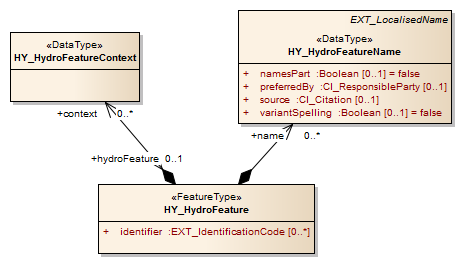
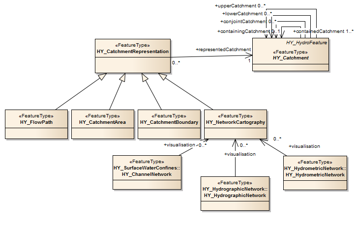
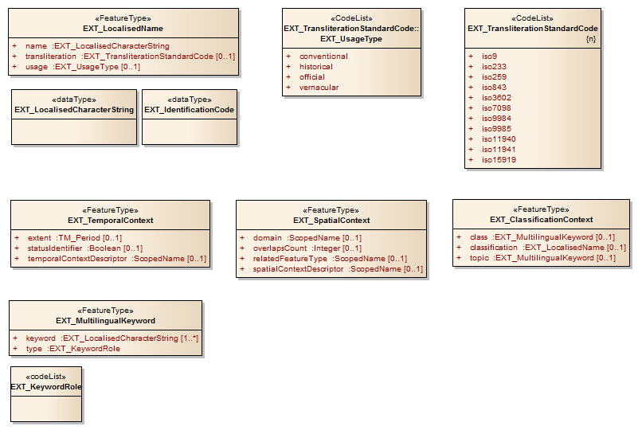

## 7. The HY\_Features common hydrologic feature model (normative)

### 7.1 The HY\_Features conceptual model

This standard defines the HY\_Features conceptual model as a standard for the identification and description of hydrologic features reflecting both hydrologic significance and topological connectivity of hydrologic features. HY\_Features formalizes the fundamental relationships between components of the hydrosphere. It describes the hydrosphere as an hierarchical network of hydrologically connected catchments, their organization in networks of catchments and/or waterbodies, and their various visual and topological realizations.

Core concepts of HY\_Features are: 1) an abstract idea of 'catchment' witch has many possible 'realizations', 2) upstream - downstream catchment topology and nested hierarchy, 3) aggregation of networks of watercourses within catchment networks, and 4) linear referencing along a river using a nominal main flow path. The single concept that governs HY\_Features is that any place on the land surface can be thought of as the outfall of a corresponding catchment and be placed into a hydrologic topology of connected, often named, hydrologic features.

The conceptual model is implemented in several discrete modules. It is intended that implementations of the conceptual model need to consider only those parts of the model required. An implementation may include or exlude feature properties, or allow cardinality one or more associations to be nillable. Table 1 lists the application schemas, the leaf packages included and the concepts reflected therein.

Table 1: HY\_Features modules, packages and concepts

| Application schema | Concepts reflected | Leaf packages included |
| --- | --- | --- |
| HY\_HydroFeature  | fundamental properties and relationships between features governed by the physical laws of Hydrology, naming of hydrologic features, location of hydrologic feature along a line | NamedFeature, HydroComplex, RiverPositioningSystem |
| HY\_SurfaceHydroFeature | hydrologic fetaures on the Earth’s land surface without complexity and detail of hydrologic and hydraulic models | ChannelNetwork, HydrographicNetwork, WaterBodyTypes, Storage |
| HY\_HydrometricNetwork | hydrometric network of logically connected hydrometric features located on or along a hydrologic feature | --- |

The conceptual model is expressed in the Geographic Information Conceptual Schema Language (ISO 19103:2005) based on the Unified Modeling Language (UML). The organization into packages and package dependencies are shown in Figure 16. The following sections describe requirements classes for each application schema, whereby each feature addressed in the requirements shall be understood as an instance of the GF_FeatureType (aka FeatureType) «metaclass». 

  
Figure 16: HY\_Features modules and packages  

### 7.2	The HY\_Features conceptual conformance (mapping)

The HY\_Features model is a 'conceptual model', not intended to be directly implementable for data exchange or persistence. The conformance target of the HY\_Feature model is therefore a logical model of an implementation that encodes aspects of the HY\_Features model. 

Conformance to the HY\_Features model is a matter of being able to unambiguously identify what elements of an implementation schema map to the HY\_Features model, and inclusion of all mandatory properties of the HY\_Feature defined Feature Types in such mappings. 

The HY\_Features conceptual model provides the basis for determining whether two references to hydrologic features are references to the same feature. i.e. to specify the real world type of features independent of their implementation or format. More specifically, it provides the means to distinguish between the reference concept (e.g. a catchment) and its realizations as geographic features (e.g. flowpath, catchment area or boundary), and hence to declare that different realizations share common hydrological connectivity. 

Disparate systems describing hydrologic features may be mapped to the equivalent HY\_Features definitions to disambiguate the local usage of terminology and specific implementation choices made. 

Note that a direct encoding of HY\_Features to an implementation format such as RDF may be implemented through annotation or direct correspondance of names to the HY\_Feature elements.

| **Requirements Class** | [/req/hy_features_conceptual_model](/req/hy_features_conceptual_model) |
| --- | --- |
| Target type | Implementation Schema |
| Name | HY\_Features Conceptual Conformance |
| Dependency | [/iso/19109/] (https://inspire-twg.jrc.it/svn/iso) |
| Requirement | [/req/ hy_features_conceptual_model/mapping] (/req/ hy_features_conceptual_model/mapping) |

An implementation schema conforming to HY\_Features SHALL provide a formal mapping from one or more Feature Types present in the implementation schema to Feature Types defined in this standard specification, including all mandatory properties defined by the realized HY\_Features concept. Default values to be assumed must be specified in this mapping.

### 7.3	The HY\_Features data conformance (encoding) 

As a conceptual model HY\_Features does not specify conformance requirements regarding the structure of possible encodings. It does however specify that equivalence of feature instances can be expressed. The requirement that arises is therefore that the content of feature identification elements can be matched between implementations. This does not demand the use of identical identifiers across different implementations, but it does require that implementations provide a mechanism to match identifiers from different schemes.

| **Requirements Class** | [/req/hy_features_content] (/req/hy_features_content) |
| --- | --- |
| Target type	| Dataset |
| Name | HY\_Features Data Conformance |
| Dependency | [/req/hy_features_conceptual_model](/req/hy_features_conceptual_model) |
| Dependency | [/iso/19109/](https://inspire-twg.jrc.it/svn/iso) |
| Dependency | [/iso/19150/](https://inspire-twg.jrc.it/svn/iso) |
| Dependency | [/iso/19136/](https://inspire-twg.jrc.it/svn/iso) |
| Requirement	| [/req/ hy_features_conceptual_model/identifiers] (/req/ hy_features_conceptual_model/identifiers) |

Implementations of HY\_Features SHALL either use common identifiers for instances of Feature Types mapped to the same underlying HY\_Features Feature Type, OR provide a mechanism to match identifiers from different identification schemes.

### 7.4 The Hydro Feature application schema

The Hydro Feature schema provides the core concepts of a named hydrologic feature, of a catchment and its multiple realisations, and of a river positioning using a linear referencing. Hydrologic features are identified by hydrologically significant characteristics and feature topology accordint to hydrologic rules. Providing a standard terminology for the typical relationships between hydrologic features allows the hydrosphere to be expressed in a consistent way across multiple data products, regardless of various spatial or temporal representations.  

Hydrologic features are usually named in cross-jurisdictional and multi-lingual contexts. The Hydro Feature schema provides a concept for a named hydrologic feature which allows the use of multiple names and identifiers without the need for a formal naming model. The named hydrologic feature is further described using various domain-specific feature types, which specify properties of the specializations to define one or more aspects of the hydrology phenomenon (Figure 17).  

Figure 17: Hydrologic features describing separate aspects of the hydrology phenomenon (UML class diagram)

The Hydro Feature schema provides the core model of catchments and their multiple realisations. The catchment model denotes the hydrologic definition of a catchment by its outlet (HY\_Outfall) and the interaction of catchments through such defined outfalls. This allows division of the hydrosphere into a logically connected network of catchments. Depending on the perspective of a particular study, the logical catchment can be realized in multiple ways by geometric or topologic features. The Hydro Feature schema provides a model to place a catchment's outfall relative to a feature which realises the logical outfall. The river positioning model provides a river reference system which allows linear referencing of an outfall (typically a monitoring location) using the linear realisation of a catchment that corresponds to another outfall (typically a confluence).

The definitions applied in the Hydro Feature schema are rooted in the definitions given in the WMO Glossary of Hydrology regardless of their application context in respect to the Earth's surface. For the purpose of testing the applicability of the conceptual model in the context of surface water hydrology, the definitions in this standard refer to surface water hydrology. A conceptual model capturing the specifics of features associated with the groundwater domain is developed with reference to the GroundWaterML standard **[ correct ref ]**.

The Hydro Feature schema contains the leaf packages: NamedFeature, HydroComplex, and RiverPositioning. Figure 18 shows the external and internal dependencies.

Figure 18: External dependencies 

| **Requirements Class** | [/req/hy_abstract/*] (/req/hy_abstract/*) |
| --- | --- |
| Target type	| Implementation schema |
| Name | HY\_HydroFeature (abstract) |
| Dependency | [/iso/19103/](https://inspire-twg.jrc.it/svn/iso) |
| Dependency | [/iso/19107/](https://inspire-twg.jrc.it/svn/iso) |
| Dependency | [/iso/19111/](https://inspire-twg.jrc.it/svn/iso) |
| Requirement	| [/req/hy_hydrofeature/namedfeature/*](/req/hy_hydrofeature/namedfeature/*) |
| Requirement	| [/req/hy_hydrofeature/hydrocomplex/*](/req/hy_hydrofeature/hydrocomplex/*) |
| Requirement	| [/req/hy_hydrofeature/positioning/*](/req/hy_hydrofeature/positioning/*) |

#### 7.4.1	The Named Feature model

The Named Feature model (Figure 19) denotes the abstraction of the hydrology phenomenon as a named hydrologic feature. It provides an approach to identify a named hydrologic feature in cross-jurisdiction and multi-lingual contexts by considering the cultural, political and historical aspects of names assigned to hydrologic features in common usage. 

Figure 19: Named Feature (UML class diagram) 

The HY\_HydroFeature feature type is further specialised by separate feature types. Each specialisation inherits the properties from generalization; HY\_HydroFeature type has one association: *name*.

The **name** association associates a name given to the hydrologic feature in cultural, political or historical context. If required, this association shall be used where names are assigned to a feature instance in cross-jurisdictional and multi-lingual contexts, that may occur with trans-boundary features. 

| **Requirements Class** | [/req/hy_hydrofeature/namedFeature/hydrofeature] (/req/hy_hydrofeature/namedFeature/hydrofeature) |
| --- | --- |
| Target type	| Implementation Schema |
| Name | HY\_HydroFeature |
| Dependency | [/req/hy_hydrofeature/namedFeature/hydrofeaturename] (/req/hy_hydrofeature/namedFeature/hydrofeaturename) | 
| Requirement	| [/req/hy_hydrofeature/namedFeature/hydrofeature.name] (/req/hy_hydrofeature/namedFeature/hydrofeature.name) | 

The HY\_HydroFeatureName feature type provides an abstract pattern to handle cultural, political and historical variability of names. This allows to assign a referencable name for all or part of a hydrologic feature without necessarily have a formal model for naming. HY\_HydroFeatureName has five attributes: name, namesPart, preferredBy, usage and variantSpelling. If required, an implementation shall use this type to describe the usage of multiple names. The usage type may be identified using the HY\_NameUsage codelist described in Annex ...,  table ... 

| **Requirements Class** | [/req/hy_hydrofeature/namedFeature/hydrofeaturename] (/req/hy_hydrofeature/namedFeature/hydrofeaturename) |
| --- | --- |
| Target type	| Implementation Schema |
| Name | HY\_HydroFeatureName |
| Dependency | [/iso/19103/](https://inspire-twg.jrc.it/svn/iso) |
| Dependency | [/iso/19115/](https://inspire-twg.jrc.it/svn/iso) |
| Dependency | [/req/hy_hydrofeature/namedFeature/nameusage](/req/hy_hydrofeature/namedFeature/nameusage) | 
| Requirement |	[/req/hy_hydrofeature/namedFeature/hydrofeature.name](/req/hy_hydrofeature/namedFeature/hydrofeature.name) | 
| Requirement	| [/req/hy_hydrofeature/namedFeature/hydrofeature.namespart](/req/hy_hydrofeature/namedFeature/hydrofeature.namespart) | 
| Requirement	| [/req/hy_hydrofeature/namedFeature/hydrofeature.preferredBy](/req/hy_hydrofeature/namedFeature/hydrofeature.preferredby) | 
| Requirement	| [/req/hy_hydrofeature/namedFeature/hydrofeature.usage](/req/hy_hydrofeature/namedFeature/hydrofeature.usage) | 
| Requirement	| [/req/hy_hydrofeature/namedFeature/hydrofeature.variantspelling](/req/hy_hydrofeature/namedFeature/hydrofeature.variantspelling) |

#### 7.4.2	The Hydro Complex model
The Hydro Complex model conceptualizes the hydrologic definition of a catchment through an 'outfall' feature with the role of getting flow from a contributing catchment, or providing inflow to a receiving catchment (Figure 20 and 21). Conceptually, each catchment has an outfall, and any outfall has a corresponding catchment, even if catchment and outfall may not be present in a particular application. A catchment interacts with upper and lower catchments via associated outfals, and ultimately contributes flow to the outfall of a containing catchment. The catchment should be understood as the logical link between outfalls.

The Hydro Complex model implies a collection of hydrologic features that form a hydrologically closed system. The union of a catchment, its inflow and outflow (conceptualised as outfalls) is realised by typical hydrologic features to form a single hydro complex. A topological realization of the logical catchment is always of higher topological  dimension than the realization of the corresponding outfall in terms of a topological boundary. For example, a linear flowpath realising a catchment may be understood as an edge between inflow and outflow nodes; the areal realisation of a catchment as a face bounded by linear inflow and outflow.

The Hydro Complex model allows an arbitrary location to be the realisation of the logical outfall. Such a 'real' outfall provides an identifiable reference to which alternative catchment realisations may refer. This supports establishment of topological relationships between hydrographic features, or hydrographic and hydrometric features. 

The Hydro Complex model allows for the catchments to be recognized and identifiers assigned through reference to an outfall even if stream networks, catchment areas or watersheds are not available. It is intended that hydrological reporting applications may use this model without the full complexity and detail of scientific catchment models.

##### 7.4.2.1	Catchment
The HY\_Catchment feature type denotes the hydrologic determination by associating an outfall, and the logical network of catchments through internal relationships. Each catchment may associate many different realisations within an implied hydro(sphere) complex under the condition of the hydrologic determination, incl. a topological realisation as an edge 'bounded' by inflow and outflow nodes. HY\_Catchment is an abstract class and may be further specialised with respect to catchment interaction. 

Figure 20: Catchment (UML class diagram) 

The HY\_Catchment type (Figure 20) specializes the general HY\_HydroFeature class. From generalization HY\_Catchment inherits the *name* property, and carries the *code* attribute and the associations: *outflow*, *inflow*, *containing Catchment*, *containedCatchment*, *conjointCatchment*, *upperCatchment*, *lowerCatchment*, *realisation*.

The **code** attribute may be used to assign to the catchment a unique identifier in given context. If required, the code attribute shall be implemented using a controlled classification or coding system. Example: WMO Basin Codes.  

The **outflow** and *inflow* associations describe the outfall in terms of outflow or inflow of the corresponding catchment. Assuming a dendritic network of catchments, the outflow of a contributing catchment coincides with the inflow to a receiving catchment. This allows to describe upstream-downstream relations. If required, this association shall be used to identify the place to which flow is contributed, or from where flow is received.

Figure 21: Catchment and outfall (UML class diagram) 

The **containingCatchment** and **containedCatchment** associations connect the nesting of catchments in a simple “is-in” containment hierarchy as typically used for high-order organization of management and reporting units. If required, this association shall be used to identify a nesting catchment or the catchments nested therein.

Figure 22: Containing / contained catchment (UML class diagram) 

The **conjointCatchment** association describes the interaction of a catchment with another catchment crossing an internal boundary line. This line may be a divide separating adjacent catchments, or a diffuse divide between non-delineated sub-catchments within an encompassing catchment, or a fictive line between distant catchments. If required, this association shall be used to identify a catchment contributing with others to a 'joined' outfall. Assuming a dendritic network of catchments, where each catchment is determined by its single outflow, this association may be used to summarize diffuse inflow into an encompassing catchment, as required to describe inflow to headwater catchments. 

Figure 23: Conjoint / contained catchment (UML class diagram) 

The **upperCatchment** and **lowerCatchment** associations connect the catchment to the adjacent catchment above or below. This allows to describe connected catchments without knowing their inflow or outflow. If required, this association shall be used to trace the catchment network in upstream direction from mouth to source, or downstream from source to mouth. 

Figure 24: Upper / lower catchment (UML class diagram)

The **realisation** association relates the catchment to a feature which realises the logical catchment. This supports to link multiple realisations of the same catchment. If required, this association shall be used identify a particular realisation. In case of a topological realisation, the realisation of the catchment shall be of higher dimension than the realisation of the outfall.

| **Requirements Class** | [/req/hy_hydrofeature/hydrocomplex/catchment] (/req/hy_hydrofeature/hydrocomplex/catchment) | 
| --- | --- |
| Target type	| Implementation schema |
| Name | HY\_Catchment | 
| Dependency | [/iso/19103/](https://inspire-twg.jrc.it/svn/iso) |
| Dependency | [/req/hy_namedFeature/hydrofeature](/req/hy_namedFeature/hydrofeature) |
| Dependency | [/req/hy_hydrofeature/hydrocomplex/outfall](/req/hy_hydrofeature/hydrocomplex/outfall) | 
| Dependency | [/req/hy_hydrofeature/hydrocomplex/catchment](/req/hy_hydrofeature/hydrocomplex/catchment) | 
| Dependency | [/req/hy_hydrofeature/hydrocomplex/catchmentrealisation](/req/hy_hydrofeature/hydrocomplex/catchmentrealisation) |
| Requirement	| [/req/hy_hydrofeature/hydrocomplex/catchment.outflow](/req/hy_hydrofeature/hydrocomplex/catchment.outflow) | 
| Requirement	| [/req/hy_hydrofeature/hydrocomplex/catchment.inflow](/req/hy_hydrofeature/hydrocomplex/catchment.inflow) | 
| Requirement	| [/req/hy_hydrofeature/hydrocomplex/catchment.containingcatchment](/req/hy_hydrofeature/hydrocomplex/catchment.containingcatchment) |
| Requirement	| [/req/hy_hydrofeature/hydrocomplex/catchment.containedcatchment](/req/hy_hydrofeature/hydrocomplex/catchment.containedcatchment) |  
| Requirement	| [/req/hy_hydrofeature/hydrocomplex/catchment.conjointcatchment](/req/hy_hydrofeature/hydrocomplex/catchment.conjointcatchment) | 
| Requirement	| [/req/hy_hydrofeature/hydrocomplex/catchment.uppercatchment](/req/hy_hydrofeature/hydrocomplex/catchment.uppercatchment) |
| Requirement	| [/req/hy_hydrofeature/hydrocomplex/catchment.lowercatchment](/req/hy_hydrofeature/hydrocomplex/catchment.lowercatchment) | 
| Requirement	| [/req/hy_hydrofeature/hydrocomplex/catchment.realisation](/req/hy_hydrofeature/hydrocomplex/catchment.realisation) |
 
##### 7.4.2.2	CatchmentAggregate 
The HY\_CatchmentAggregate feature type (Figure 25) specializes the HY\_Catchment specifically as a set of dendritic and interior catchments, arranged in an encompassing catchment at the next upper hierarchy level without any spatial overlap. This allows to describe multiple inflows into a catchment aggregate through several hydrologically discrete sub-catchments each with a single inflow, and contributing to a joined outflow of the catchment aggregate, incl. the 'nillable' outflow of interior catchments. The catchment aggregate may be part of a containing catchment at the next higher hierarchy level, which consists of many of those neighbouring catchments. This does not necessarily implies a series of containing catchments, but allows jumping to the 'highest' upper-level system as typically used for reporting purposes.

Figure 25: Catchment aggregate (UML class diagram)

HY\_CatchmentAggregate inherits from generalization the *outflow*, *inflow*, *containing Catchment*, *containedCatchment*, *conjointCatchment*, *upperCatchment*, *lowerCatchment*, and *realisation* properties, and associates the *exorheicDrainage* and *endorheicDrainage*. 

The **exorheicDrainage** association references an exorheic drained catchment connected to others in a dendritic network. The **endorheicDrainage** association references an endorheic drained catchment, temporarily connected to the enveloping aggregate. If required, these asscoations shall be used to identify aggegrated catchment parts which permanently or temporarily interact with other catchment parts at the same hierarchy level. 

| **Requirements Class** | [/req/hy_hydrofeature/hydrocomplex/catchmentaggregate](/req/hy_hydrofeature/hydrocomplex/catchmentaggregate) | 
| --- | --- |
| Target type	| Implementation schema |
| Name | HY\_CatchmentAggregate | 
| Dependency | [/req/hy_hydrofeature/hydrocomplex/catchment](/req/hy_hydrofeature/hydrocomplex/catchment) | 
| Dependency | [/req/hy_hydrofeature/hydrocomplex/dendriticcatchment](/req/hy_hydrofeature/hydrocomplex/dendriticcatchment) |
| Dependency | [/req/hy_hydrofeature/hydrocomplex/interiorcatchment](/req/hy_hydrofeature/hydrocomplex/interiorcatchment) |
| Requirement	| [/req/hy_hydrofeature/hydrocomplex/catchmentaggregate.exorheicdrainage](/req/hy_hydrofeature/hydrocomplex/catchmentaggregate.exorheicdrainage) | 
| Requirement	| [/req/hy_hydrofeature/hydrocomplex/catchmentaggregate.endorheicdrainage](/req/hy_hydrofeature/hydrocomplex/catchmentaggregate.endorheicdrainage) |

##### 7.4.2.3	DendriticCatchment
The HY\_DendriticCatchment feature type (Figure 26) specializes the general HY\_Catchment class specifically as a hydrologically discrete catchment, which is determined by a single common outlet to which all waters flow. This class denotes the catchment as the topological link between an inflow and an outflow allowing catchments to be connected in a dendritic network by upstream-downstream relationships, without knowing the complex hydrology between inflow and outflow. This concept requires a stable identifier that is not merely a function of an arbitrary delineation of the surface, and that catchments are delineated within a simple tree hierarchy. 

Figure 26: Dendritic catchment (UML class diagram)

HY\_DendriticCatchment inherits from generalization the *code*, *outflow*, *inflow*, *containing Catchment*, *containedCatchment*, *conjointCatchment*, *upperCatchment*, *lowerCatchment*, and *realisation* properties, and associates the *encompassingCatchment*.

The **encompassingCatchment** association relates to the dendritic catchment the aggregate encompassing the catchment. If required, this association shall be used to identify the catchment encompassing one or more exorheic or endorheic drained catchments contributing flow to the common outlet, either from a single identified inflow, or in join with other sub-catchments crossing a divide intern of the encompassing aggregate.

| **Requirements Class** | [/req/hy_hydrofeature/hydrocomplex/dendriticcatchment] (/req/hy_hydrofeature/hydrocomplex/dendriticcatchment) | 
| --- | --- |
| Target type	| Implementation schema |
| Name | HY\_DendriticCatchment | 
| Dependency | [/req/hy_hydrofeature/hydrocomplex/catchment](/req/hy_hydrofeature/hydrocomplex/catchment) | 
| Dependency | [/req/hy_hydrofeature/hydrocomplex/catchmentaggregate](/req/hy_hydrofeature/hydrocomplex/catchmentaggregate) |
| Requirement	| [/req/hy_hydrofeature/hydrocomplex/dendriticcatchment.encompassingcatchment](/req/hy_hydrofeature/hydrocomplex/dendriticcatchment.encompassingcatchment) |

##### 7.4.2.4	InteriorCatchment
The HY\_InteriorCatchment feature type (Figure 27) specializes the general HY\_Catchment class specifically as a hydrologically discrete catchment, which is generally not connected to other catchments. This class describes the interior catchment as a catchment enveloped by other catchments to which it may temporary contribute. 

Figure 27: Interior catchment (UML class diagram)

HY\_InteriorCatchment inherits from generalization the *code*, *outflow*, *inflow*, *containing Catchment*, *containedCatchment*, *conjointCatchment*, *upperCatchment*, *lowerCatchment*, and *realisation* properties, and associates the *envelopingCatchment*.

The **envelopingCatchment** association relates to the interior catchment the aggregate surrounding the catchment. If required, this association shall be used to identify the catchment enveloping one or more endorheic drained catchments contributing 'nillable' flow to the common outlet. 

| **Requirements Class** | [/req/hy_hydrofeature/hydrocomplex/interiorcatchment](/req/hy_hydrofeature/hydrocomplex/interiorcatchment) | 
| --- | --- |
| Target type	| Implementation schema |
| Name | HY\_InteriorCatchment | 
| Dependency | [/req/hy_hydrofeature/hydrocomplex/catchment](/req/hy_hydrofeature/hydrocomplex/catchment) | 
| Dependency | [/req/hy_hydrofeature/hydrocomplex/catchmentaggregate](/req/hy_hydrofeature/hydrocomplex/catchmentaggregate) |
| Requirement	| [/req/hy_hydrofeature/hydrocomplex/interiorcatchment.envelopingcatchment](/req/hy_hydrofeature/hydrocomplex/interiorcatchment.envelopingcatchment) |

##### 7.4.2.5	Outfall
The HY\_Outfall feature type (Figure 28) denotes the hydrologic determination of the outfall by associating a corresponding catchment (Figure 20). The logical outfall marks the place where a catchment interacts with another catchment, i.e. where the outflow of a contributing catchment becomes inflow into a receiving catchment, whereby a catchment may receive flow from several catchments. Logically placed in reference to a catchment which links inflow and outflow, an outfall has a position relative to another outfall 'fixed' by the  catchment. Each outfall may associate different realisations within an implied hydro(sphere) complex under the condition of the hydrologic determination, incl. the topological realisation as a node in terms of the 'boundary' of a catchment edge. 

Figure 28: Outfall (UML class diagram)

HY\_Outfall carries the associations: *contributingCatchment*, *receivingCatchment*, *relativePosition* and *outfallRealisation*. 

The **contributingCatchment** association relates to the outfall a catchment that contributes flow. This allows to relate to an outflow an identified inflow and to determine its position through referencing this. If required, this association shall be used to identify the catchment connecting the outfall and the inflow used for reference.  

The **receivingCatchment** association relates to the outfall a catchment that receives flow from here. This allows to relate to an inflow an identified outflow and to determine its position through referencing this. If required, this association shall be used to identify the catchment connecting the outfall and the outflow used for reference. 

The **relativePosition** association assigns to the outfall a position relative to a reference location fixed in the logical network of catchments. This means that the position of an outfall is determined relative to another realised outfall. If required, this association shall be used to assign a position to an inflow or outflow of a catchment using existing reference location.  

The **outfallRealisation** association relates the outfall to a feature which realises the logical outfall. If required, this association shall be used to describe the 'real' object considered to be outfall of a catchment. In case of a topological realisation, the realisation of the outfall shall be of lower dimension than the realisation of the corresponding catchment.

| **Requirements Class** | [req/hy_hydrofeature/hydrocomplex/outfall] (req/hy_hydrofeature/hydrocomplex/outfall) | 
| --- | --- |
| Target type	| Implementation schema |
| Name | HY\_Outfall | 
| Dependency | [/req/hy_hydrofeature/hydrocomplex/catchment](/req/hy_hydrofeature/hydrocomplex/catchment) |
| Dependency | [/req/hy_hydrofeature/hydrocomplex/indirectposition](/req/hy_hydrofeature/hydrocomplex/indirectposition) | 
| Dependency | [/req/hy_hydrofeature/hydrocomplex/outfallrealisation](/req/hy_hydrofeature/hydrocomplex/outfallrealisation) | 
| Requirement	| [/req/hy_hydrofeature/hydrocomplex/outfall.contributingcatchment](/req/hy_hydrofeature/hydrocomplex/outfall.contributingcatchment) |
| Requirement	| [/req/hy_hydrofeature/hydrocomplex/outfall.receivingcatchment](/req/hy_hydrofeature/hydrocomplex/outfall.receivingcatchment) |
| Requirement	| [/req/hy_hydrofeature/hydrocomplex/outfall.relativeposition](/req/hy_hydrofeature/hydrocomplex/outfall.relativeposition) |
| Requirement	| [/req/hy_hydrofeature/hydrocomplex/outfall.outfallrealisation](/req/hy_hydrofeature/hydrocomplex/outfall.outfallrealisation) |

##### 7.4.2.6	Catchment Realisation
The HY\_CatchmentRealisation feature type (Figure 29) conceptualizes the multiple realisation of a 'un-realised', logical catchment by typical features in common use to communicate the common recognition of a catchment as the unit of study shared across sub-domains. However, particular realisations may refer only to one or the other. HY\_Flowpath, HY\_CatchmentBoundary, and HY\_Catchment Area are special types defined to topologically realise the hydrologic determination of the logical catchment in terms of face, edge and node, as well as to reflect the connectivity of catchments by hydrologic features connected in typical networks. The HY\_HydroNetwork type realises a logical catchment in the enirety of connected network features, whereas the HY\_CartographicRealisation realises a catchment as set of map layers. The implied topological relationships 'boundary' and 'spoke' reference the ISO topology model described in the ISO1907: Spatial Schema, whereby the realised outfall is always of lower dimension than the realised catchment. 

The catchment realisation concept implies a hydro(sphere) complex in such that if a catchment realisation exists, these features are in the same hydrologic complex as the catchment they realise. In this way any feature realisation of a logical catchment references the hydrologic determination of the realised catchment. If the realised catchment is connected with other catchments via its outfall, possible feature realisations are also connected. 

Figure 29: Catchment realisation (UML class diagram)

The catchment realisation feature types defined in this standard refer to objects on the land surface for the purpose of testing the applicability of the conceptual model in the context of surface water hydrology. In other contexts other types of catchment realisation may exist. Catchment realisations that not conform to the special types defined in this standard, for instance realisations in 3-dimensional perspectives, or in time, may use the general HY\_CatchmentRealisation type. HY\_CatchmentRealisation carries the *realisedCatchment* association implying the *hydroComplex* feature collection **[(in the conceptual model described by means of 'tagged value') - mention tagged values in general?]**. 

The **realisedCatchment** association relates a particular realisation with exactly the catchment that this feature realises. Referencing the hydrologic complex encompassing the catchment and its realisations, allows the existence of catchments to be recognized without the complexity and detail of a scientific model, and to link multiple realisations. Referencing the hydrologic determination, topological relationships can be established and common identifiers assigned. If required, this association shall be used to identify the unit of study realised in a domain-specific feature. 

| **Requirements Class** | [/req/hy_hydrofeature/hydrocomplex/catchmentrealisation] (/req/hy_hydrofeature/hydrocomplex/catchmentrealisation)|
| --- | --- |
| Target type	| Implementation schema |
| Name | HY\_CatchmentRealisation | 
| Dependency | [/req/hy_hydrofeature/hydrocomplex/catchment](/req/hy_hydrofeature/hydrocomplex/catchment) | 
| Requirement	| [/req/hy_hydrofeature/hydrocomplex/catchmentrealisation.realisedcatchment](/req/hy_hydrofeature/hydrocomplex/catchmentrealisation.realisedcatchment) |

The HY\_Flowpath feature type specialises HY\_CatchmentRealisation with respect to an implied linear geometric representation, incl. a straight line. The flowpath connecting the inflow and outflow of the logical catchment, is topologically understood as an edge bounded by inflow node and outflow nodes, and corresponding to left-bank and right-bank catchment faces. The 'boundary' and 'spoke' properties are described by means of 'tagged values': the topological 'boundary' is of type HY\_OutfallRealisation, the topological 'spoke' of type HY\_CatchmentArea. 

HY\_Flowpath inherits from generalization the *realisedCatchment* association incl. *hydroComplex*, and carries the properties: *shape*, *flowpathNetwork*, and *contourLine*. 

The **shape** attribute defines the linear geometric representation. If required, an implementation shall use a geometry type  defined in ISO19107: Spatial Schema, e.g. GM_Curve type.

The **contourLine** association relates a contour line accompanying a given flowpath. ContourLine references the inflow and outflow node of the flowpath, and allows for an additional linear realisation of a catchment bound to the inflow and outflow nodes of a flowpath. If required, this association shall be used to assign isolines of some kind to a flowpath.     

The **flowpathNetwork** association defines a network as sequence of connected flowpathes. This concept requires a non-branching 'mainstem' of watercourses, and a single linear representation of each of these. If required, this association may be used to identify a network the realises in its entirety a catchment that contains the catchment which is realised by the network part. 

| **Requirements Class** | [req/hy_hydrofeature/hydrocomplex/flowpath] (req/hy_hydrofeature/hydrocomplex/flowpath) | 
| --- | --- |
| Target type	| Implementation schema |
| Name | HY\_Flowpath | 
| Dependency | [/iso/19107/](https://inspire-twg.jrc.it/svn/iso) |
| Dependency | [/req/hy_hydrofeature/hydrocomplex/catchmentrealisation](/req/hy_hydrofeature/hydrocomplex/catchmentrealisation) |
| Dependency | [/req/hy_hydrofeature/hydrocomplex/contourline](/req/hy_hydrofeature/hydrocomplex/contourline) | 
| Dependency | [/req/hy_hydrofeature/hydrocomplex/hydronetwork](/req/hy_hydrofeature/hydrocomplex/hydronetwork) | 
| Requirement	| [/req/hy_hydrofeature/hydrocomplex/flowpath.shape](/req/hy_hydrofeature/hydrocomplex/flowpath.shape) |
| Requirement	| [/req/hy_hydrofeature/hydrocomplex/flowpath.contourline](/req/hy_hydrofeature/hydrocomplex/flowpath.contourline) |
| Requirement	| [/req/hy_hydrofeature/hydrocomplex/flowpath.flowpathnetwork](/req/hy_hydrofeature/hydrocomplex/flowpath.flowpathnetwork) |

HY\_ContourLine feature type specialises the HY\_Flowpath class. It defines a linear contour accompanied to a given flowpath incl. a single polygon. Topologically, the contour is also a flowpath connecting the same inflow node and outflow node, but appears simultaneously to the flowpath. Connecting equal values of a certain property, the contour line may represent shore lines, stream lines or other isolines. HY\_ContourLine inherits all properties from generalisation; it carries a *shape* attribute on its own. 

The HY\_CatchmentBoundary feature type specialises HY\_CatchmentRealisation with respect to an implied linear geometric representation, incl. single polygon. The catchment boundary connecting the inflow and outflow of the logical catchment, whereby inflow and outflow may overlay. It is topologically understood as an edge bounded by inflow node and outflow nodes, and corresponding to left-bank and right-bank catchment faces inside of the boundary. The 'boundary' and 'spoke' properties are described by means of 'tagged values': the topological 'boundary' is of type HY\_OutfallRealisation; the topological 'spoke' is of type HY\_CatchmentArea. 

HY\_CatchmentBoundary inherits from generalization the *realisedCatchment* association incl. *hydroComplex*, and carries the properties: *shape*, and *boundaryNetwork*. 

The **shape** attribute defines the linear geometric representation. If required, an implementation shall use a geometry type  defined in ISO19107: Spatial Schema, e.g. GM_CompositeCurve type.

The **boundaryNetwork** association defines a network as mesh of connected boundaries. This concept requires a mesh of non-overlapping boundary lines, and a single linear representation of each of these. If required, this association may be used to identify a network the realises in its entirety a catchment that contains the catchment which is realised by the network part. 

| **Requirements Class** | [req/hy_hydrofeature/hydrocomplex/catchmentboundary] (req/hy_hydrofeature/hydrocomplex/catchmentboundary) | 
| --- | --- |
| Target type	| Implementation schema |
| Name | HY\_CatchmentBoundary | 
| Dependency | [/iso/19107/](https://inspire-twg.jrc.it/svn/iso) |
| Dependency | [/req/hy_hydrofeature/hydrocomplex/catchmentrealisation](/req/hy_hydrofeature/hydrocomplex/catchmentrealisation) |
| Dependency | [/req/hy_hydrofeature/hydrocomplex/hydronetwork](/req/hy_hydrofeature/hydrocomplex/hydronetwork) | 
| Requirement	| [/req/hy_hydrofeature/hydrocomplex/catchmentboundary.shape](/req/hy_hydrofeature/hydrocomplex/catchmentboundary.shape) |
| Requirement	| [/req/hy_hydrofeature/hydrocomplex/catchmentboundary.boundarynetwork](/req/hy_hydrofeature/hydrocomplex/catchmentboundary.boundarynetwork) |

The HY\_CatchmentArea feature type specialises HY\_CatchmentRealisation with respect to an implied areal geometric representation, incl. plane surface. The catchment area connecting the inflow and outflow of the logical catchment, is topologically understood as a  face bounded inwards by an inflow edge and outwards by an outflow edge. The 'boundary' is described by means of 'tagged values': the inward directed 'boundary' is of type HY\_CatchmentBoundary, the outward directed 'boundary' of type HY\_Flowpath. A topological 'spoke' is not defined in this standard. 

HY\_CatchmentArea inherits from generalization the *realisedCatchment* association incl. *hydroComplex*, and carries the properties: *shape*, and *areaNetwork*. 

The **shape** attribute defines the linear geometric representation. If required, an implementation shall use a geometry type  defined in ISO19107: Spatial Schema, e.g. GM_Surface type.

The **areaNetwork** association defines an aggregate of catchment areas forming a connected network. This concept requires a non-overlapping aggregate of areas, and a single areal representation of each of these. If required, this association may be used to identify a network the realises in its entirety a catchment that contains the catchment which is realised by the network part. 

| **Requirements Class** | [req/hy_hydrofeature/hydrocomplex/catchmentarea] (req/hy_hydrofeature/hydrocomplex/catchmentarea) | 
| --- | --- |
| Target type	| Implementation schema |
| Name | HY\_CatchmentArea | 
| Dependency | [/iso/19107/](https://inspire-twg.jrc.it/svn/iso) |
| Dependency | [/req/hy_hydrofeature/hydrocomplex/catchmentrealisation](/req/hy_hydrofeature/hydrocomplex/catchmentrealisation) |
| Dependency | [/req/hy_hydrofeature/hydrocomplex/hydronetwork](/req/hy_hydrofeature/hydrocomplex/hydronetwork) | 
| Requirement	| [/req/hy_hydrofeature/hydrocomplex/catchmentarea.shape](/req/hy_hydrofeature/hydrocomplex/catchmentarea.shape) |
| Requirement	| [/req/hy_hydrofeature/hydrocomplex/catchmentarea.boundarynetwork](/req/hy_hydrofeature/hydrocomplex/catchmentarea.areanetwork) |

The HY\_HydroNetwork feature type specialises HY\_CatchmentRealisation with respect to a network of connected hydrologic features. Such a network realises in its entirety the hierarchical network of logically connected catchments, which are contained in an ultimate high-order catchment. It may be a sequence of flowpathes, an aggregate of catchment areas or a mesh of catchment boundaries.  HY\_HydroNetwork inherits from generalization the *realisedCatchment* association incl. *hydroComplex*, and carries the associations *flowpath*, *catchmentBoundary* and *catchmentArea*. 

The HY\_CartographicRealisation feature type specialises HY\_CatchmentRealisation separate cartographic layers or maps, displaying a network of hydrologic features which may be connected at the representation level, or not. HY\_HydroNetwork inherits from generalization the *realisedCatchment* association incl. *hydroComplex*.

##### 7.4.2.7	Outfall Realisation 
The HY\_OutfallRealisation feature type (Figure 30) conceptualizes the idea of an arbitrary feature of interest that may be considered as outfall. Referencing the hydrologic determination of a catchment by the outfall, various hydrologic features may by associated to a corresponding catchment through reference to the outfall realisation feature. Any feature referencing the outfall realisation within an implied hydro(sphere) complex may realise the logical outfall, specifically as a permanent, stable location fixed or referenced by coordinates. 

Permanent, fixed landmarks such as confluences, points at cross or longitudinal sections, position of a monitoring station on a river are typical outfall realisations. In other than surface water contexts other types may realise a catchment's logical outfall. Outfall realisations that not support the associations defined for surface water in this standard, e.g. a spring where groundwater enters the surface, or a point projected onto the surface or created from merging disjoint locations, may use or specialise the general HY\_OutfallRealisation type. 

The HY\_OutfallRealisation is topologically understood as boundary of the corresponding catchment, and always of lower dimension than the realised catchment. With respect to the very common topological realisation of a catchment as an edge, a 'spoke' property of type HY_Flowpath is described by means of a 'tagged value' and used to associate an upstream and downstream flowpath. The outfall realisation may be represented by any geometric object, incl. a single point.

Figure 30: Outfall realisation (UML class diagram) 

HY\_OutfallRealisation carries the *realisedOutfall* association implying the *hydroComplex* feature collection, and carries two attributes: *shape* and *outfallType*. 

The **realisedOutfall** association identifies exactly the catchment that contributes to the outfall, or that receives flow from the outfall. This allows identifiers to be assigned to a catchment even if flowpath, catchment area or stream network are not reliably determined. If required, this association shall be used to identify the logical outfall which is referenced by the hydrologic feature that realises the logical catchment either on separately, or as part of a typical network. 

The **shape** attribute defines the geometric representation of the realised outfall, here with the option to use a geometry type defined in ISO19107: Spatial Schema, if required.
  
The *outfallType* attribute provides a list of terms in common use to express verbally the type of the realised outfall. If required, an implementation may use a term from the HY\_TypeOfOutfall codelist. Note that alternative code lists may be used but should be related to the terms in Annex ..., table ...  **[correct reference]** using an appropriate formalism.  

| **Requirements Class** | [/req/hy_hydrofeature/hydrocomplex/outfallrealisation] (/req/hy_hydrofeature/hydrocomplex/outfallrealisation) | 
| --- | --- |
| Target type	| Implementation schema |
| Name | HY\_CatchmentRealisation | 
| Dependency | [/iso/19107/...](https://inspire-twg.jrc.it/svn/iso) |
| Dependency | [/req/hy_hydrofeature/hydrocomplex/outfall](/req/hy_hydrofeature/hydrocomplex/outfall) | 
| Dependency | [/req/hy_hydrofeature/hydrocomplex/typeofoutfall](/req/hy_hydrofeature/hydrocomplex/typeofoutfall) | 
| Requirement	| [/req/hy_hydrofeature/hydrocomplex/outfallrealisation.realisedoutfall](/req/hy_hydrofeature/hydrocomplex/outfallrealisation.realisedoutfall) ]
| Requirement	| [/req/hy_hydrofeature/hydrocomplex/outfallrealisation.shape](/req/hy_hydrofeature/hydrocomplex/outfallrealisation.shape) ]
| Requirement	| [/req/hy_hydrofeature/hydrocomplex/outfallrealisation.typeofoutfall](/req/hy_hydrofeature/hydrocomplex/outfallrealisation.typeofoutfall) ]

#### 7.4.3	The River Positioning System model
The River Positioning System provides a simple model to place a feature of interest 'on a river' using its topological realization. It introduces the concept of Indirect Position where a position is determined relative to an already established reference location. This concept uses a linear river reference system whose origin is set at the outfall of the catchment that corresponds to the feature of interest, and whose linear shape is given by the flowpath realising the catchment between the origin and the reference location. It is important to note, that each logical catchment has its own reference system, and must have one outfall (origin) and one linear flowpath realisation (shape). 

The River Positioning System references the topological realization of catchment and outfall within an implied hydro(sphere) complex in such that origin and referent of the reference system are nodes on the boundary of the flowpath shape. Given that the flowpath realizes a logical catchment between inflow and outflow nodes, the feature of interest realizes either the inflow or outflow node of the catchment determined by the corresponding reference location upstream or downstream. Using reference locations in both directions will allow to place a feature of interest interpolative between identified inflow and outflow nodes on the flowpath, even if the realised catchment is not explicitly delineated. 

Figure 31: River Positioning System (UML class diagram)

The HY\_IndirectPosition feature type defines the indirect position, expressed either as the absolute distance to a reference point, or relative to the reference point or to the distance (interpolative).  Indirect position assigns to an feature of interest realizing an outfall a position in reference to an existing outfall realization using a linear river reference system.  HY\_IndirectPosition carries four properties: absolute, relative, referenceLocation, riverReferenceSystem. An implementation may use ISO 19148(2012): LinearReferencing understanding the feature to be placed as an ‘Event’ at a *locating* indirect position  in distance to an already *located* outfall realisation, and this distance expressed  as a *linear Element* (flowpath)  *fromReferent*  (outfall realization) *towardsReferent* (outfall realization).

The **absolute** attribute provide an distance expression as absolute value, including an indication of accuracy and precision of the absolute value; the **relative** attribute provides an expression for the relative and interpolative distance value. If required, an implementation shall use these attributes to express the absolute or relative value using the HY\_DistanceToRefPoint and HY_RelativePosition data types, or other basic types defined in ISO19103: Conceptual Schema. To express a relative position verbally, a term from the HY\_RelativePositionDescription  code list of terms commonly used in hydrology to describe a spatial relationship between two locations may be used. Note that alternative code lists may be used but should be related to the terms in Annex …, table ... **[correct ref]** using an appropriate formalism. 

The **referenceLocation** association describes an existing outfall realization used for reference. If required, this association shall be used to identify a permanent reference location relative to which a position is assigned to an outfall, or the feature of interest realizing the outfall. 

The **riverReferenceSystem** association describes the special linear coordinate system applied to assign the position. If required, this association shall be used to identify the origin and shape of reference system used to place an outfall, or the feature of interest realizing the outfall; an implementation may use the HY_RiverReferenceSystem feature type defined in this standard.

HY\_IndirectPosition feature type defines an indirect position, either expressed as the distance to a reference point or as position relative to a reference point or to the distance (interpolative). HY\_IndirectPosition associates four properties: *absolute*, *relative*, *referenceLocation*, *riverReferenceSystem*.

| **Requirements Class** | [/req/hy_hydrofeature/riverpositioningsystem/indirectposition] (/req/hy_hydrofeature/riverpositioningsystem/indirectposition) |
| --- | --- |
| Target type	| Implementation Schema |
| Name | HY\_IndirectPosition |
| Dependency | [/req/hy_hydrofeature/hydrocomplex/referencelocation] (/req/hy_hydrofeature/hydrocomplex/referencelocation) | 
| Dependency | [/req/hy_hydrofeature/riverpositioningsystem/distancetorefpoint] (/req/hy_hydrofeature/riverpositioningsystem/distancetorefpoint) | 
| Dependency | [/req/hy_hydrofeature/riverpositioningsystem/relativeposition] (/req/hy_hydrofeature/riverpositioningsystem/relativeposition) | 
| Dependency | [/req/hy_hydrofeature/riverpositioningsystem/riverreferencesystem] (/req/hy_hydrofeature/riverpositioningsystem/riverreferencesystem) | 
| Requirement |	[/req/hy_hydrofeature/riverpositioningsystem/indirectposition.absolut]  (/req/hy_hydrofeature/riverpositioningsystem/indirectposition.absolut)
| Requirement |	[/req/hy_hydrofeature/riverpositioningsystem/indirectposition.relative]  (/req/hy_hydrofeature/riverpositioningsystem/indirectposition.relative)
| Requirement |	[/req/hy_hydrofeature/riverpositioningsystem/indirectposition.referencelocation]  (/req/hy_hydrofeature/riverpositioningsystem/indirectposition.referencelocation) |
| Requirement |	[/req/hy_hydrofeature/riverpositioningsystem/indirectposition.riverreferencesystem]  (/req/hy_hydrofeature/riverpositioningsystem/indirectposition.riverreferencesystem) |

The HY\_RiverReferenceSystem feature class specializes the ISO LinearCS feature type for a linear coordinate system using inflow and outflow nodes on the linear flowpath. The origin of the river reference system is set at the outfall to be placed. The geometric shape is defined by the linear flowpath realizing the catchment between the origin and an identified reference location upstream or downstream of the origin. The position on flowpath is provided as distance from the located start of the flowpath at origin and end at the reference location towards the flowpath is directed. HY\_RiverReferenceSystem inherits from generalization the *axis* property, and carries the associations *linearElement* and *locatedStart*.

The **linearElement** association defines the flowpath as the linear shape applied in the river reference system, and the **locatedStart** association defines the outfall as the origin. Bounded by inflow node and outflwo node, the flowpath starts at the feature of interest realizing the origin. If required, these associations shall be used to identify the flowpath used as shape, and the start of the flowpath at a realized origin.

| **Requirements Class** | [/req/hy_riverpositioningsystem/riverreferencesystem] (/req/hy_riverpositioningsystem/indirectposition.riverreferencesystem) |
| --- | --- |
| Target type	| Implementation Schema |
| Name | HY\_RiverReferenceSystem |
| Dependency | [/iso/19111/...](https://inspire-twg.jrc.it/svn/iso) |
| Dependency | [/req/hy_hydrofeature/hydrocomplex/outfall] (/req/hy_hydrofeature/hydrocomplex/outfall) | 
| Dependency | [/req/hy_hydrofeature/hydrocomplex/flowpath] (/req/hy_hydrofeature/hydrocomplex/flowpath) |
| Requirement |	[/req/hy_hydrofeature/riverpositioningsystem/riverreferencesystem.locatedstart]  (/req/hy_hydrofeature/riverpositioningsystem/indirectposition.locatedstart) |
| Requirement |	[/req/hy_hydrofeature/riverpositioningsystem/riverreferencesystem.linearelement]  (/req/hy_hydrofeature/riverpositioningsystem/riverreferencesystem.linearelement) |

## 7.5 The Surface Hydro Feature application schema

The Surface Hydro Feature application schema provides common concepts of hydrologic features occurring on the land surface specifying the core concepts defined in the abstract Hydro Feature application schema. This will enable contextually related information models to build relationships to the multiple realized catchment.  Providing a standard terminology for the relationships between surface water features, typical realizations of the logical catchment and its conceptual outfall can be described in a consistent way. The definitions in this package are rooted in the definition given in the WMO Glossary of Hydrology which defines the channel network regardless of the location in respect to the Earth's surface. For the purpose of testing the applicability of the conceptual model in the context of surface water hydrology, in this standard 'channel network' and its parts refer to surface channels, incl. large interstices in the ground. 

The Surface Hydro Feature schema conceptualizes the accumulation of on the land surface in typical water bodies, each special by origin, size, or the property to move. With respect to the management of water resources, a simple concept of water storage is provided that allows to consider any water body type as a reservoir. Following the conceptual separation of a watercourse into water body and containing channel,  the Surface Hydro Feature schema defines the network of connected depressions and channels on land surface which periodically or continuously contain water, and separate from this the hydrographic network of permanent or temporary water bodies using the channel network as connecting system. 

The Surface Hydro Feature application schema contains the leaf packages: Channel Network, Hydrographic Network, Water Body Types and Storage. Figure 32 shows the external and internal dependencies.

Figure 32: Surface Hydro Feature, external and internal dependencies 

### 7.5.1 The Channel Network model
The Channel Network model defines a network of connected depressions and channels which in its entirety realizes a logical catchment (Figure 33), usually as a network of linear  flowpathes realizing catchments connected to each other within the containing catchment realized by the entire network.  This allows to represent the drainage pattern, even if logically connected features may or may not be connected at the representation level.

Figure 33: Channel Network realization of catchment (UML class diagram)

The channel network is defined independent of the hydrographic network. This conceptual separation references to the specific concerns of hydraulics focused on the analysis and design of channels and conduits. It allows to realize the logical catchment as a network of connected channels and depressions, regardless of water is contained therein or not.  

A single depression or channel may realize the logical catchment either as part of the network, or via a reference location which realizes the conceptual outfall of the catchment realized by the channel or depression (Figure 34). For example, a point at an associated cross or longitudinal section may be considered to realize the outflow of the catchment which is realized by the channel expressed as a flowpath.  

Figure 34: Channel realization of outfall (UML class diagram)

#### 7.5.1.1 ChannelNetwork
The HY\_ChannelNetwork feature type specializes the HY\_HydroNetwork realization defined in the core model, specifically as an aggregate of surface depressions and surface channels which continuously or periodically contain water, without imposing a particular drainage pattern. This allows to represent the network, even if logically connected features may or may not be connected at the representation level. If the realized catchment is connected with other catchments via outfall, the channel network is considered connected to the channel network realizing these catchments.  If required, an application focused on the structures containing a water body may use the defined relationships s to describe the realization of a catchment by the channel network, or network parts associated with the hydrographic network.

HY\_ChannelNetwork associates the *surfaceDepression* and *surfaceChannel*, and carries a *drainagePattern* attribute; it inherits from generalization the *realizedCatchment*  and *flowpath* associations. Depending on the application, the channel network and the related features may be described by suitable attributes. A *flowpath* constraint is defined such that whenever the channel network is a network of flowpathes, the surface channel is of type HY_Flowpath, and a *contourline* constraint such that whenever the channel network is a network of flowpathes, and the flowpath accompanies a contourline, the surface depression is of type HY_ContourLine.

The **drainagePattern** attribute describes in general the drainage pattern. If required, an implementation may use a term from the HY\_DrainagePattern codelist.  Note that alternative code lists may be used but should be related to the terms in Annex ... , table ... . **[insert reference]** using an appropriate formalism. 

The **surfaceDepression** association relates a depression which may contain stagnant water or not to the channel network. If required, this association shall be used to identify a depression which realizes the logical catchment either separately, or as part of the channel network.

The **surfaceChannel** association relates a channel which may contain moving water or not to the channel network. If required, this association shall be used to identify a surface channel which realizes the logical catchment either separately, or as part of the channel network.

| **Requirements Class** | [/req/hy_surfacehydrofeature/channelnetwork/channelnetwork] (/req/hy_surfacehydro/channelnetwork/channelnetwork) |
| --- | --- |
| Target type	| Implementation Schema |
| Name | HY\_ChannelNetwork |
| Dependency | [/req/hy_abstract/hydrocomplex/hydronetwork] (/req/hy_abstract/hydrocomplex/hydronetwork) | 
| Dependency | [/req/hy_surfacehydrofeature/channelnetwork/drainagepattern] (/req/hy_surfacehydrofeature/channelnetwork/drainagepattern) | 
| Dependency | [/req/hy_surfacehydrofeature/channelnetwork/depression] (/req/hy_surfacehydrofeature/channelnetwork/depression) | 
| Dependency | [/req/hy_surfacehydrofeature/channelnetwork/channel] (/req/hy_surfacehydrofeature/channelnetwork/channel) | 
| Requirement |	[/req/hy_surfacehydrofeature/channelnetwork/channelnetwork.drainagepattern]  (/req/hy_surfacehydrofeature/channelnetwork/channelnetwork.drainagepattern) |
| Requirement |	[/req/hy_surfacehydrofeature/channelnetwork/channelnetwork.surfacedepression]  (/req/hy_surfacehydrofeature/channelnetwork/channelnetwork.surfacedepression) |
| Requirement |	[/req/hy_surfacehydrofeature/channelnetwork/channelnetwork.surfacechannel]  (/req/hy_surfacehydrofeature/channelnetwork/channelnetwork.surfacechannel) |

#### 7.5.1.2 Depression 
The HY\_Depression feature type specializes the general HY\_HydroFeature class. It describes land lower than the surrounding land as container for standing water. A depression is part of the network of channels and depressions forming the connecting system for the wherein water bodies stand as parts of hydrographic network. HY\_Depressions inherits from generalization the *name* property. It associates the *surfaceNetwork* in which it participates  and a body of *standingWater* .

The **standingWater** association relates to the water body of stagnant water. This allows to establish a relationship to a water body carrying a permanent reference location which realizes the outfall of the catchment realized by the associated water body. If required, this association shall be used to identify the water body contained in the depression. 

| **Requirements Class** | [/req/hy_surfacehydrofeature/channelnetwork/depression] (/req/hy_surfacehydrofeature/channelnetwork/depression) |
| --- | --- |
| Target type	| Implementation Schema |
| Name | HY\_Depression |
| Dependency | [/req/hy_abstract/namedfeature/hydrofeature] (/req/hy_abstract/namedfeature/hydrofeature) | 
| Dependency | [/req/hy_surfacehydrofeature/channelnetwork/channelnetwork] (/req/hy_surfacehydrofeature/channelnetwork/channelnetwork) | 
| Dependency | [/req/hy_surfacehydrofeature/hydrographicnetwork/waterbody] (/req/hy_surfacehydrofeature/hydrographicnetwork/waterbody) | 
| Requirement |	[/req/hy_surfacehydrofeature/channelnetwork/depression.surfacenetwork]  (/req/hy_surfacehydrofeature/channelnetwork/depression.surfacenetwork) |
| Requirement |	[/req/hy_surfacehydrofeature/channelnetwork/depression.standingwater]  (/req/hy_surfacehydrofeature/channelnetwork/depression.standingwater) |

#### 7.5.1.3 Channel 
The HY\_Channel feature type specializes the general HY\_HydroFeature class with respect to a natural or man-made, open or closed channel through or along which water may flow, or not. A channel is part of the network of channels and depressions which form the connecting system for the hydrographic network; a channel may have vertical sections at right angles to the main (average) direction of flow or along its centreline. An *outflow* constraint is defined such that whenever an outfall is realized through the associated water body, cross or longitudinal section, the outflow of the catchment realized by the channel network (the channel is part of) is of type HY_OutfallRealistion. 

HY\_Channel associates the *channelNetwork* in which it participates. It carries the associations: *stream*, *bedProfileTransversal* and *bedProfileLongitudinal*.  

The **stream** association relates to the channel a water body periodically or continuously flowing in the channel. This allows to establish a relationship to a water body carrying a  permanent reference location which realizes the outfall of the catchment realized by the water body. If required, this association shall be used to identify the water body contained in the channel. 

The **bedProfileTransversal** and **bedProfileLongitudinal** associations relate to the channel a transversal or longitudinal vertical shape. If required, this association shall be used to identify the vertical section carrying a permanent reference location which realizes the outfall of the catchment which is realized by the channel.

| **Requirements Class** | [/req/hy_surfacehydrofeature/channelnetwork/channel] (/req/hy_surfacehydrofeature/channelnetwork/channel) |
| --- | --- |
| Target type	| Implementation Schema |
| Name | HY\_Channel |
| Dependency | [/req/hy_abstract/namedfeature/hydrofeature] (/req/hy_abstract/namedfeature/hydrofeature) | 
| Dependency | [/req/hy_surfacehydrofeature/channelnetwork/channelnetwork] (/req/hy_surfacehydrofeature/channelnetwork/channelnetwork) | 
| Dependency | [/req/hy_surfacehydrofeature/hydrographicnetwork/waterbody] (/req/hy_surfacehydrofeature/hydrographicnetwork/waterbody) | 
| Dependency | [/req/hy_surfacehydrofeature/hydrographicnetwork/crosssection] (/req/hy_surfacehydrofeature/hydrographicnetwork/crossection) | 
| Dependency | [/req/hy_surfacehydrofeature/hydrographicnetwork/longitudinalsection] (/req/hy_surfacehydrofeature/hydrographicnetwork/longitudinalsection) | 
| Requirement |	[/req/hy_surfacehydrofeature/channelnetwork/channel.channelnetwork]  (/req/hy_surfacehydrofeature/channelnetwork/channel.channelnetwork) |
| Requirement |	[/req/hy_surfacehydrofeature/channelnetwork/channel.stream]  (/req/hy_surfacehydrofeature/channelnetwork/channel.stream) |
| Requirement |	[/req/hy_surfacehydrofeature/channelnetwork/channel.bedprofiletransversal]  (/req/hy_surfacehydrofeature/channelnetwork/channel.bedprofiletransversal) |
| Requirement |	[/req/hy_surfacehydrofeature/channelnetwork/channel.bedprofilelongitudinal]  (/req/hy_surfacehydrofeature/channelnetwork/channel.bedprofilelongitudinal) |

### 7.5.2	The Hydrographic Network model
The Hydrographic Network model defines a logical network of water bodies which in its entirety realizes a logical catchment (Figure 35), usually as a network of linear  flowpathes realizing catchments connected to each other within a containing catchment that is realized by the entire network.  This allows to represent the network of ‘blue lines’, even if logically connected features may or may not be connected at the representation level.

Figure 35: Hydrographic Network realization of chatchment (UML class diagram)

The hydrographic network is defined independent of the channel network. This conceptual separation references to the specific concerns of hydrology studying the occurrence, accumulation, and circulation of water. It and allows to realize the logical catchment as a network of moving or standing water bodies, regardless of the channel wherein it may move, or not.

A single water body realizes the logical catchment either as part of the hydrographic network, or via a reference location which realizes the conceptual outfall of the catchment realized by the water body (Figure 36). For example, a fixed landmark, or a point at an associated cross or longitudinal section is considered to realize the outflow of the catchment which is realized by the channel expressed as a flowpath.  

Figure 36: Water Body realization of outfall  (UML class diagram)

##### 7.5.2.1	HydrographicNetwork
The HY\_HydrographicNetwork feature type specializes the HY\_HydroNetwork realization defined in the core model, specifically as aggregate of permanent or temporary bodies of water standing in depressions or moving in channels. If the realized catchment is connected with other catchments via outfall, the hydrographic network is considered connected to the network realizing these catchments. This allows to represent the network, even if logically connected features may or may not be connected at the representation level. If required, an application focused on surface water bodies contained in channels or depressions  may use the defined relationships s to describe the realization of a catchment by the hydrographic network, or network parts associated with the channel network.

HY\_HydrographicNetwork inherits from generalization the *realizedCatchment* and *flowpath* associations, and associates a *networkWaterBody. A *flowpath* constraint is defined such that whenever the hydrographic network is a network of flowpathes, the network water body is of type HY_Flowpath, and a *contourline* constraint such that whenever the hydrographic  network is a network of flowpathes, and the flowpath accompanies a contourline, the network water body is of type HY_ContourLine.

The **networkWaterBody** association relates a surface water body to the hydrographic network. If required, this association shall be used to identify a water body which realizes the logical catchment either separately, or as part of the network.

| **Requirements Class** | [/req/hy_surfacehydro/hydrographicnetwork/hydrographicnetwork] (/req/hy_hydrographicnetwork/hydrographicnetwork) |
| --- | --- |
| Target type	| Implementation Schema |
| Name | HY\_HydrographicNetwork |
| Dependency | [/req/hy_abstract/hydrocomplex/hydronetwork] (/req/hy_abstract/hydrocomplex/hydronetwork) | 
| Dependency | [/req/hy_surfacehydrofeature/hydrographicnetwork/waterbody] (/req/hy_surfacehydrofeature/hydrographicnetwork/waterbody) | 
| Requirement |	[/req/hy_surfacehydrofeature/hydrographicnetwork/hydrographicnetwork.networkwaterbody]  (/req/hy_surfacehydrofeature/hydrographicnetwork/hydrographicnetwork.networkwaterbody) |

##### 7.5.2.2	WaterBody and WaterBodyStratum
The HY\_WaterBody feature type specializes the general HY\_HydroFeature class. The water body as part of the hydrographic network, either standing in a water pool, or flowing as stream in a watercourse, which are parts of the channel network. A water body may be segmented in vertical sections at right angles to the main (average) direction of flow or along its centreline, and horizontal strata. Conceptually, each water body, or a stratum, is understood as a reservoir used for storage, regulation or control of water recourses. 

HY\_WaterBody inherits from the generalization the *name* property, associates the *hydrographicNetwork* in which it participates, and carries the associations: *stratum*, *waterpool*, *watercourse*, *upstreamWaterBody*,* downstreamWaterBody*, *fixedLandmark*,* streamCrossSection* and *streamLongitudinalSection*. An *outflow* constraint is defined such that whenever an outfall is realized through the associated cross or longitudinal section, the outflow of the catchment realized by the hydrographic network (the water body is part of) is of type HY_OutfallRealistion; a *contourline* constraint such that whenever the hydrographic network is a network of flowpathes, and the flowpath accompanies a contourline, the stratum is of type HY_ContourLine.

The **stratum** association describes a stratum or zone in a water body. If required, this association shall be used to identify a layer of consistent characteristics, or a storage zone of a reservoir.

The **waterpool** association relates to a water body the natural or artificial depression wherein water may stand, incl. large interstices in the ground, such as cave, cavern or a group of these. If required, this association shall be used to identify the waterpool which continuously or periodically contains standing water.

The **watercourse** association  relates to a water body the natural or man-made channel through or along which water may flow, incl. large interstices in the ground, such as cave, cavern or a group of these. If required, this association shall be used to identify the watercourse which continuously or periodically contains moving water.

The **upstreamWaterBody** and **downstreamWaterBody** associations relate to a water body another water body immediately up or downstream. If required, these associations shall be used to identify a water body to trace the hydrographic network without knowing the inflow or outflow of the catchment realized by the water body.

The **fixedLandmark** association relates to the water body permanent reference location. If required, this association shall be used to identify a reference location which realizes the conceptual outfall of the catchment realized by the water body.

The **streamCrossSection ** and ** longitudinalCrossSection ** associations relate to the water body a vertical section either at right angles to the main (average) direction of flow, or along a centre line.  If required, this association shall be used to identify the vertical section. carrying a permanent reference location which realizes the outfall of the catchment which is realized by the water body.

| **Requirements Class** | [/req/hy_surfacehydro/hydrographicnetwork/waterbody] (/req/hy_hydrographicnetwork/waterbody) |
| --- | --- |
| Target type	| Implementation Schema |
| Name | HY\_WaterBody |
| Dependency | [/req/hy_abstract/namedFeature/hydrofeature] (/req/hy_abstract/namedFeature/hydrofeature) |
| Dependency | [/req/hy_abstract/hydrocomplex/outfallrealisation] (/req/hy_abstract/hydrocomplex/outfallrealisation) |
| Dependency | [/req/hy_surfacehydrofeature/channelnetwork/channel] (/req/hy_surfacehydrofeature/channelnetwork/channel) | 
| Dependency | [/req/hy_surfacehydrofeature/channelnetwork/depression] (/req/hy_surfacehydrofeature/channelnetwork/depression) | 
| Dependency | [/req/hy_surfacehydrofeature/hydrographicnetwork/hydrographicnetwork] (/req/hy_surfacehydrofeature/hydrographicnetwork/hydrographicnetwork) | 
| Dependency | [/req/hy_surfacehydrofeature/hydrographicnetwork/waterbody] (/req/hy_surfacehydrofeature/hydrographicnetwork/waterbody) | 
| Dependency | [/req/hy_surfacehydrofeature/hydrographicnetwork/stratum] (/req/hy_surfacehydrofeature/hydrographicnetwork/stratum) | 
| Dependency | [/req/hy_surfacehydrofeature/hydrographicnetwork/crosssection] (/req/hy_surfacehydrofeature/hydrographicnetwork/crosssection) | 
| Dependency | [/req/hy_surfacehydrofeature/hydrographicnetwork/longitudinalsection] (/req/hy_surfacehydrofeature/hydrographicnetwork/longitudinalsection) | 
| Requirement |	[/req/hy_surfacehydrofeature/hydrographicnetwork/waterbody.fixedlandmark]  (/req/hy_surfacehydrofeature/hydrographicnetwork/waterbody.fixedlandmark) 
| Requirement |	[/req/hy_surfacehydrofeature/hydrographicnetwork/waterbody.waterpool]  (/req/hy_surfacehydrofeature/hydrographicnetwork/waterbody.waterpool) |
| Requirement |	[/req/hy_surfacehydrofeature/hydrographicnetwork/waterbody.watercourse]  (/req/hy_surfacehydrofeature/hydrographicnetwork/waterbody.watercourse) |
| Requirement |	[/req/hy_surfacehydrofeature/hydrographicnetwork/waterbody.hydrographicnetwork]  (/req/hy_surfacehydrofeature/hydrographicnetwork/waterbody.hydrographicnetwork) |
| Requirement |	[/req/hy_surfacehydrofeature/hydrographicnetwork/waterbody.upstreamwaterbody]  (/req/hy_surfacehydrofeature/hydrographicnetwork/waterbody.upstreamwaterbody) |
| Requirement |	[/req/hy_surfacehydrofeature/hydrographicnetwork/waterbody.downstreamwaterbody]  (/req/hy_surfacehydrofeature/hydrographicnetwork/waterbody.downstreamwaterbody |
| Requirement |	[/req/hy_surfacehydrofeature/hydrographicnetwork/waterbody.stratum]  (/req/hy_surfacehydrofeature/hydrographicnetwork/waterbody.stratum) |
| Requirement |	[/req/hy_surfacehydrofeature/hydrographicnetwork/waterbody.streamcrosssection]  (/req/hy_surfacehydrofeature/hydrographicnetwork/waterbody.streamcrosssection) |
| Requirement |	[/req/hy_surfacehydrofeature/hydrographicnetwork/waterbody.streamlongitudinalsection]  (/req/hy_surfacehydrofeature/hydrographicnetwork/waterbody.streamlongitudinalsection) |

The HY\_WaterBodyStratum feature type describes a horizontal layer in a stratified water body determined by differences in thermal or salinity characteristics or by oxygen or nutrient content, or by virtual storage zones of a reservoir. HY\_WaterBodyStratum associates the *waterBody* of which it is part, and carries the carries the properties: *storage* and *stratumType*.

The **stratumType** attribute characterizes in general the stratum using a term from a controlled vocabulary. If required, an implementation may use the Scoped Name type defined in the ISO 19103. 

The **storage** association describes a zone in a stratified water body, part of the network, in terms of storing water as a resource for future use. If required, this association shall be used to describe the reservoir used for storage, regulation and control of water resources. 

| **Requirements Class** | [/req/hy_surfacehydrofeature/hydrographicnetwork/waterbodystratum] (/req/hy_surfacehydrofeature/hydrographicnetwork/waterbodystratum) |
| --- | --- |
| Target type	| Implementation Schema |
| Name | HY\_WaterBodyStratum |
| Dependency | [/iso/19103/](https://inspire-twg.jrc.it/svn/iso) |
| Dependency | [/req/hy_surfacehydrofeature/hydrographicnetwork/waterbody] (/req/hy_surfacehydrofeature/hydrographicnetwork/waterbody) | 
| Dependency | [/req/hy_surfacehydrofeature/storage/reservoir] (/req/hy_surfacehydrofeature/storage/reservoir) | 
| Requirement |	[/req/hy_surfacehydrofeature/hydrographicnetwork/waterbodystratum.stratifiedwaterbody]  (/req/hy_surfacehydrofeature/hydrographicnetwork/waterbodystratum.stratifiedwaterbody) 
| Requirement |	[/req/hy_surfacehydrofeature/hydrographicnetwork/waterbodystratum.storage]  (/req/hy_surfacehydrofeature/hydrographicnetwork/waterbodystratum.storage) 

##### 7.5.2.3	Water-LiquidPhase and Water-SolidPhase 
The HY\_Water\_LiquidPhase and HY\_Water\_SolidPhase feature types provide simple concepts of the accumulation of water in water bodies. This definition refers to the matter accumulated to a mass of water. In its liquid form water is considered accumulated in water bodies; in its solid phase water may be accumulated after melting, or as a layer of ice or snow on an open water body. The accumulation of water in the atmosphere or below the land surface, e.g. rain, soil moisture or groundwater, is not in scope of this standard, as well as the accumulation of snow and ice in glaciers which is subject of glaciology science. Contextually related information models may use the HY\_Water\_LiquidPhase and HY\_Water\_SolidPhase feature types to build relationships to an accumulating water body, and ultimately to the catchment realized either by the water body or by the network of which the water body is part. 

HY\_Water\_LiquidPhase carries the association accumulatingWaterBody; HY\_Water\_SolidPhase associates two properties: *snowmelt* and *coveredWaterBody*. If required, these associations shall be used to identify the water body (part of the network) where liquid water as a material is accumulated. 

| **Requirements Class** | [/req/hy_surfacehydrofeature/hydrographicnetwork/waterliquidphase] (/req/hy_surfacehydrofeature/hydrographicnetwork/waterliquidphase) |
| --- | --- |
| Target type	| Implementation Schema |
| Name | HY\_WaterLiquidPhase |
| Dependency | [/req/hy_surfacehydrofeature/hydrographicnetwork/waterbodystratum] (/req/hy_surfacehydrofeature/hydrographicnetwork/waterbodystratum) | 
| Requirement |	[/req/hy_surfacehydrofeature/hydrographicnetwork/waterliquidphase.accumulatingwaterbody]  (/req/hy_surfacehydrofeature/hydrographicnetwork/waterliquidphase.accumulatingwaterbody) |

| **Requirements Class** | [/req/hy_surfacehydrofeature/hydrographicnetwork/watersolidphase] (/req/hy_surfacehydrofeature/hydrographicnetwork/watersolidphase) |
| --- | --- |
| Target type	| Implementation Schema |
| Name | HY\_WaterSolidPhase |
| Dependency | [/req/hy_surfacehydrofeature/hydrographicnetwork/waterbody] (/req/hy_surfacehydrofeature/hydrographicnetwork/waterbody) | 
| Dependency | [/req/hy_surfacehydrofeature/hydrographicnetwork/waterliquidphase] (/req/hy_surfacehydrofeature/hydrographicnetwork/waterliquidphase) | 
| Requirement |	[/req/hy_surfacehydrofeature/hydrographicnetwork/watersolidphase.coveredwaterbody]  (/req/hy_surfacehydrofeature/hydrographicnetwork/watersolidphase.coveredwaterbody) |
| Requirement |	[/req/hy_surfacehydrofeature/hydrographicnetwork/watersolidphase.snowmelt]  (/req/hy_surfacehydrofeature/hydrographicnetwork/watersolidphase.snowmelt) |

##### 7.5.2.4	Cross-Section and Longitudinal Section
The HY\_CrossSection and HY\_LongitudinalSection feature types conceptualize the segmentation of a water body or a containing channel through vertical sections. Taking into account the conceptual separation of a watercourse, the cross section concept refers to both the cross section of a water body orthogonal to the direction of flow, and to the transversal bed profile of a channel; the longitudinal section concept refers to centre, stream or contour lines, and a longitudinal bed profile. 

Both types of vertical section associate permanent reference locations: *crossSectionPoint* and *longitudalinalSectionPoint*. If required, this associations shall be used to identify a reference location at a vertical section which realizes the conceptual outfall of the catchment realized by the associated channel or water body. 

| **Requirements Class** | [/req/hy_surfacehydrofeature/hydrographicnetwork/crosssection] (/req/hy_surfacehydrofeature/hydrographicnetwork/crosssection) |
| --- | --- |
| Target type	| Implementation Schema |
| Name | HY\_CrossSection |
| Dependency | [/req/hy_abstract/hydrocomplex/catchment/outfallrealisation] (/req/hy_abstract/hydrocomplex/catchment/outfallrealisation) | 
| Requirement |	[/req/hy_surfacehydrofeature/hydrographicnetwork/crosssection.crosssectionpoint]  (/req/hy_surfacehydrofeature/hydrographicnetwork/crosssection.crosssectionpoint)

| **Requirements Class** | [/req/hy_surfacehydrofeature/hydrographicnetwork/longitudinalsection] (/req/hy_surfacehydrofeature/hydrographicnetwork/longitudinalsection) |
| --- | --- |
| Target type	| Implementation Schema |
| Name | HY\_LongitudinalSection |
| Dependency | [/req/hy_abstract/hydrocomplex/catchment/outfallrealisation] (/req/hy_abstract/hydrocomplex/catchment/outfallrealisation) | 
| Requirement |	[/req/hy_surfacehydrofeature/hydrographicnetwork/longitudinalsection.longitudinalsectionpoint]  (/req/hy_surfacehydrofeature/hydrographicnetwork/longitudinalsection.longitudinalsectionpoint)

**[continue here]**

#### 7.5.3 The Surface Water Body types 

The Surface Water model defines typical specialisations of the water body defined in section 7.4.3 of this standard. Being a specialization of the HY\_WaterBody class, each subtype inherits from the general HY\_HydroFeature class the name and context properties which allows to handle names given in cross-jurisdiction and multi-lingual contexts to a river, canal, lake, lagoon, estuary, or impoundment, as well as to describe them in related contexts, e.g. water resources assessment. 

The HY\_River subtype defines the existence of body of surface water, participating in a hydrographic network, special due to its property to permanently or temporarily flow. 

The HY\_Canal subtype defines the existence of body of surface water, participating in a hydrographic network, special due to its artificial origin (man-made).

The HY\_Lake subtype defines the existence of body of surface water, participating in a hydrographic network, special due to its considerable size.  

The HY\_Impoundment subtype defines the existence of body of surface water, participating in a hydrographic network, special due to be formed by collecting water, as by a dam. 

The HY\_Lagoon subtype defines the existence of body of surface water, participating in a hydrographic network, special due to its shallow depth and interaction with the open sea.

The HY\_Estuary subtype defines the existence of body of surface water, participating in a hydrographic network, special due to branching and its interaction with the open sea.

Each water body specialisation is understood to be part of the hydrographic network, and may generally consist of several parts, may be stratified or used as reservoir. In other contexts other specialisations, or a typical segmentation may exist, that not conform to the types defined in this standard may use the general water body or water body part types.

#### 7.5.4	The Storage model

The Storage model (figure 24) provides a concept to describe any water body, or a part/stratum of this, in terms of a reservoir storing water for future use. The separate storage model allows to describe the hydrographic network without the details of storage capacities that a water body may have, and vice versa storage reservoirs to be referenced independent of their role within a network. To virtually connect a reservoir (defined as special water body) with other water bodies in the hydrographic network, a typical reference point on reservoir is defined allowing to place a feature of interest relative to this using the (linear) river reference system described in section 7.4.5. Details of connectivity may be designed with a particular application. 

Special concepts of surface or underground reservoirs may be defined with application. The storage concept can be applied to surface and subsurface reservoirs, whereby underground reservoirs should not be confused with the groundwater reservoir which usually refers to the containing aquifer. A conceptual model capturing the specifics of features associated with the groundwater domain will be provided with the GroundwaterML 2.0 under development. **[\*\*\* insert reference to GWML2\*\*\*]** 

Figure 24: Storage model (UML class diagram)
**[\*\*\*!!! Dave, fig24 updated\*\*\*]**

The HY\_Reservoir class specializes the water body, either natural or man-made, used for storage, regulation and control of water resources. The reservoir concept refers to a mass of water managed in zones between operating levels. Being a specialization of the HY\_WaterBody class, the reservoir inherits from the general HY\_HydroFeature class the name and context properties which allows to describe the reservoirs in a related context, e.g. flood control or water supply. 

HY\_Reservoir associates to a reservoir a typical reference point: *barrierePoint*. Located in the network of catchments, a barrier point allows to place a feature of interest relative to this using the (linear) river reference system described in section 7.4.5. If required, these associations shall be used to identify on reservoir a permanent reference location located in the network of catchments as outfall. 

| **Requirements Class** | [/req/hy_storage/reservoir] (/req/hy_storage/reservoir) |
| --- | --- |
| Target type	| Implementation Schema |
| Name | HY\_Reservoir |
| Dependency | [/req/hy_hydrographicnetwork/waterbody] (/req/hy_hydrographicnetwork/waterbody) | 
| Dependency | [/req/hy_catchment/referencelocation] (/req/hy_catchment/referencelocation) | 
| Requirement |	[/req/hy_storage/reservoir.barrierpoint]  (/req/hy_storage/reservoir.barrierpoint) | 

### 7.6 The Hydrometric Network application schema

The Hydrometric Network schema (figure 29) defines a logical model to take into account a network of hydrometric stations as a specific appearance of the catchment of study in the perspective of an hydrologic observation, without the detail of the observation strategy. The core concept is that of a network of logically connected hydrometric stations situated in the catchment that is represented with the cartographic visualisation of the network. This enables contextually related information models to relate monitoring stations and observing posts to the hydrologic features, finally to the represented catchment, as usually required in the context of environmental reporting or when interpreting, comprising and processing results of preceding observations into a new set of data. 

Figure 28: Hydrometric network model (UML class diagram)
**[\*\*\*insert class diagram\*\*\*]**

The hydrometric network model introduces the concept of 'position on river' which allows an arbitrary hydrologic station, even free from position, to be located in the network of catchments to establish upstream-downstream relationships, and to assign a position releative to a reference location, or to place another feature of interest relative to a network station using the (linear) river reference system described in section 7.4.5. 

The HY\_HydrometricNetwork class defines the network aggregate consisting of hydrometric features which may be separated into several hydrometric feature parts. To support the concept of a virtual connectivity, a hydrometric feature associate typical reference points which can be located topologically as outfall of a corresponding catchment. HY\_HydrometricFeature and HY\_HydrometricFeaturePart classes associate the aggregate in which they participate. HY\_HydrometricFeature associates a *positionOnRiver*. 

| **Requirements Class** | [/req/hy_hydrometricnetwork/hydrometricnetwork] (/req/hy_hydrometricnetwork/hydrometricnetwork) |
| --- | --- |
| Target type	| Implementation Schema |
| Name | HY\_HydrometricNetwork |
| Dependency | [/req/hy_catchment/networkcartography] (/req/hy_catchment/networkcartography) | 
| Requirement |	[/req/hy_hydrometricnetwork/hydrometricnetwork.visualisation]  (/req/hy_hydrometricnetwork/hydrometricnetwork.visualisation)| 

| **Requirements Class** | [/req/hy_hydrometricnetwork/hydrometricfeature] (/req/hy_hydrometricnetwork/hydrometricfeature) |
| --- | --- |
| Target type	| Implementation Schema |
| Name | HY\_HydrometricFeature |
| Dependency | [/req/hy_hydrometricnetwork/hydrometricnetwork] (/req/hy_hydrometricnetwork/hydrometricnetwork) |
| Dependency | [/req/hy_catchment/referencelocation] (/req/hy_catchment/referencelocation) | 
| Requirement |	[/req/hy_hydrometricnetwork/hydrometricfeature.hydrometricnetwork]  (/req/hy_hydrometricnetwork/hydrometricfeature.hydrometricnetwork)| 
| Requirement |	[/req/hy_hydrometricnetwork/hydrometricfeature.positiononriver]  (/req/hy_hydrometricnetwork/hydrometricfeature.positiononriver)| 

| **Requirements Class** | [/req/hy_hydrometricnetwork/hydrometricfeaturepart] (/req/hy_hydrometricnetwork/hydrometricfeaturepart) |
| --- | --- |
| Target type	| Implementation Schema |
| Name | HY\_HydrometricFeaturePart |
| Dependency | [/req/hy_hydrometricnetwork/hydrometricfeature] (/req/hy_hydrometricnetwork/hydrometricfeature) |
| Requirement |	[/req/hy_hydrometricnetwork/hydrometricfeaturepart.hydrometricfeature]  (/req/hy_hydrometricnetwork/hydrometricfeaturepart.hydrometricfeature)| 

** END OF SECTION 7 --- END OF SECTION 7 --- END OF SECTION 7 --- END OF SECTION 7 --- END OF SECTION 7 --- END OF SECTION 7 **

