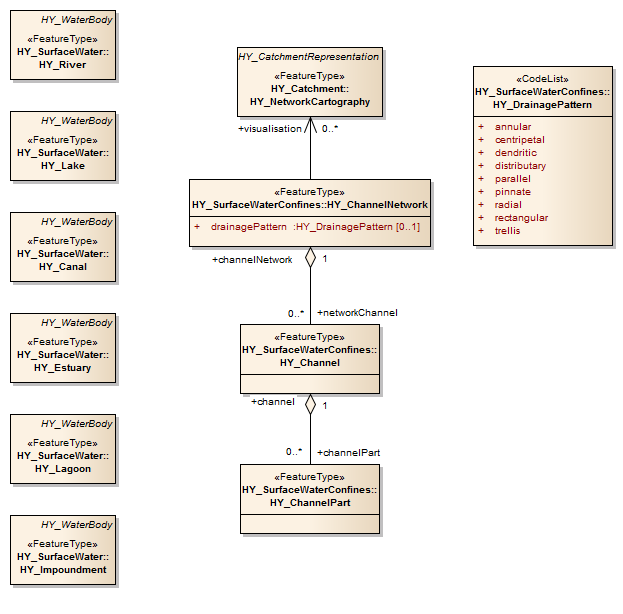
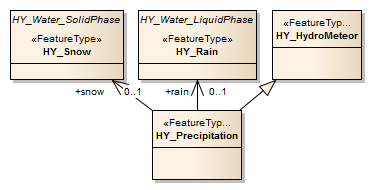

## 7. The HY\_Features common hydrologic feature model (normative)

### 7.1 The HY\_Features conceptual model

This standard defines the HY\_Features conceptual model as a standard for the identification and description of hydrologic features reflecting both hydrologic significance and topological connectivity of hydrologic features. HY\_Features formalizes the fundamental relationships between components of the hydrosphere. It describes the hydrosphere as an hierarchical network of hydrologically connected catchments, their organization in networks of catchments and/or waterbodies, and their various visual and topological realizations.

Core concepts of HY\_Features are: 1) an abstract idea of 'catchment' witch has many possible 'realizations', 2) upstream - downstream catchment topology and nested hierarchy, 3) aggregation of networks of watercourses within catchment networks, and 4) linear referencing along a river using a nominal main flow path. The single concept that governs HY\_Features is that any place on the land surface can be thought of as the outfall of a corresponding catchment and be placed into a hydrologic topology of connected, often named, hydrologic features.

The conceptual model is implemented in several discrete modules. It is intended that implementations of the conceptual model need to consider only those parts of the model required. An implementation may include or exclude feature properties, or allow cardinality one or more associations to be nillable. Table 1 lists the application schemas, the leaf packages included and the concepts reflected therein.

Table 1: HY\_Features modules, packages and concepts

| Application schema | Concepts reflected | Leaf packages included |
| --- | --- | --- |
| HY\_HydroFeature  | fundamental properties and relationships between features governed by the physical laws of Hydrology, naming of hydrologic features, location of hydrologic feature along a line | NamedFeature, HydroComplex, RiverPositioningSystem |
| HY\_SurfaceHydroFeature | hydrologic features on the Earth’s land surface without complexity and detail of hydrologic and hydraulic models | ChannelNetwork, HydrographicNetwork, WaterBodyTypes, Storage |
| HY\_HydrometricNetwork | hydrometric network of logically connected hydrometric features located on or along a hydrologic feature | --- |

The conceptual model is expressed in the Geographic Information Conceptual Schema Language (ISO 19103:2005) based on the Unified Modeling Language (UML). The organization into packages and package dependencies are shown in Figure 16. The following sections describe requirements classes for each application schema, whereby each feature addressed in the requirements shall be understood as an instance of the GF_FeatureType (aka FeatureType) «metaclass». For the purpose of consistency with the conceptual UML model the British spelling of feature type names and properties has been adopted.

  
Figure 16: HY\_Features modules and packages  

### 7.2	The HY\_Features conceptual conformance (mapping)

The HY\_Features model is a 'conceptual model', not intended to be directly implementable for data exchange or persistence. The conformance target of the HY\_Feature model is therefore a logical model of an implementation that encodes aspects of the HY\_Features model. 

Conformance to the HY\_Features model is a matter of being able to unambiguously identify what elements of an implementation schema map to the HY\_Features model, and inclusion of all mandatory properties of the HY\_Feature defined Feature Types in such mappings. 

The HY\_Features conceptual model provides the basis for determining whether two references to hydrologic features are references to the same feature. i.e. to specify the real world type of features independent of their implementation or format. More specifically, it provides the means to distinguish between the reference concept (e.g. a catchment) and its realizations as geographic features (e.g. flowpath, catchment area or boundary), and hence to declare that different realizations share common hydrological connectivity. 

Disparate systems describing hydrologic features may be mapped to the equivalent HY\_Features definitions to disambiguate the local usage of terminology and specific implementation choices made. 

Note that a direct encoding of HY\_Features to an implementation format such as RDF may be implemented through annotation or direct correspondence of names to the HY\_Feature elements.

| **Requirements Class** | [/req/hy_features_conceptual_model](/req/hy_features_conceptual_model) |
| --- | --- |
| Target type | Implementation Schema |
| Name | HY\_Features Conceptual Conformance |
| Dependency | [/iso/19109/] (https://inspire-twg.jrc.it/svn/iso) |
| Requirement | [/req/ hy_features_conceptual_model/mapping] (/req/ hy_features_conceptual_model/mapping) |

An implementation schema conforming to HY\_Features SHALL provide a formal mapping from one or more Feature Types present in the implementation schema to Feature Types defined in this standard specification, including all mandatory properties defined by the realized HY\_Features concept. Default values to be assumed must be specified in this mapping.

### 7.3	The HY\_Features data conformance (encoding) 

As a conceptual model HY\_Features does not specify conformance requirements regarding the structure of possible encodings. It does however specify that equivalence of feature instances can be expressed. The requirement that arises is therefore that the content of feature identification elements can be matched between implementations. This does not demand the use of identical identifiers across different implementations, but it does require that implementations provide a mechanism to match identifiers from different schemes.

| **Requirements Class** | [/req/hy_features_content] (/req/hy_features_content) |
| --- | --- |
| Target type	| Dataset |
| Name | HY\_Features Data Conformance |
| Dependency | [/req/hy_features_conceptual_model](/req/hy_features_conceptual_model) |
| Dependency | [/iso/19109/](https://inspire-twg.jrc.it/svn/iso) |
| Dependency | [/iso/19150/](https://inspire-twg.jrc.it/svn/iso) |
| Dependency | [/iso/19136/](https://inspire-twg.jrc.it/svn/iso) |
| Requirement	| [/req/ hy_features_conceptual_model/identifiers] (/req/ hy_features_conceptual_model/identifiers) |

Implementations of HY\_Features SHALL either use common identifiers for instances of Feature Types mapped to the same underlying HY\_Features Feature Type, OR provide a mechanism to match identifiers from different identification schemes.

### 7.4 The Hydro Feature application schema

The Hydro Feature schema provides the core concepts of a named hydrologic feature, of a catchment and its multiple realizations, and of a river positioning using a linear referencing. Hydrologic features are identified by hydrologically significant characteristics and feature topology according to hydrologic rules. Providing a standard terminology for the typical relationships between hydrologic features allows the hydrosphere to be expressed in a consistent way across multiple data products, regardless of various spatial or temporal representations.  

Hydrologic features are usually named in cross-jurisdictional and multi-lingual contexts. The Hydro Feature schema provides a concept for a named hydrologic feature which allows the use of multiple names and identifiers without the need for a formal naming model. The named hydrologic feature is further described using various domain-specific feature types, which specify properties of the specializations to define one or more aspects of the hydrology phenomenon (Figure 17).  

Figure 17: Hydrologic features describing separate aspects of the hydrology phenomenon (UML class diagram)

The Hydro Feature schema provides the core model of catchments and their multiple realizations. The catchment model denotes the hydrologic definition of a catchment by its outlet (HY\_Outfall) and the interaction of catchments through such defined outfalls. This allows division of the hydrosphere into a logically connected network of catchments. Depending on the perspective of a particular study, the logical catchment can be realized in multiple ways by geometric or topologic features. The Hydro Feature schema provides a model to place a catchment's outfall relative to a feature which realizes the logical outfall. The river positioning model provides a river reference system which allows linear referencing of an outfall (typically a monitoring location) using the linear realization of a catchment that corresponds to another outfall (typically a confluence).

The definitions applied in the Hydro Feature schema are rooted in the definitions given in the WMO Glossary of Hydrology regardless of their application context in respect to the Earth's surface. For the purpose of testing the applicability of the conceptual model in the context of surface water hydrology, the definitions in this standard refer to surface water hydrology. A conceptual model capturing the specifics of features associated with the groundwater domain is developed with reference to the GroundWaterML standard **[ correct ref ]**.

The Hydro Feature schema contains the leaf packages: NamedFeature, HydroComplex, and RiverPositioning. Figure 18 shows the external dependencies.

Figure 18: External dependencies 

| **Requirements Class** | [/req/hy_hydrofeature/*] (/req/hy_hydrofeature/*) |
| --- | --- |
| Target type	| Implementation schema |
| Name | HY\_HydroFeature (abstract) |
| Dependency | [/iso/19103/](https://inspire-twg.jrc.it/svn/iso) |
| Dependency | [/iso/19107/](https://inspire-twg.jrc.it/svn/iso) |
| Dependency | [/iso/19111/](https://inspire-twg.jrc.it/svn/iso) |
| Requirement	| [/req/hy_hydrofeature/namedfeature/*](/req/hy_hydrofeature/namedfeature/*) |
| Requirement	| [/req/hy_hydrofeature/hydrocomplex/*](/req/hy_hydrofeature/hydrocomplex/*) |
| Requirement	| [/req/hy_hydrofeature/positioning/*](/req/hy_hydrofeature/positioning/*) |

#### 7.4.1	The Named Feature model

The Named Feature model (Figure 19) denotes the abstraction of the hydrology phenomenon as a named hydrologic feature. It provides an approach to identify a named hydrologic feature in cross-jurisdiction and multi-lingual contexts by considering the cultural, political and historical aspects of names assigned to hydrologic features in common usage. 

Figure 19: Named Feature (UML class diagram, [/req/hy_hydrofeature/namedFeature/hydrofeature] (/req/hy_hydrofeature/namedFeature/hydrofeature) )

The HY\_HydroFeature feature type is further specialized by separate feature types. Each specialization inherits the properties from generalization; HY\_HydroFeature type has one association: *name*.

The **name** associates a name given to the hydrologic feature in cultural, political or historical context. If required, this association shall be used where names are assigned to a feature instance in cross-jurisdictional and multi-lingual contexts, that may occur with trans-boundary features. 

| **Requirements Class** | [/req/hy_hydrofeature/namedFeature/hydrofeature] (/req/hy_hydrofeature/namedFeature/hydrofeature) |
| --- | --- |
| Target type	| Implementation Schema |
| Name | HY\_HydroFeature |
| Dependency | [/req/hy_hydrofeature/namedFeature/hydrofeaturename] (/req/hy_hydrofeature/namedFeature/hydrofeaturename) | 
| Requirement	| [/req/hy_hydrofeature/namedFeature/hydrofeature.name] (/req/hy_hydrofeature/namedFeature/hydrofeature.name) | 

The HY\_HydroFeatureName feature type provides an abstract pattern to handle cultural, political and historical variability of names. This the assignment of a referencable name for all or part of a hydrologic feature without necessarily have a formal model for naming. HY\_HydroFeatureName has five attributes: name, namesPart, preferredBy, usage and variantSpelling. If required, an implementation shall use this type to describe the usage of multiple names. The usage type may be identified using the HY\_NameUsage codelist described in Annex ...,  table ... 

| **Requirements Class** | [/req/hy_hydrofeature/namedFeature/hydrofeaturename] (/req/hy_hydrofeature/namedFeature/hydrofeaturename) |
| --- | --- |
| Target type	| Implementation Schema |
| Name | HY\_HydroFeatureName |
| Dependency | [/iso/19103/](https://inspire-twg.jrc.it/svn/iso) |
| Dependency | [/iso/19115/](https://inspire-twg.jrc.it/svn/iso) |
| Dependency | [/req/hy_hydrofeature/namedFeature/nameusage](/req/hy_hydrofeature/namedFeature/nameusage) | 
| Requirement |	[/req/hy_hydrofeature/namedFeature/hydrofeature.name](/req/hy_hydrofeature/namedFeature/hydrofeature.name) | 
| Requirement	| [/req/hy_hydrofeature/namedFeature/hydrofeature.namespart](/req/hy_hydrofeature/namedFeature/hydrofeature.namespart) | 
| Requirement	| [/req/hy_hydrofeature/namedFeature/hydrofeature.preferredBy](/req/hy_hydrofeature/namedFeature/hydrofeature.preferredby) | 
| Requirement	| [/req/hy_hydrofeature/namedFeature/hydrofeature.usage](/req/hy_hydrofeature/namedFeature/hydrofeature.usage) | 
| Requirement	| [/req/hy_hydrofeature/namedFeature/hydrofeature.variantspelling](/req/hy_hydrofeature/namedFeature/hydrofeature.variantspelling) |

#### 7.4.2	The Hydro Complex model
The Hydro Complex model conceptualizes the hydrologic definition of a catchment through an 'outfall' feature with the role of getting flow from a contributing catchment, or providing inflow to a receiving catchment (Figure 20 and 21). Conceptually, each catchment has an outfall, and any outfall has a corresponding catchment, even if catchment and/or outfall may not be present in a particular application. A catchment interacts with upper and lower catchments via associated outfalls, and ultimately contributes flow to the outfall of a containing catchment. The catchment should be understood as the logical link between outfalls.

The Hydro Complex model implies a collection of hydrologic features that form a hydrologically closed system. The union of a catchment, its inflow and outflow (conceptualized as outfalls) is realized by typical hydrologic features to form a single hydrologic complex. A topological realization of the logical catchment is always of higher topological dimension than the realization of the corresponding outfall in terms of a topological boundary. For example, a linear flowpath realizing a catchment may be understood as an edge between inflow and outflow nodes; the areal realization of a catchment as a face bounded by linear inflow and outflow.

The Hydro Complex model allows the realization of a logical outfall to be any arbitrary location with various realizations of it's own. Such a 'real' outfall provides an identifiable reference feature to which alternative catchment realizations may refer. This very general outfall feature supports establishment of topological relationships between hydrographic features, or between hydrographic and hydrometric features. The Hydro Complex model also allows for catchments to be recognized through reference to an outfall even if stream networks, catchment areas or watersheds are not available. It is intended that hydrological reporting applications may use this model without the full complexity and detail of scientific catchment models.

##### 7.4.2.1	Catchment
The HY\_Catchment feature type represents a hydrologically determined feature through association an outfall, and the logical network of catchments that form a connected network of smaller catchments and outfalls within the catchment. Each HY\_Catchment may provide association between its many realizations within a hydrologically determined hydrologic complex. These realizations include a both geometric and topological realizations such as an edge 'bounded' by inflow and outflow nodes. HY\_Catchment is an abstract class and may be further specialized with respect to catchment interaction. 

Figure 20: Catchment (UML class diagram, [/req/hy_hydrofeature/hydrocomplex/catchment] (/req/hy_hydrofeature/hydrocomplex/catchment) | ) 

The HY\_Catchment type (Figure 20) specializes the general HY\_HydroFeature class. Through generalization, HY\_Catchment inherits the *name* property, and carries the *code* attribute and the associations: *outflow*, *inflow*, *containing Catchment*, *containedCatchment*, *conjointCatchment*, *upperCatchment*, *lowerCatchment*, *realisation*.

The **code** attribute may be used to assign a unique identifier to the catchment in given context. If required, the code attribute shall be implemented using a controlled classification or coding system. Example: WMO Basin Codes.  

The **outflow** and **inflow** associations describe the outfall in terms of outflow or inflow to or from the corresponding catchment. Assuming a dendritic network of catchments, the outflow of a contributing catchment coincides with the inflow to a receiving catchment. This allows description of upstream-downstream relations. If required, this association shall be used to identify the place to which flow is contributed, or where flow is received from.

Figure 21: Catchment and outfall (UML class diagram, [/req/hy_hydrofeature/hydrocomplex/catchment.inflow](/req/hy_hydrofeature/hydrocomplex/catchment.inflow) , [/req/hy_hydrofeature/hydrocomplex/catchment.outflow](/req/hy_hydrofeature/hydrocomplex/catchment.outflow) )  

The **containingCatchment** and **containedCatchment** associations connect the nesting of catchments in a simple “is-in” containment hierarchy as typically used for high-order organization of management and reporting units. If required, this association shall be used to identify a nesting catchment or the catchments nested therein.

Figure 22: Containing / contained catchment (UML class diagram, [/req/hy_hydrofeature/hydrocomplex/catchment.containingcatchment](/req/hy_hydrofeature/hydrocomplex/catchment.containingcatchment) , [/req/hy_hydrofeature/hydrocomplex/catchment.containedcatchment](/req/hy_hydrofeature/hydrocomplex/catchment.containedcatchment) )

The **conjointCatchment** association describes the interaction of a catchment with another catchment crossing an internal boundary line. This line may be a divide separating adjacent catchments, or a diffuse divide between non-delineated sub-catchments within an encompassing catchment, or a fictive line between distant catchments. If required, this association shall be used to identify a catchment contributing with others to a 'joined' outfall. Assuming a dendritic network of catchments, where each catchment is determined by its single outflow, this association may be used to summarize diffuse inflow into an encompassing catchment, as required to describe inflow to headwater catchments. 

Figure 23: Conjoint catchment (UML class diagram, [/req/hy_hydrofeature/hydrocomplex/catchment.conjointcatchment](/req/hy_hydrofeature/hydrocomplex/catchment.conjointcatchment) ) 

The **upperCatchment** and **lowerCatchment** associations connect the catchment to the adjacent catchment above or below. This allows the description of connected catchments without knowing their inflow or outflow outfalls. If required, this association shall be used to trace the catchment network in upstream direction from mouth to source, or downstream from source to mouth. 

Figure 24: Upper / lower catchment (UML class diagram, [/req/hy_hydrofeature/hydrocomplex/catchment.uppercatchment](/req/hy_hydrofeature/hydrocomplex/catchment.uppercatchment), [/req/hy_hydrofeature/hydrocomplex/catchment.lowercatchment](/req/hy_hydrofeature/hydrocomplex/catchment.lowercatchment) )

The **realisation** association relates the catchment to a feature which realizes the logical catchment. This supports linking multiple realizations of the same catchment. If required, this association shall be used identify a particular realization. In case of a topological realization, the realization of the catchment shall be of higher dimension than the realization of the outfall.

| **Requirements Class** | [/req/hy_hydrofeature/hydrocomplex/catchment] (/req/hy_hydrofeature/hydrocomplex/catchment) | 
| --- | --- |
| Target type	| Implementation schema |
| Name | HY\_Catchment | 
| Dependency | [/iso/19103/](https://inspire-twg.jrc.it/svn/iso) |
| Dependency | [/req/hy_hydrofeature/namedFeature/hydrofeature](/req/hy_hydrofeature/namedFeature/hydrofeature) |
| Dependency | [/req/hy_hydrofeature/hydrocomplex/outfall](/req/hy_hydrofeature/hydrocomplex/outfall) | 
| Dependency | [/req/hy_hydrofeature/hydrocomplex/catchment](/req/hy_hydrofeature/hydrocomplex/catchment) | 
| Dependency | [/req/hy_hydrofeature/hydrocomplex/catchmentrealisation](/req/hy_hydrofeature/hydrocomplex/catchmentrealisation) |
| Requirement	| [/req/hy_hydrofeature/hydrocomplex/catchment.outflow](/req/hy_hydrofeature/hydrocomplex/catchment.outflow) | 
| Requirement	| [/req/hy_hydrofeature/hydrocomplex/catchment.inflow](/req/hy_hydrofeature/hydrocomplex/catchment.inflow) | 
| Requirement	| [/req/hy_hydrofeature/hydrocomplex/catchment.containingcatchment](/req/hy_hydrofeature/hydrocomplex/catchment.containingcatchment) |
| Requirement	| [/req/hy_hydrofeature/hydrocomplex/catchment.containedcatchment](/req/hy_hydrofeature/hydrocomplex/catchment.containedcatchment) |  
| Requirement	| [/req/hy_hydrofeature/hydrocomplex/catchment.conjointcatchment](/req/hy_hydrofeature/hydrocomplex/catchment.conjointcatchment) | 
| Requirement	| [/req/hy_hydrofeature/hydrocomplex/catchment.uppercatchment](/req/hy_hydrofeature/hydrocomplex/catchment.uppercatchment) |
| Requirement	| [/req/hy_hydrofeature/hydrocomplex/catchment.lowercatchment](/req/hy_hydrofeature/hydrocomplex/catchment.lowercatchment) | 
| Requirement	| [/req/hy_hydrofeature/hydrocomplex/catchment.realisation](/req/hy_hydrofeature/hydrocomplex/catchment.realisation) |
 
##### 7.4.2.2	Catchment Aggregate 
The HY\_CatchmentAggregate feature type (Figure 25) specializes the HY\_Catchment as a set of non-overlapping dendritic and interior catchments arranged in an encompassing catchment. This allows description of multiple inflows into a catchment aggregate through several hydrologically discrete sub-catchments each with a single inflow, and contributing to a joined outflow of the catchment aggregate, including the 'nillable' outflow of interior catchments. Nillable is meant to signify that the outfall exists, in the for of flow to the subsurface or atmosphere but is unknown in a given implementation. The catchment aggregate may be part of a containing catchment at the next higher level of hierarchy, which consists of similar-scale neighboring catchments. The catchment aggregate does not necessarily imply a series of nested containing catchments. It primarily allows navigation to the 'highest' level system (total drainage basin) as typically used for reporting purposes.

Figure 25: Catchment aggregate (UML class diagram, [/req/hy_hydrofeature/hydrocomplex/catchmentaggregate](/req/hy_hydrofeature/hydrocomplex/catchmentaggregate) )

HY\_CatchmentAggregate inherits from generalization the *outflow*, *inflow*, *containing Catchment*, *containedCatchment*, *conjointCatchment*, *upperCatchment*, *lowerCatchment*, and *realisation* properties, and associates the *exorheicDrainage* and *endorheicDrainage*. 

The **exorheicDrainage** association references an exorheic drained catchment connected to others in a dendritic network. The **endorheicDrainage** association references an endorheic drained catchment, temporarily connected to the enveloping aggregate. If required, these associations shall be used to identify aggregated catchment parts which permanently or temporarily interact with other catchment parts at the same hierarchy level. 

| **Requirements Class** | [/req/hy_hydrofeature/hydrocomplex/catchmentaggregate](/req/hy_hydrofeature/hydrocomplex/catchmentaggregate) | 
| --- | --- |
| Target type	| Implementation schema |
| Name | HY\_CatchmentAggregate | 
| Dependency | [/req/hy_hydrofeature/hydrocomplex/catchment](/req/hy_hydrofeature/hydrocomplex/catchment) | 
| Dependency | [/req/hy_hydrofeature/hydrocomplex/dendriticcatchment](/req/hy_hydrofeature/hydrocomplex/dendriticcatchment) |
| Dependency | [/req/hy_hydrofeature/hydrocomplex/interiorcatchment](/req/hy_hydrofeature/hydrocomplex/interiorcatchment) |
| Requirement	| [/req/hy_hydrofeature/hydrocomplex/catchmentaggregate.exorheicdrainage](/req/hy_hydrofeature/hydrocomplex/catchmentaggregate.exorheicdrainage) | 
| Requirement	| [/req/hy_hydrofeature/hydrocomplex/catchmentaggregate.endorheicdrainage](/req/hy_hydrofeature/hydrocomplex/catchmentaggregate.endorheicdrainage) |

##### 7.4.2.3	Dendritic Catchment
The HY\_DendriticCatchment feature type (Figure 26) specializes the general HY\_Catchment class as a catchment which is determined by a single common downstream catchment. It represents the catchment as the topological link between an inflow and an outflow. This allows catchments to be connected in a dendritic network by upstream-downstream relationships without knowing the complex hydrology between inflow and outflow. This concept requires a stable identifier purposefully assigned to the catchment and that catchments are delineated as a simple tree hierarchy. The dendritic nature of this class is enforced through constraints that the catchment must have one and only one outflowNode (which can be unknown), must have one and only one lowerCatchment (which may be unknown), and must an outflowNode that contributes to only one receiving catchment. **note issue #143 regarding this**

Figure 26: Dendritic catchment (UML class diagram, [/req/hy_hydrofeature/hydrocomplex/dendriticcatchment] (/req/hy_hydrofeature/hydrocomplex/dendriticcatchment) )

HY\_DendriticCatchment inherits from generalization the *code*, *outflow*, *inflow*, *containing Catchment*, *containedCatchment*, *conjointCatchment*, *upperCatchment*, *lowerCatchment*, and *realisation* properties, and associates the *encompassingCatchment*.

The **encompassingCatchment** association relates to the dendritic catchment the aggregate encompassing the catchment. If required, this association shall be used to identify the catchment encompassing one or more exorheic or endorheic drained catchments contributing flow to the common outlet, either from a single identified inflow, or in joining with other sub-catchments crossing a divide internal to the encompassing aggregate catchment.

| **Requirements Class** | [/req/hy_hydrofeature/hydrocomplex/dendriticcatchment] (/req/hy_hydrofeature/hydrocomplex/dendriticcatchment) | 
| --- | --- |
| Target type	| Implementation schema |
| Name | HY\_DendriticCatchment | 
| Dependency | [/req/hy_hydrofeature/hydrocomplex/catchment](/req/hy_hydrofeature/hydrocomplex/catchment) | 
| Dependency | [/req/hy_hydrofeature/hydrocomplex/catchmentaggregate](/req/hy_hydrofeature/hydrocomplex/catchmentaggregate) |
| Requirement	| [/req/hy_hydrofeature/hydrocomplex/dendriticcatchment.encompassingcatchment](/req/hy_hydrofeature/hydrocomplex/dendriticcatchment.encompassingcatchment) |

##### 7.4.2.4	Interior Catchment
The HY\_InteriorCatchment feature type (Figure 27) specializes the general HY\_Catchment class as a catchment which is generally not connected to other catchments. This class describes the interior catchment as a catchment enveloped by other catchments to which it may temporarily contribute. While the interior catchment concept precludes flow to neighboring surface catchments, holistically it is a candidate for establishing connections to groundwater or atmospheric systems.

Figure 27: Interior catchment (UML class diagram, [/req/hy_hydrofeature/hydrocomplex/interiorcatchment](/req/hy_hydrofeature/hydrocomplex/interiorcatchment) )

HY\_InteriorCatchment inherits from generalization the *code*, *outflow*, *inflow*, *containing Catchment*, *containedCatchment*, *conjointCatchment*, *upperCatchment*, *lowerCatchment*, and *realisation* properties, and associates the *envelopingCatchment*.

The **envelopingCatchment** association relates to the interior catchment the aggregate surrounding the catchment. If required, this association shall be used to identify the catchment enveloping one or more endorheic drained catchments contributing 'nillable' flow to the common outlet. 

| **Requirements Class** | [/req/hy_hydrofeature/hydrocomplex/interiorcatchment](/req/hy_hydrofeature/hydrocomplex/interiorcatchment) | 
| --- | --- |
| Target type	| Implementation schema |
| Name | HY\_InteriorCatchment | 
| Dependency | [/req/hy_hydrofeature/hydrocomplex/catchment](/req/hy_hydrofeature/hydrocomplex/catchment) | 
| Dependency | [/req/hy_hydrofeature/hydrocomplex/catchmentaggregate](/req/hy_hydrofeature/hydrocomplex/catchmentaggregate) |
| Requirement	| [/req/hy_hydrofeature/hydrocomplex/interiorcatchment.envelopingcatchment](/req/hy_hydrofeature/hydrocomplex/interiorcatchment.envelopingcatchment) |

##### 7.4.2.5	Outfall
The HY\_Outfall feature type (Figure 28) conceptualizes the hydrologically determined outfall of a corresponding catchment (Figure 20). The logical outfall represents the logical place where a catchment interacts with another catchment, i.e. where the outflow of a contributing catchment becomes inflow into a receiving catchment. A catchment may receive flow from several catchments or contribute flow to several catchments through a single logical outfall. Logically placed in reference to a catchment which links inflow and outflow, an outfall has a position relative to another outfall that is 'fixed' by the catchment. Through unique identity, each outfall feature may associate different outfall realizations within an hydrologic complex given that each realization has the same hydrologic determination. This includes the topological realization as a node in terms of the 'boundary' of a catchment edge.  

Figure 28: Outfall (UML class diagram,  [req/hy_hydrofeature/hydrocomplex/outfall] (req/hy_hydrofeature/hydrocomplex/outfall)  )

HY\_Outfall carries the associations: *contributingCatchment*, *receivingCatchment*, *relativePosition* and *outfallRealisation*. 

The **contributingCatchment** association relates the outfall to the catchment that contributes flow to it. This allows relation of a catchment's outflow to an identified inflow and to determine its position through referencing an outfall. If required, this association shall be used to identify the catchment connecting the outfall and an inflow used for reference.  

The **receivingCatchment** association relates to the outfall to a catchment that receives flow from it. This allows relation of a catchment's inflow to an identified outflow and to determine its position through referencing an outfall. If required, this association shall be used to identify the catchment connecting the outfall and the outflow used for reference. 

The **relativePosition** association assigns a position to the outfall relative to a reference location (typically an outfall realization) fixed in the logical network of catchments. This means that the position of an outfall is determined relative to another realized outfall. If required, this association shall be used to assign a position to an inflow or outflow of a catchment using existing reference location(s). Commonly, this is used to locate an outfall such as at a hydrometric station, to a reference outfall such as a confluence but it can be used to locate any outfall relative to another.

The **outfallRealisation** association relates the outfall to a feature which realizes the logical outfall. If required, this association shall be used to describe the 'real' object considered to be outfall of a catchment. In case of a topological realization, the realization of the outfall shall be of lower dimension than the realization of the corresponding catchment.

| **Requirements Class** | [req/hy_hydrofeature/hydrocomplex/outfall] (req/hy_hydrofeature/hydrocomplex/outfall) | 
| --- | --- |
| Target type	| Implementation schema |
| Name | HY\_Outfall | 
| Dependency | [/req/hy_hydrofeature/hydrocomplex/catchment](/req/hy_hydrofeature/hydrocomplex/catchment) |
| Dependency | [/req/hy_hydrofeature/hydrocomplex/indirectposition](/req/hy_hydrofeature/hydrocomplex/indirectposition) | 
| Dependency | [/req/hy_hydrofeature/hydrocomplex/outfallrealisation](/req/hy_hydrofeature/hydrocomplex/outfallrealisation) | 
| Requirement	| [/req/hy_hydrofeature/hydrocomplex/outfall.contributingcatchment](/req/hy_hydrofeature/hydrocomplex/outfall.contributingcatchment) |
| Requirement	| [/req/hy_hydrofeature/hydrocomplex/outfall.receivingcatchment](/req/hy_hydrofeature/hydrocomplex/outfall.receivingcatchment) |
| Requirement	| [/req/hy_hydrofeature/hydrocomplex/outfall.relativeposition](/req/hy_hydrofeature/hydrocomplex/outfall.relativeposition) |
| Requirement	| [/req/hy_hydrofeature/hydrocomplex/outfall.outfallrealisation](/req/hy_hydrofeature/hydrocomplex/outfall.outfallrealisation) |

##### 7.4.2.6	Catchment Realization
The HY\_CatchmentRealisation feature type (Figure 29) conceptualizes the multiple realization of an 'un-realized', logical catchment, by typical features used to describe a catchment as a unit of study shared across sub-domains and studies. HY\_CatchmentArea, HY\_CatchmentBoundary, HY\_Flowpath and HY\_WaterEdge are special types of catchment realization defined to topologically realize the hydrologically determined logical catchment in terms of face, edge, and node, as well as to reflect the connectivity of catchments by hydrologic features connected in networks. Topologically, the catchment area is a face bounded by catchment boundary and flowpath.  Flowpath and water edge are topological edges each bounded by an inflow node and an outflow node. The HY\_HydroNetwork type realizes a logical catchment as a collection of connected network features, the HY\_CartographicRealisation as a set of map layers.

The catchment realization concept implies a hydrologic complex in that, if a catchment realization exists, they are in the same hydrologic complex as the catchment they realize. In this way, any feature realization of a logical catchment has the same hydrologic determination as the realized catchment. If the realized catchment is connected with other catchments via its outfall, possible feature realizations are also connected. 

Figure 29: Catchment realization and its specialization (UML class diagram, [/req/hy_hydrofeature/hydrocomplex/catchmentrealisation] (/req/hy_hydrofeature/hydrocomplex/catchmentrealisation) ) 

The catchment realization feature types defined in this standard refer to objects on the land surface for the purpose of surface water hydrology. In other contexts, other types of catchment realization may exist. Catchment realizations that do not conform to those defined in this standard, for instance realizations in 3 or 4 dimensional perspectives, may use the general HY\_CatchmentRealisation type. 

HY\_CatchmentRealisation carries the *realisedCatchment* association implying the *hydroComplex* feature collection **[(in the conceptual model described by means of 'tagged value') - mention tagged values in general?] --DB-- not sure how this should be handled, let's check with Josh.**. 

The **realisedCatchment** association relates a particular realization with the catchment it realizes. Referencing the hydrologic complex encompassing the catchment and its realizations, allows a catchment's existence to be recognized and linked to multiple realizations without the complexity and full detail of a scientific model. By referencing the fundamental hydrologically determined catchment, topological relationships can be established and common identifiers assigned. If required, this association shall be used to identify the unit of study realized in a domain-specific feature. 

| **Requirements Class** | [/req/hy_hydrofeature/hydrocomplex/catchmentrealisation] (/req/hy_hydrofeature/hydrocomplex/catchmentrealisation)|
| --- | --- |
| Target type	| Implementation schema |
| Name | HY\_CatchmentRealisation | 
| Dependency | [/req/hy_hydrofeature/hydrocomplex/catchment](/req/hy_hydrofeature/hydrocomplex/catchment) | 
| Requirement	| [/req/hy_hydrofeature/hydrocomplex/catchmentrealisation.realisedcatchment](/req/hy_hydrofeature/hydrocomplex/catchmentrealisation.realisedcatchment) |

The HY\_Flowpath feature type specializes HY\_CatchmentRealisation with respect to an implied linear geometric representation including a straight or curved line. Hydrologically, the flowpath is a line describing a moving particle of water. Topologically, the flowpath connects the inflow and outflow of the logical catchment,  and is understood as an edge bounded by an inflow node and an outflow node, and corresponding to left-bank and right-bank catchment faces. The 'boundary' and 'spoke' properties are described by means of 'tagged values': the topological 'boundary' is of type HY\_OutfallRealisation, the topological 'spoke' of type HY\_CatchmentArea. 

Through generalization, HY\_Flowpath inherits the *realisedCatchment* association including *hydroComplex*, and carries the properties: *shape*, and *flowpathNetwork*. 

The **shape** attribute defines the linear geometric representation. If required, an implementation shall use a geometry type defined in ISO19107: Spatial Schema, e.g. GM_Curve type.

The **flowpathNetwork** association defines a network as sequence of connected flowpathes. This concept requires a non-branching 'mainstem' of watercourses, and a single linear representation of each of these. If required, this association may be used to identify the network which realizes as a whole the catchment that contains the catchment realized by the single part.  

| **Requirements Class** | [req/hy_hydrofeature/hydrocomplex/flowpath] (req/hy_hydrofeature/hydrocomplex/flowpath) | 
| --- | --- |
| Target type	| Implementation schema |
| Name | HY\_Flowpath | 
| Dependency | [/iso/19107/](https://inspire-twg.jrc.it/svn/iso) |
| Dependency | [/req/hy_hydrofeature/hydrocomplex/catchmentrealisation](/req/hy_hydrofeature/hydrocomplex/catchmentrealisation) |
| Dependency | [/req/hy_hydrofeature/hydrocomplex/hydronetwork](/req/hy_hydrofeature/hydrocomplex/hydronetwork) | 
| Requirement	| [/req/hy_hydrofeature/hydrocomplex/flowpath.shape](/req/hy_hydrofeature/hydrocomplex/flowpath.shape) |
| Requirement	| [/req/hy_hydrofeature/hydrocomplex/flowpath.flowpathnetwork](/req/hy_hydrofeature/hydrocomplex/flowpath.flowpathnetwork) |

The HY\_WaterEdge feature type specializes HY\_CatchmentRealisation with respect to an implied linear geometric representation including a closed line. Hydrologically, the water edge follows the line of intersection between a water body stratum and the confining depression, or channel.  Topologically, the water edge realizes the catchment as an edge connecting inflow and outflow realised as nodes fixed at the inflow node and outflow node of the corresponding flowpath. The 'boundary' of type HY\_OutfallRealisation is described by means of 'tagged values'.

Through generalization, HY\_WaterEdge inherits the *realisedCatchment* association including *hydroComplex*, and carries the properties: *shape*, *waterEdgeNetwork*. 

The **shape** attribute defines the linear geometric representation. If required, an implementation shall use a geometry type defined in ISO19107: Spatial Schema, e.g. GM_Curve type.

The **waterEdgeNetwork** association defines an aggregate of water edges forming a connected network. This concept requires an aggregate of  non-overlaying edges, and a single linear representation of each of these. If required, this association may be used to identify the network which realizes as a whole the catchment that contains the catchment realized by the single part.  

| **Requirements Class** | [req/hy_hydrofeature/hydrocomplex/wateredge] (req/hy_hydrofeature/hydrocomplex/wateredge) | 
| --- | --- |
| Target type	| Implementation schema |
| Name | HY\_WaterEdge | 
| Dependency | [/iso/19107/](https://inspire-twg.jrc.it/svn/iso) |
| Dependency | [/req/hy_hydrofeature/hydrocomplex/catchmentrealisation](/req/hy_hydrofeature/hydrocomplex/catchmentrealisation) |
| Dependency | [/req/hy_hydrofeature/hydrocomplex/hydronetwork](/req/hy_hydrofeature/hydrocomplex/hydronetwork) | 
| Requirement	| [/req/hy_hydrofeature/hydrocomplex/wateredge.shape](/req/hy_hydrofeature/hydrocomplex/wateredge.shape) |
| Requirement	| [/req/hy_hydrofeature/hydrocomplex/wateredge.wateredgenetwork](/req/hy_hydrofeature/hydrocomplex/wateredge.wateredgenetwork) |

The HY\_CatchmentBoundary feature type specializes HY\_CatchmentRealisation with respect to an implied linear geometric representation including a single polygon. The catchment boundary connecting the inflow and outflow of the logical catchment, whereby inflow and outflow may overlay. It is topologically understood as an edge bounded by inflow node and outflow nodes, and corresponding to left-bank and right-bank catchment faces inside of the boundary. The 'boundary' and 'spoke' properties are described by means of 'tagged values': the topological 'boundary' is of type HY\_OutfallRealisation; the topological 'spoke' is of type HY\_CatchmentArea. 

HY\_CatchmentBoundary inherits from generalization the *realisedCatchment* association incl. *hydroComplex*, and carries the properties: *shape*, and *boundaryNetwork*. 

The **shape** attribute defines the linear geometric representation. If required, an implementation shall use a geometry type  defined in ISO19107: Spatial Schema, e.g. GM_CompositeCurve type.

The **boundaryNetwork** association defines a network as mesh of connected boundaries. This concept requires a mesh of non-overlapping boundary lines, and a single linear representations of each of these. If required, this association may be used to identify the network which realizes as a whole the catchment that contains the catchment realized by the single part.   

| **Requirements Class** | [req/hy_hydrofeature/hydrocomplex/catchmentboundary] (req/hy_hydrofeature/hydrocomplex/catchmentboundary) | 
| --- | --- |
| Target type	| Implementation schema |
| Name | HY\_CatchmentBoundary | 
| Dependency | [/iso/19107/](https://inspire-twg.jrc.it/svn/iso) |
| Dependency | [/req/hy_hydrofeature/hydrocomplex/catchmentrealisation](/req/hy_hydrofeature/hydrocomplex/catchmentrealisation) |
| Dependency | [/req/hy_hydrofeature/hydrocomplex/hydronetwork](/req/hy_hydrofeature/hydrocomplex/hydronetwork) | 
| Requirement	| [/req/hy_hydrofeature/hydrocomplex/catchmentboundary.shape](/req/hy_hydrofeature/hydrocomplex/catchmentboundary.shape) |
| Requirement	| [/req/hy_hydrofeature/hydrocomplex/catchmentboundary.boundarynetwork](/req/hy_hydrofeature/hydrocomplex/catchmentboundary.boundarynetwork) |

The HY\_CatchmentArea feature type specializes HY\_CatchmentRealisation with respect to an implied areal geometric representation including a plane surface. The catchment area connecting the inflow and outflow of the logical catchment, is topologically a face bounded inwards by an inflow edge and outwards by an outflow edge. The 'boundary' is described by means of 'tagged values': the inward directed 'boundary' is of type HY\_CatchmentBoundary, the outward directed 'boundary' of type HY\_Flowpath. A topological 'spoke' is not defined in this standard. 

HY\_CatchmentArea inherits from generalization the *realisedCatchment* association incl. *hydroComplex*, and carries the properties: *shape*, and *areaNetwork*. 

The **shape** attribute defines the linear geometric representation. If required, an implementation shall use a geometry type defined in ISO19107: Spatial Schema, e.g. GM_Surface type.

The **areaNetwork** association defines an aggregate of catchment areas forming a connected network. This concept requires a non-overlapping aggregate of areas, and a single areal representation of each of these. If required, this association may be used to identify the network which realizes as a whole the catchment that contains the catchment realized by the single part.  

| **Requirements Class** | [req/hy_hydrofeature/hydrocomplex/catchmentarea] (req/hy_hydrofeature/hydrocomplex/catchmentarea) | 
| --- | --- |
| Target type	| Implementation schema |
| Name | HY\_CatchmentArea | 
| Dependency | [/iso/19107/](https://inspire-twg.jrc.it/svn/iso) |
| Dependency | [/req/hy_hydrofeature/hydrocomplex/catchmentrealisation](/req/hy_hydrofeature/hydrocomplex/catchmentrealisation) |
| Dependency | [/req/hy_hydrofeature/hydrocomplex/hydronetwork](/req/hy_hydrofeature/hydrocomplex/hydronetwork) | 
| Requirement	| [/req/hy_hydrofeature/hydrocomplex/catchmentarea.shape](/req/hy_hydrofeature/hydrocomplex/catchmentarea.shape) |
| Requirement	| [/req/hy_hydrofeature/hydrocomplex/catchmentarea.boundarynetwork](/req/hy_hydrofeature/hydrocomplex/catchmentarea.areanetwork) |

The HY\_HydroNetwork feature type specializes HY\_CatchmentRealisation with respect to a network of connected hydrologic features. Such a network realizes in the hierarchical network of logically connected catchments contained in a higher-order catchment. It may be a sequence of flowpathes, an aggregate of water edges, an aggregate of catchment areas or a mesh of catchment boundaries.  HY\_HydroNetwork inherits the *realisedCatchment* association including *hydroComplex*, and carries the associations *flowpath*, *waterEdge*, *catchmentBoundary* and *catchmentArea*. 

The HY\_CartographicRealisation feature type specializes HY\_CatchmentRealisation separate cartographic layers or maps, displaying a network of hydrologic features which may be connected at the representation level, or not. HY\_HydroNetwork inherits from generalization the *realisedCatchment* association including *hydroComplex*.

##### 7.4.2.7	Outfall Realization 
The HY\_OutfallRealisation feature type (Figure 30) conceptualizes the idea of an arbitrary feature of interest that may be considered as outfall. Referencing the hydrologic determination of a catchment by the outfall, various hydrologic features may by associated to a corresponding catchment through reference to the outfall realization feature. Any feature referencing the outfall realization within an implied hydrologic complex may realise the logical outfall, specifically as a permanent, stable location fixed or referenced by coordinates. 

Permanent, fixed landmarks such as confluences, points at vertical sections or on horizontal strata, the position of a monitoring station on a river are typical outfall realizations. In other than surface water contexts other types may realize a catchment's logical outfall. Outfall realizations that not support the associations defined for surface water in this standard, e.g. a spring where groundwater enters the surface, or a point projected onto the surface or created from merging disjoint locations, may use or specialize the general HY\_OutfallRealisation type. 

The HY\_OutfallRealisation is topologically understood as boundary of the corresponding catchment, and always of lower dimension than the realized catchment. With respect to the very common topological realization of a catchment as an edge, a 'spoke' property of type HY_Flowpath is described by means of a 'tagged value' and used to associate an upstream and downstream flowpath. The outfall realization may be represented by any geometric object, incl. a single point.

Figure 30: Outfall realisation (UML class diagram,  [/req/hy_hydrofeature/hydrocomplex/outfallrealisation] (/req/hy_hydrofeature/hydrocomplex/outfallrealisation) ) 

HY\_OutfallRealisation carries the *realisedOutfall* association implying the *hydroComplex* feature collection, and carries two attributes: *shape* and *outfallType*. 

The **realisedOutfall** association identifies exactly the catchment that contributes to the outfall, or that receives flow from the outfall. This allows identifiers to be assigned to a catchment even if flowpath, catchment area or stream network are not reliably determined. If required, this association shall be used to identify the logical outfall which is referenced by the hydrologic feature that realizes the logical catchment either on separately, or as part of a typical network. 

The **shape** attribute defines the geometric representation of the realised outfall, here with the option to use a geometry type defined in ISO19107: Spatial Schema, if required.
  
The *outfallType* attribute provides a list of terms in common use to express verbally the type of the realized outfall. If required, an implementation may use a term from the HY\_TypeOfOutfall codelist. Note that alternative code lists may be used but should be related to the terms in Annex ..., table ...  **[correct reference]** using an appropriate formalism.  

| **Requirements Class** | [/req/hy_hydrofeature/hydrocomplex/outfallrealisation] (/req/hy_hydrofeature/hydrocomplex/outfallrealisation) | 
| --- | --- |
| Target type	| Implementation schema |
| Name | HY\_CatchmentRealisation | 
| Dependency | [/iso/19107/...](https://inspire-twg.jrc.it/svn/iso) |
| Dependency | [/req/hy_hydrofeature/hydrocomplex/outfall](/req/hy_hydrofeature/hydrocomplex/outfall) | 
| Dependency | [/req/hy_hydrofeature/hydrocomplex/typeofoutfall](/req/hy_hydrofeature/hydrocomplex/typeofoutfall) | 
| Requirement	| [/req/hy_hydrofeature/hydrocomplex/outfallrealisation.realisedoutfall](/req/hy_hydrofeature/hydrocomplex/outfallrealisation.realisedoutfall) ]
| Requirement	| [/req/hy_hydrofeature/hydrocomplex/outfallrealisation.shape](/req/hy_hydrofeature/hydrocomplex/outfallrealisation.shape) ]
| Requirement	| [/req/hy_hydrofeature/hydrocomplex/outfallrealisation.typeofoutfall](/req/hy_hydrofeature/hydrocomplex/outfallrealisation.typeofoutfall) ]

#### 7.4.3	The River Positioning System model
The River Positioning System provides a simple model to place a feature of interest 'on a river' using its topological realization. It introduces the concept of Indirect Position where a position is determined relative to an already established reference location. This concept uses a linear river reference system whose origin is set at the outfall of the catchment that corresponds to the feature of interest, and whose linear shape is given by the flowpath realizing the catchment between the origin and the reference location. It is important to note, that each logical catchment has its own reference system, and must have one outfall (origin) and one linear flowpath realization (shape). 

The River Positioning System references the topological realization of catchment and outfall within an implied hydrologic complex in such that origin and referent of the reference system are nodes on the boundary of the flowpath shape. Given that the flowpath realizes a logical catchment between inflow and outflow nodes, the feature of interest realizes either the inflow or outflow node of the catchment determined by the corresponding reference location upstream or downstream. Using reference locations in both directions will allow to place a feature of interest interpolative between identified inflow and outflow nodes on the flowpath, even if the realized catchment is not explicitly delineated. 

Figure 31: River Positioning System (UML class diagram, [/req/hy_hydrofeature/positioning/indirectposition] (/req/hy_hydrofeature/positioning/indirectposition), [/req/hy_positioning/riverreferencesystem] (/req/hy_positioning/indirectposition.riverreferencesystem) )

The HY\_IndirectPosition feature type defines the indirect position, expressed either as the absolute distance to a reference point, or relative to the reference point or to the distance (interpolative).  Indirect position assigns to an feature of interest realizing an outfall a position in reference to an existing outfall realization using a linear river reference system.  HY\_IndirectPosition carries four properties: absolute, relative, referenceLocation, riverReferenceSystem. An implementation may use ISO 19148(2012): LinearReferencing understanding the feature to be placed as an ‘Event’ at a *locating* indirect position  in distance to an already *located* outfall realization, and this distance expressed  as a *linear Element* (flowpath)  *fromReferent*  (outfall realization) *towardsReferent* (outfall realization).

The **absolute** attribute provide an distance expression as absolute value, including an indication of accuracy and precision of the absolute value; the **relative** attribute provides an expression for the relative and interpolative distance value. If required, an implementation shall use these attributes to express the absolute or relative value using the HY\_DistanceToRefPoint and HY_RelativePosition data types, or other basic types defined in ISO19103: Conceptual Schema. To express a relative position verbally, a term from the HY\_RelativePositionDescription  code list of terms commonly used in hydrology to describe a spatial relationship between two locations may be used. Note that alternative code lists may be used but should be related to the terms in Annex …, table ... **[correct ref]** using an appropriate formalism. 

The **referenceLocation** association describes an existing outfall realization used for reference. If required, this association shall be used to identify a permanent reference location relative to which a position is assigned to an outfall, or the feature of interest realizing the outfall. 

The **riverReferenceSystem** association describes the special linear coordinate system applied to assign the position. If required, this association shall be used to identify the origin and shape of reference system used to place an outfall, or the feature of interest realizing the outfall; an implementation may use the HY_RiverReferenceSystem feature type defined in this standard.

HY\_IndirectPosition feature type defines an indirect position, either expressed as the distance to a reference point or as position relative to a reference point or to the distance (interpolative). HY\_IndirectPosition associates four properties: *absolute*, *relative*, *referenceLocation*, *riverReferenceSystem*.

| **Requirements Class** | [/req/hy_hydrofeature/positioning/indirectposition] (/req/hy_hydrofeature/positioning/indirectposition) |
| --- | --- |
| Target type	| Implementation Schema |
| Name | HY\_IndirectPosition |
| Dependency | [/req/hy_hydrofeature/hydrocomplex/outfallrealisation] (/req/hy_hydrofeature/hydrocomplex/outfallrealisation) | 
| Dependency | [/req/hy_hydrofeature/positioning/distancetorefpoint] (/req/hy_hydrofeature/positioning/distancetorefpoint) | 
| Dependency | [/req/hy_hydrofeature/positioning/relativeposition] (/req/hy_hydrofeature/positioning/relativeposition) | 
| Dependency | [/req/hy_hydrofeature/positioning/riverreferencesystem] (/req/hy_hydrofeature/positioning/riverreferencesystem) | 
| Requirement |	[/req/hy_hydrofeature/positioning/indirectposition.absolut]  (/req/hy_hydrofeature/positioning/indirectposition.absolut)
| Requirement |	[/req/hy_hydrofeature/positioning/indirectposition.relative]  (/req/hy_hydrofeature/positioning/indirectposition.relative)
| Requirement |	[/req/hy_hydrofeature/positioning/indirectposition.referencelocation]  (/req/hy_hydrofeature/positioning/indirectposition.referencelocation) |
| Requirement |	[/req/hy_hydrofeature/positioning/indirectposition.riverreferencesystem]  (/req/hy_hydrofeature/positioning/indirectposition.riverreferencesystem) |

The HY\_RiverReferenceSystem feature class specializes the ISO LinearCS feature type for a linear coordinate system using inflow and outflow nodes on the linear flowpath. The origin of the river reference system is set at the outfall to be placed. The geometric shape is defined by the linear flowpath realizing the catchment between the origin and an identified reference location upstream or downstream of the origin. The position on flowpath is provided as distance from the located start of the flowpath at origin and end at the reference location towards the flowpath is directed. HY\_RiverReferenceSystem inherits from generalization the *axis* property, and carries the associations *linearElement* and *locatedStart*.

The **linearElement** association defines the flowpath as the linear shape applied in the river reference system, and the **locatedStart** association defines the outfall as the origin. Bounded by inflow node and outflow node, the flowpath starts at the feature of interest realizing the origin. If required, these associations shall be used to identify the flowpath used as shape, and the start of the flowpath at a realized origin.

| **Requirements Class** | [/req/hy_positioning/riverreferencesystem] (/req/hy_positioning/indirectposition.riverreferencesystem) |
| --- | --- |
| Target type	| Implementation Schema |
| Name | HY\_RiverReferenceSystem |
| Dependency | [/iso/19111/...](https://inspire-twg.jrc.it/svn/iso) |
| Dependency | [/req/hy_hydrofeature/hydrocomplex/outfall] (/req/hy_hydrofeature/hydrocomplex/outfall) | 
| Dependency | [/req/hy_hydrofeature/hydrocomplex/flowpath] (/req/hy_hydrofeature/hydrocomplex/flowpath) |
| Requirement |	[/req/hy_hydrofeature/positioning/riverreferencesystem.locatedstart]  (/req/hy_hydrofeature/positioning/indirectposition.locatedstart) |
| Requirement |	[/req/hy_hydrofeature/positioning/riverreferencesystem.linearelement]  (/req/hy_hydrofeature/positioning/riverreferencesystem.linearelement) |

## 7.5 The Surface Hydro Feature application schema

The Surface Hydro Feature application schema provides common concepts of hydrologic features occurring on the land surface specifying the core concepts defined in the abstract Hydro Feature application schema. This will enable contextually related information models to build relationships to the multiple realized catchment.  Providing a standard terminology for the relationships between surface water features, typical realizations of the logical catchment and its conceptual outfall can be described in a consistent way. 

The Surface Hydro Feature schema conceptualizes the accumulation of on the land surface in typical water bodies, each special by origin, size, or the property to move. With respect to the management of water resources, a simple concept of water storage is provided that allows to consider any water body type as a reservoir. Following the conceptual separation of a watercourse into water body and containing channel, the Surface Hydro Feature schema defines the network of connected depressions and channels on land surface which periodically or continuously contain water, and separate from this the hydrographic network of permanent or temporary water bodies using the channel network as connecting system. 

The definitions in this schema are rooted in the definitions given in the WMO Glossary of Hydrology which defines the network of watercourse regardless of the location in respect to the Earth's surface. For the purpose of testing the applicability of the conceptual model in the context of surface water hydrology, in this standard 'channel network' and 'hydrographic network' as well as parts refer to surface channels, incl. large interstices in the ground, containg surface water bodies.

The Surface Hydro Feature application schema contains the leaf packages: Channel Network, Hydrographic Network, Water Body Types and Storage. Figure 32 shows the external and internal dependencies.

Figure 32: Surface Hydro Feature, external and internal dependencies 

### 7.5.1 The Channel Network model
The Channel Network model defines a network of connected depressions and channels which in its entirety realizes a logical catchment (Figure 33), usually as a network of linear flowpathes and/or water edges realizing catchments connected to each other within the containing catchment realized by the entire network.  This allows to represent the drainage pattern, even if logically connected features may or may not be connected at the representation level.

Figure 33: Channel Network realizzing the catchment (UML class diagram, [/req/hy_surfacehydrofeature/channelnetwork/channelnetwork] (/req/hy_surfacehydro/channelnetwork/channelnetwork) )

The channel network is defined independent of the hydrographic network. This conceptual separation references to the specific concerns of hydraulics focused on the analysis and design of channels and conduits. It allows to realize the logical catchment as a network of connected channels and depressions, regardless of water is contained therein or not.  

A single depression or channel may realize the logical catchment either as part of the network, or via a reference location which realizes the conceptual outfall of the catchment realized by the channel or depression (Figure 34). For example, a point at an associated cross or longitudinal section may be considered to realize the outflow of the catchment which is realized by the channel expressed as a flowpath.  

Figure 34: Depression and Channel realizing the outfall (UML class diagram,  [/req/hy_surfacehydrofeature/channelnetwork/depression] (/req/hy_surfacehydrofeature/channelnetwork/depression),  [/req/hy_surfacehydrofeature/channelnetwork/channel] (/req/hy_surfacehydrofeature/channelnetwork/channel) )

#### 7.5.1.1 Channel Network 
The HY\_ChannelNetwork feature type specializes the HY\_HydroNetwork realization defined in the core model, specifically as an aggregate of surface depressions and surface channels which continuously or periodically contain water, without imposing a particular drainage pattern. This allows to represent the network, even if logically connected features may or may not be connected at the representation level. If the realized catchment is connected with other catchments via outfall, the channel network is considered connected to the channel network realizing these catchments.  If required, an application focused on the structures containing a water body may use the defined relationships s to describe the realization of a catchment by the channel network, or network parts associated with the hydrographic network.

HY\_ChannelNetwork associates the *surfaceDepression* and *surfaceChannel*, and carries a *drainagePattern* attribute; it inherits from generalization the *realisedCatchment*, *flowpath* and *waterEdge* associations. Depending on the application, the channel network and the related features may be described by suitable attributes. A *channel path* constraint is defined such that whenever the channel network is a network of flowpathes, a depression or channel is of type HY_Flowpath, and a *channel edge* constraint such that depression or channel is of type HY_WaterEdge whenever the channel network is a network of water edges. 

The **drainagePattern** attribute describes in general the drainage pattern. If required, an implementation may use a term from the HY\_DrainagePattern codelist.  Note that alternative code lists may be used but should be related to the terms in Annex E.3 **[correct reference]** using an appropriate formalism. 

The **surfaceDepression** association relates a depression which may contain stagnant water or not to the channel network. If required, this association shall be used to identify a depression which realizes the logical catchment either separately, or as part of the channel network.

The **surfaceChannel** association relates a channel which may contain moving water or not to the channel network. If required, this association shall be used to identify a surface channel which realizes the logical catchment either separately, or as part of the channel network.

| **Requirements Class** | [/req/hy_surfacehydrofeature/channelnetwork/channelnetwork] (/req/hy_surfacehydro/channelnetwork/channelnetwork) |
| --- | --- |
| Target type	| Implementation Schema |
| Name | HY\_ChannelNetwork |
| Dependency | [/req/hy_hydrofeature/hydrocomplex/hydronetwork] (/req/hy_hydrofeature/hydrocomplex/hydronetwork) | 
| Dependency | [/req/hy_surfacehydrofeature/channelnetwork/drainagepattern] (/req/hy_surfacehydrofeature/channelnetwork/drainagepattern) | 
| Dependency | [/req/hy_surfacehydrofeature/channelnetwork/depression] (/req/hy_surfacehydrofeature/channelnetwork/depression) | 
| Dependency | [/req/hy_surfacehydrofeature/channelnetwork/channel] (/req/hy_surfacehydrofeature/channelnetwork/channel) | 
| Requirement |	[/req/hy_surfacehydrofeature/channelnetwork/channelnetwork.drainagepattern]  (/req/hy_surfacehydrofeature/channelnetwork/channelnetwork.drainagepattern) |
| Requirement |	[/req/hy_surfacehydrofeature/channelnetwork/channelnetwork.surfacedepression]  (/req/hy_surfacehydrofeature/channelnetwork/channelnetwork.surfacedepression) |
| Requirement |	[/req/hy_surfacehydrofeature/channelnetwork/channelnetwork.surfacechannel]  (/req/hy_surfacehydrofeature/channelnetwork/channelnetwork.surfacechannel) |

#### 7.5.1.2 Depression 
The HY\_Depression feature type specializes the general HY\_HydroFeature class. It describes land lower than the surrounding land as container for standing water. A depression is part of the network of channels and depressions forming the connecting system for the wherein water bodies stand as parts of hydrographic network. HY\_Depression inherits from generalization the *name* property, and the *channel path* and *channel edge* constraints. It associates the *surfaceNetwork* in which it participates, a body of *standingWater* and a *confinedWaterBody*. A *depression edge* constraint is defined such that whenever the depression  is part of the surface network, the confined water body is  of type HY_WaterEdge. An *outflow at benchmark* constraint is defined such that the outflow of the catchment which is realized by the channel network is of type  HY_OutfallRealisation whenever an outfall is realized on a water body stratum.

The **standingWater** association relates a body of stagnant water to a containing pool. This allows to establish a relationship to a water body carrying a permanent reference location which realizes the outfall of the catchment realized by the associated water body. If required, this association shall be used to identify the water body contained in the depression. 

The **confinedWaterBody** association relates a stratum of the contained water body to the depression. If required, this association shall be used to identify the horizontal layer carrying a permanent reference location which realizes the outfall of the catchment which is realized by the depression.

| **Requirements Class** | [/req/hy_surfacehydrofeature/channelnetwork/depression] (/req/hy_surfacehydrofeature/channelnetwork/depression) |
| --- | --- |
| Target type	| Implementation Schema |
| Name | HY\_Depression |
| Dependency | [/req/hy_hydrofeature/namedfeature/hydrofeature] (/req/hy_hydrofeature/namedfeature/hydrofeature) | 
| Dependency | [/req/hy_surfacehydrofeature/channelnetwork/channelnetwork] (/req/hy_surfacehydrofeature/channelnetwork/channelnetwork) | 
| Dependency | [/req/hy_surfacehydrofeature/hydrographicnetwork/waterbody] (/req/hy_surfacehydrofeature/hydrographicnetwork/waterbody) | 
| Dependency | [/req/hy_surfacehydrofeature/hydrographicnetwork/waterbodystratum] (/req/hy_surfacehydrofeature/hydrographicnetwork/waterbodystratum) |
| Requirement |	[/req/hy_surfacehydrofeature/channelnetwork/depression.surfacenetwork]  (/req/hy_surfacehydrofeature/channelnetwork/depression.surfacenetwork) |
| Requirement |	[/req/hy_surfacehydrofeature/channelnetwork/depression.standingwater]  (/req/hy_surfacehydrofeature/channelnetwork/depression.standingwater) |
| Requirement |	[/req/hy_surfacehydrofeature/channelnetwork/depression.standingwater]  (/req/hy_surfacehydrofeature/channelnetwork/depression.confinedwaterbody) |

#### 7.5.1.3 Channel 
The HY\_Channel feature type specializes the general HY\_HydroFeature class with respect to a natural or man-made, open or closed channel through or along which water may flow, or not. A channel is part of the network of channels and depressions which form the connecting system for the hydrographic network; a channel may have vertical sections at right angles to the main (average) direction of flow or along its centreline. 

HY\_Channel associates the *channelNetwork* in which it participates. It carries the associations: *stream*, *bedProfileTransversal* and *bedProfileLongitudinal*.  HY_Channel inherits from generalization the *confinedWaterBody* association and the constraints *depression edge* and *outflow at benchmark*. An *outflow at profile* constraint is defined such that whenever an outfall is realized at a bed profile, the outflow of the catchment realized by the channel network is of type HY_OutfallRealisation.

The **stream** association relates to the channel a water body periodically or continuously flowing in the channel. This allows to establish a relationship to a water body carrying a  permanent reference location which realizes the outfall of the catchment realized by the water body. If required, this association shall be used to identify the water body contained in the channel. 

The **bedProfileTransversal** and **bedProfileLongitudinal** associations relate to the channel a transversal or longitudinal vertical shape. If required, this association shall be used to identify the vertical section carrying a permanent reference location which realizes the outfall of the catchment which is realized by the channel.

| **Requirements Class** | [/req/hy_surfacehydrofeature/channelnetwork/channel] (/req/hy_surfacehydrofeature/channelnetwork/channel) |
| --- | --- |
| Target type	| Implementation Schema |
| Name | HY\_Channel |
| Dependency | [/req/hy_surfacehydrofeature/channelnetwork/channelnetwork] (/req/hy_surfacehydrofeature/channelnetwork/channelnetwork) | 
| Dependency | [/req/hy_surfacehydrofeature/channelnetwork/depression] (/req/hy_surfacehydrofeature/channelnetwork/depression)  | 
| Dependency | [/req/hy_surfacehydrofeature/hydrographicnetwork/waterbody] (/req/hy_surfacehydrofeature/hydrographicnetwork/waterbody) | 
| Dependency | [/req/hy_surfacehydrofeature/hydrographicnetwork/crosssection] (/req/hy_surfacehydrofeature/hydrographicnetwork/crossection) | 
| Dependency | [/req/hy_surfacehydrofeature/hydrographicnetwork/longitudinalsection] (/req/hy_surfacehydrofeature/hydrographicnetwork/longitudinalsection) | 
| Requirement |	[/req/hy_surfacehydrofeature/channelnetwork/channel.channelnetwork]  (/req/hy_surfacehydrofeature/channelnetwork/channel.channelnetwork) |
| Requirement |	[/req/hy_surfacehydrofeature/channelnetwork/channel.stream]  (/req/hy_surfacehydrofeature/channelnetwork/channel.stream) |
| Requirement |	[/req/hy_surfacehydrofeature/channelnetwork/channel.bedprofiletransversal]  (/req/hy_surfacehydrofeature/channelnetwork/channel.bedprofiletransversal) |
| Requirement |	[/req/hy_surfacehydrofeature/channelnetwork/channel.bedprofilelongitudinal]  (/req/hy_surfacehydrofeature/channelnetwork/channel.bedprofilelongitudinal) |

### 7.5.2	The Hydrographic Network model
The Hydrographic Network model defines a logical network of water bodies which in its entirety realizes a logical catchment (Figure 35), usually as a network of linear  flowpathes and/or water edges realizing catchments connected to each other within a containing catchment that is realized by the entire network.  This allows to represent the network of ‘blue lines’, even if logically connected features may or may not be connected at the representation level.

Figure 35: Hydrographic Network realizing the catchment (UML class diagram, [/req/hy_surfacehydro/hydrographicnetwork/hydrographicnetwork] (/req/hy_hydrographicnetwork/hydrographicnetwork) )

The hydrographic network is defined independent of the channel network. This conceptual separation references to the specific concerns of hydrology studying the occurrence, accumulation, and circulation of water. It and allows to realize the logical catchment as a network of moving or standing water bodies, regardless of the channel wherein it may move, or not.

A single water body realizes the logical catchment either as part of the hydrographic network, or via a reference location which realizes the conceptual outfall of the catchment realized by the water body (Figure 36). For example, a fixed landmark, or a point at an associated cross or longitudinal section is considered to realize the outflow of the catchment which is realized by the channel expressed as a flowpath.  

Figure 36: Water Body realizing the outfall  (UML class diagram, [/req/hy_surfacehydro/hydrographicnetwork/waterbody] (/req/hy_hydrographicnetwork/waterbody) )

##### 7.5.2.1	HydrographicNetwork 
The HY\_HydrographicNetwork feature type specializes the HY\_HydroNetwork realization defined in the core model, specifically as aggregate of permanent or temporary bodies of water standing in depressions or moving in channels. If the realized catchment is connected with other catchments via outfall, the hydrographic network is considered connected to the network realizing these catchments. This allows to represent the network, even if logically connected features may or may not be connected at the representation level. If required, an application focused on surface water bodies contained in channels or depressions  may use the defined relationships s to describe the realization of a catchment by the hydrographic network, or network parts associated with the channel network.

HY\_HydrographicNetwork inherits from generalization the *realizedCatchment*, *flowPath* and *waterEdge* associations, and associates a *networkWaterBody. A *flow line* constraint is defined such that whenever the hydrographic network is a network of flowpathes, the network water body is of type HY_Flowpath, and a *waters edge* constraint such that the network water body is of type HY_WaterEdge whenever the hydrographic network is a network of water edges.

The **networkWaterBody** association relates a surface water body to the hydrographic network. If required, this association shall be used to identify a water body which realizes the logical catchment either separately, or as part of the network.

| **Requirements Class** | [/req/hy_surfacehydro/hydrographicnetwork/hydrographicnetwork] (/req/hy_hydrographicnetwork/hydrographicnetwork) |
| --- | --- |
| Target type	| Implementation Schema |
| Name | HY\_HydrographicNetwork |
| Dependency | [/req/hy_hydrofeature/hydrocomplex/hydronetwork] (/req/hy_hydrofeature/hydrocomplex/hydronetwork) | 
| Dependency | [/req/hy_surfacehydrofeature/hydrographicnetwork/waterbody] (/req/hy_surfacehydrofeature/hydrographicnetwork/waterbody) | 
| Requirement |	[/req/hy_surfacehydrofeature/hydrographicnetwork/hydrographicnetwork.networkwaterbody]  (/req/hy_surfacehydrofeature/hydrographicnetwork/hydrographicnetwork.networkwaterbody) |

##### 7.5.2.2	WaterBody 
The HY\_WaterBody feature type specializes the general HY\_HydroFeature class. The water body as part of the hydrographic network, either standing in a water pool, or flowing as stream in a watercourse, which are parts of the channel network. A water body may be segmented in vertical sections at right angles to the main (average) direction of flow or along its centreline, and horizontal strata. Conceptually, each water body, or a stratum, is understood as a reservoir used for storage, regulation or control of water recourses. 

HY\_WaterBody inherits from generalization the *name* property, and the *flow line* and *waters edge* constraints. It associates the *hydrographicNetwork* in which it participates, the containing *waterpool* and *watercourse*, the vertical *streamCrossSection*, *streamLongitudinalSection*, a horizontal *stratum*, and a reservoir for *storage* of water. A *stratum edge* constraint is defined such that whenever the water body is part of the hydrographic network, the confined stratum is of type HY_WaterEdge. An *outflow at section* and an *outflow at landmark* constraint are defined such that the outflow of the catchment which is realized by the hydrographic network is of type  HY_OutfallRealisation whenever an outfall is realized at a fixed landmark, a cross or longitudinal section.

The **waterpool** association relates to a water body the natural or artificial depression wherein water may stand, incl. large interstices in the ground, such as cave, cavern or a group of these. If required, this association shall be used to identify the pool which continuously or periodically contains standing water.

The **watercourse** association  relates to a water body the natural or man-made channel through or along which water may flow, incl. large interstices in the ground, such as cave, cavern or a group of these. If required, this association shall be used to identify the watercourse which continuously or periodically contains moving water.

The **upstreamWaterBody** and **downstreamWaterBody** associations relate to a water body another water body immediately up or downstream. If required, these associations shall be used to identify a water body to trace the hydrographic network without knowing the inflow or outflow of the catchment realized by the water body.

The **fixedLandmark** association relates to the water body permanent reference location. If required, this association shall be used to identify a fixed landmark which realizes the conceptual outfall of the catchment realized by the water body.

The **stratum** association relates a horizontal stratum. If required, this association shall be used to identify a layer of consistent characteristics, or a storage zone of a reservoir, carrying a permanent reference location which realizes the outfall of the catchment which is realized by the water body.

The **streamCrossSection ** and ** longitudinalCrossSection ** associations relate to the water body a vertical section either at right angles to the main (average) direction of flow, or along a centre line.  If required, this association shall be used to identify the vertical section carrying a permanent reference location which realizes the outfall of the catchment which is realized by the water body.

The **storage** association associates to the water body a reservoir storing water as a resource for future use. If required, this association shall be used to describe storage characteristics of the water body participating in the hydrographic network. 

| **Requirements Class** | [/req/hy_surfacehydro/hydrographicnetwork/waterbody] (/req/hy_hydrographicnetwork/waterbody) |
| --- | --- |
| Target type	| Implementation Schema |
| Name | HY\_WaterBody |
| Dependency | [/req/hy_hydrofeature/namedFeature/hydrofeature] (/req/hy_hydrofeature/namedFeature/hydrofeature) |
| Dependency | [/req/hy_hydrofeature/hydrocomplex/outfallrealisation] (/req/hy_hydrofeature/hydrocomplex/outfallrealisation) |
| Dependency | [/req/hy_surfacehydrofeature/channelnetwork/channel] (/req/hy_surfacehydrofeature/channelnetwork/channel) | 
| Dependency | [/req/hy_surfacehydrofeature/channelnetwork/depression] (/req/hy_surfacehydrofeature/channelnetwork/depression) | 
| Dependency | [/req/hy_surfacehydrofeature/hydrographicnetwork/hydrographicnetwork] (/req/hy_surfacehydrofeature/hydrographicnetwork/hydrographicnetwork) | 
| Dependency | [/req/hy_surfacehydrofeature/hydrographicnetwork/waterbody] (/req/hy_surfacehydrofeature/hydrographicnetwork/waterbody) | 
| Dependency | [/req/hy_surfacehydrofeature/hydrographicnetwork/stratum] (/req/hy_surfacehydrofeature/hydrographicnetwork/stratum) | 
| Dependency | [/req/hy_surfacehydrofeature/hydrographicnetwork/crosssection] (/req/hy_surfacehydrofeature/hydrographicnetwork/crosssection) | 
| Dependency | [/req/hy_surfacehydrofeature/hydrographicnetwork/longitudinalsection] (/req/hy_surfacehydrofeature/hydrographicnetwork/longitudinalsection) | 
| Requirement |	[/req/hy_surfacehydrofeature/hydrographicnetwork/waterbody.fixedlandmark]  (/req/hy_surfacehydrofeature/hydrographicnetwork/waterbody.fixedlandmark) 
| Requirement |	[/req/hy_surfacehydrofeature/hydrographicnetwork/waterbody.waterpool]  (/req/hy_surfacehydrofeature/hydrographicnetwork/waterbody.waterpool) |
| Requirement |	[/req/hy_surfacehydrofeature/hydrographicnetwork/waterbody.watercourse]  (/req/hy_surfacehydrofeature/hydrographicnetwork/waterbody.watercourse) |
| Requirement |	[/req/hy_surfacehydrofeature/hydrographicnetwork/waterbody.hydrographicnetwork]  (/req/hy_surfacehydrofeature/hydrographicnetwork/waterbody.hydrographicnetwork) |
| Requirement |	[/req/hy_surfacehydrofeature/hydrographicnetwork/waterbody.upstreamwaterbody]  (/req/hy_surfacehydrofeature/hydrographicnetwork/waterbody.upstreamwaterbody) |
| Requirement |	[/req/hy_surfacehydrofeature/hydrographicnetwork/waterbody.downstreamwaterbody]  (/req/hy_surfacehydrofeature/hydrographicnetwork/waterbody.downstreamwaterbody |
| Requirement |	[/req/hy_surfacehydrofeature/hydrographicnetwork/waterbody.stratum]  (/req/hy_surfacehydrofeature/hydrographicnetwork/waterbody.stratum) |
| Requirement |	[/req/hy_surfacehydrofeature/hydrographicnetwork/waterbody.streamcrosssection]  (/req/hy_surfacehydrofeature/hydrographicnetwork/waterbody.streamcrosssection) |
| Requirement |	[/req/hy_surfacehydrofeature/hydrographicnetwork/waterbody.streamlongitudinalsection]  (/req/hy_surfacehydrofeature/hydrographicnetwork/waterbody.streamlongitudinalsection) |

The HY\_WaterBodyStratum feature type describes a horizontal layer in a stratified water body determined by differences in thermal or salinity characteristics or by oxygen or nutrient content, or by virtual storage zones of a reservoir. HY\_WaterBodyStratum carries the properties: *stratumType* and *benchmark*.

The **stratumType** attribute characterizes in general the stratum using a term from a controlled vocabulary. If required, an implementation may use the Scoped Name type defined in the ISO 19103. 

The **benchmark** association relates to the water body permanent reference location. If required, this association shall be used to identify a benchmark which realizes the conceptual outfall of the catchment realized by the water body.

| **Requirements Class** | [/req/hy_surfacehydrofeature/hydrographicnetwork/waterbodystratum] (/req/hy_surfacehydrofeature/hydrographicnetwork/waterbodystratum) |
| --- | --- |
| Target type	| Implementation Schema |
| Name | HY\_WaterBodyStratum |
| Dependency | [/iso/19103/](https://inspire-twg.jrc.it/svn/iso) |
| Dependency | [/req/hy_hydrofeature/hydrocomplex/outfallrealisation] (/req/hy_hydrofeature/hydrocomplex/outfallrealisation) |
| Requirement |	[/req/hy_surfacehydrofeature/hydrographicnetwork/waterbodystratum.benchmark]  (/req/hy_surfacehydrofeature/hydrographicnetwork/waterbodystratum.benchmark) 

##### 7.5.2.3	Water-LiquidPhase and Water-SolidPhase 
The HY\_Water\_LiquidPhase and HY\_Water\_SolidPhase feature types provide simple concepts of the accumulation of water in water bodies. This definition refers to the matter accumulated to a mass of water. In its liquid form water is considered accumulated in water bodies; in its solid phase water may be accumulated after melting, or as a layer of ice or snow on an open water body. The accumulation of water in the atmosphere or below the land surface, e.g. rain, soil moisture or groundwater, is not in scope of this standard, as well as the accumulation of snow and ice in glaciers which is subject of glaciology science. Contextually related information models may use the HY\_Water\_LiquidPhase and HY\_Water\_SolidPhase feature types to build relationships to an accumulating water body, and ultimately to the catchment realized either by the water body or by the network of which the water body is part. 

HY\_Water\_LiquidPhase carries the association accumulatingWaterBody; HY\_Water\_SolidPhase associates two properties: *snowmelt* and *coveredWaterBody*. If required, these associations shall be used to identify the water body (part of the network) where liquid water as a material is accumulated. 

| **Requirements Class** | [/req/hy_surfacehydrofeature/hydrographicnetwork/waterliquidphase] (/req/hy_surfacehydrofeature/hydrographicnetwork/waterliquidphase) |
| --- | --- |
| Target type	| Implementation Schema |
| Name | HY\_WaterLiquidPhase |
| Dependency | [/req/hy_surfacehydrofeature/hydrographicnetwork/waterbodystratum] (/req/hy_surfacehydrofeature/hydrographicnetwork/waterbodystratum) | 
| Requirement |	[/req/hy_surfacehydrofeature/hydrographicnetwork/waterliquidphase.accumulatingwaterbody]  (/req/hy_surfacehydrofeature/hydrographicnetwork/waterliquidphase.accumulatingwaterbody) |

| **Requirements Class** | [/req/hy_surfacehydrofeature/hydrographicnetwork/watersolidphase] (/req/hy_surfacehydrofeature/hydrographicnetwork/watersolidphase) |
| --- | --- |
| Target type	| Implementation Schema |
| Name | HY\_WaterSolidPhase |
| Dependency | [/req/hy_surfacehydrofeature/hydrographicnetwork/waterbody] (/req/hy_surfacehydrofeature/hydrographicnetwork/waterbody) | 
| Dependency | [/req/hy_surfacehydrofeature/hydrographicnetwork/waterliquidphase] (/req/hy_surfacehydrofeature/hydrographicnetwork/waterliquidphase) | 
| Requirement |	[/req/hy_surfacehydrofeature/hydrographicnetwork/watersolidphase.coveredwaterbody]  (/req/hy_surfacehydrofeature/hydrographicnetwork/watersolidphase.coveredwaterbody) |
| Requirement |	[/req/hy_surfacehydrofeature/hydrographicnetwork/watersolidphase.snowmelt]  (/req/hy_surfacehydrofeature/hydrographicnetwork/watersolidphase.snowmelt) |

##### 7.5.2.4	Cross-Section and Longitudinal Section
The HY\_CrossSection and HY\_LongitudinalSection feature types conceptualize the segmentation of a water body or a containing channel through vertical sections. Taking into account the conceptual separation of a watercourse, the cross section concept refers to both the cross section of a water body orthogonal to the direction of flow, and to the transversal bed profile of a channel; the longitudinal section concept refers to centre, stream or contour lines, and a longitudinal bed profile. 

Both types of vertical section associate permanent reference locations: *crossSectionPoint* and *longitudalinalSectionPoint*. If required, this associations shall be used to identify a reference location at a vertical section which realizes the conceptual outfall of the catchment realized by the associated channel or water body. 

| **Requirements Class** | [/req/hy_surfacehydrofeature/hydrographicnetwork/crosssection] (/req/hy_surfacehydrofeature/hydrographicnetwork/crosssection) |
| --- | --- |
| Target type	| Implementation Schema |
| Name | HY\_CrossSection |
| Dependency | [/req/hy_hydrofeature/hydrocomplex/catchment/outfallrealisation] (/req/hy_hydrofeature/hydrocomplex/catchment/outfallrealisation) | 
| Requirement |	[/req/hy_surfacehydrofeature/hydrographicnetwork/crosssection.crosssectionpoint]  (/req/hy_surfacehydrofeature/hydrographicnetwork/crosssection.crosssectionpoint)

| **Requirements Class** | [/req/hy_surfacehydrofeature/hydrographicnetwork/longitudinalsection] (/req/hy_surfacehydrofeature/hydrographicnetwork/longitudinalsection) |
| --- | --- |
| Target type	| Implementation Schema |
| Name | HY\_LongitudinalSection |
| Dependency | [/req/hy_hydrofeature/hydrocomplex/catchment/outfallrealisation] (/req/hy_hydrofeature/hydrocomplex/catchment/outfallrealisation) | 
| Requirement |	[/req/hy_surfacehydrofeature/hydrographicnetwork/longitudinalsection.longitudinalsectionpoint]  (/req/hy_surfacehydrofeature/hydrographicnetwork/longitudinalsection.longitudinalsectionpoint)

#### 7.5.3 The Surface Water Body types 

The Surface Water model defines typical specializations of a water body on the land surface. Being a specialization of the HY\_WaterBody class each subtypes inherits the *stratum*, *waterpool*, *watercourse*, *upstreamWaterBody*,* downstreamWaterBody*, *fixedLandmark*,* streamCrossSection* and *streamLongitudinalSection* properties. From the general HY\_HydroFeature class the special water bodies inherit the *name* property, which allows to handle names given to them in cross-jurisdiction and multi-lingual contexts. Each specialisation is understood to be part of the hydrographic network. In other contexts other specializations, or a typical segmentation may exist, that not conforms to the types defined in this standard.  

The HY\_River feature type defines the existence of body of surface water, participating in a hydrographic network, special due to its property to permanently or temporarily flow. 

The HY\_Canal feature type defines the existence of body of surface water, participating in a hydrographic network, special due to its artificial origin (man-made).

The HY\_Lake feature type defines the existence of body of surface water, participating in a hydrographic network, special due to its considerable size.  

The HY\_Impoundment feature type defines the existence of body of surface water, participating in a hydrographic network, special due to be formed by collecting water, as by a dam. 

The HY\_Lagoon feature type defines the existence of body of surface water, participating in a hydrographic network, special due to its shallow depth and interaction with the open sea.

The HY\_Estuary feature type defines the existence of body of surface water, participating in a hydrographic network, special due to branching and its interaction with the open sea.

#### 7.5.4	The Storage model

The Storage model (Figure 37) provides a concept to describe any water body, in terms of a reservoir storing water for future use. The separate storage model allows to describe the hydrographic network without the details of storage capacities that a water body may have, and vice versa storage reservoirs to be referenced independent of their role within the hydrographic network. 

Figure 37: Reservoir realizing an outfall (UML class diagram, [/req/hy_surfacehydrofeature/storage/reservoir] (/req/hy_surfacehydrofeature/storage/reservoir) )

The HY\_Reservoir feature type describes the water body, either natural or man-made, used for storage, regulation and control of water resources. The reservoir concept refers to a volume of water managed in zones between operating levels. HY_Reservoir 
associates to a reservoir the *storedWaterBody* and a *reservoirZone*. 

| **Requirements Class** | [/req/hy_surfacehydrofeature/storage/reservoir] (/req/hy_surfacehydrofeature/storage/reservoir) |
| --- | --- |
| Target type	| Implementation Schema |
| Name | HY\_Reservoir |
| Dependency | [/req/hy_surfacehydrofeature/hydrographicnetwork/waterbody] (/req/hy_surfacehydrofeature/hydrographicnetwork/waterbody) | 
| Dependency | [/req/hy_surfacehydrofeature/hydrocomplex/outfallrealisation] (/req/hy_surfacehydrofeature/hydrocomplex/outfallrealisation) | 
| Requirement |	[/req/hy_surfacehydrofeature/storage/reservoir.storedwaterbody]  (/req/hy_surfacehydrofeature/storage/reservoir.storedwaterbody) | 
| Requirement |	[/req/hy_surfacehydrofeature/storage/reservoir.reservoirzone]  (/req/hy_surfacehydrofeature/storage/reservoir.reservoirzone) | 

### 7.6 The Hydrometric Network application schema

The Hydrometric Network schema (Figure 38) defines a logical model to take into account a network of hydrometric stations as a specific realization of the catchment in the perspective of hydrologic observation, without the detail of an observation strategy. The core concept is that of a network of logically connected hydrometric stations realizing as a whole the catchment. This enables contextually related information models to relate monitoring stations and observing posts to hydrologic features, finally to the realized catchment, as usually required in the context of environmental reporting or when interpreting, comprising and processing observation results. 

Figure 38: Hydrometric network model (UML class diagram,  [/req/hy_hydrometricfeature/hydrometricnetwork] (/req/hy_hydrometricfeature/hydrometricnetwork) )

The hydrometric network model introduces the concept of a 'position on river' which allows an hydrologic station, even free from position, to be the realization of the logical outfall. This supports to establish upstream-downstream relationships between hydrometric features, to assign a position relative to a 'fixed' outfall, or to place a feature of interest relative to the hydrometric station.

The HY\_HydrometricNetwork feature type defines the network as aggregate of hydrometric features. The HY\_HydrometricFeature associates the *hydrometricNetwork* in which it participates and a *positionOnRiver*. The **positionOnRiver** association relates the hydrometric feature to a permanent reference location. If required, this association shall be used to identify a reference location which realizes the conceptual outfall of the catchment corresponding to the hydrometric feature. 

| **Requirements Class** | [/req/hy_hydrometricfeature/hydrometricnetwork] (/req/hy_hydrometricfeature/hydrometricnetwork) |
| --- | --- |
| Target type	| Implementation Schema |
| Name | HY\_HydrometricNetwork |
| Dependency | [/req/hy_hydrofeature/hydrocomplex/hydronetwork] (/req/hy_hydrofeature/hydrocomplex/hydronetwork) | 
| Dependency | [/req/hy_hydrometricfeature/hydrometricfeature] (/req/hy_hydrometricfeature/hydrometricfeature) |
| Requirement |	[/req/hy_hydrometricfeature/hydrometricnetwork.networkstation]  (/req/hy_hydrometricfeature/hydrometricnetwork.networkstation)| 

| **Requirements Class** | [/req/hy_hydrometricnetwork/hydrometricfeature] (/req/hy_hydrometricnetwork/hydrometricfeature) |
| --- | --- |
| Target type	| Implementation Schema |
| Name | HY\_HydrometricFeature |
| Dependency | [/req/hy_hydrofeature/hydrocomplex/outfallrealisation] (/req/hy_hydrofeature/hydrocomplex/outfallrealisation) |
| Dependency | [/req/hy_hydrometricfeature/hydrometricnetwork] (/req/hy_hydrometricfeature/hydrometricnetwork) |
| Requirement |	[/req/hy_hydrometricnetwork/hydrometricfeature.positiononriver]  (/req/hy_hydrometricnetwork/hydrometricfeature.positiononriver)| 
| Requirement |	[/req/hy_hydrometricnetwork/hydrometricfeature.hydrometricnetwork]  (/req/hy_hydrometricnetwork/hydrometricfeature.hydrometricnetwork)| 

** END OF SECTION 7 --- END OF SECTION 7 --- END OF SECTION 7 --- END OF SECTION 7 --- END OF SECTION 7 --- END OF SECTION 7 **

