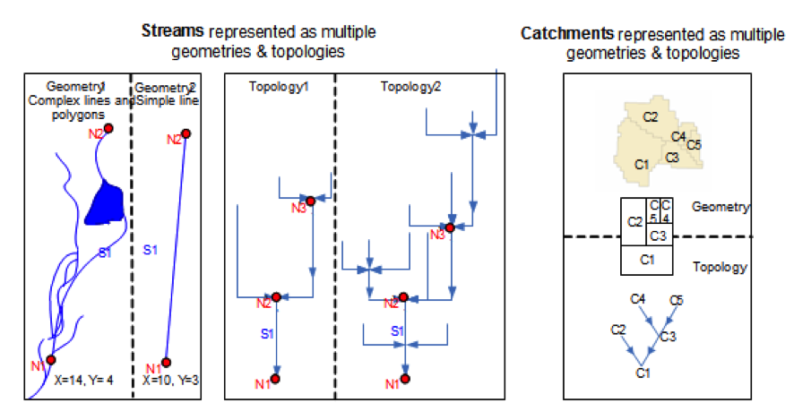

# OGC Hydrologic Features Part 1 Conceptual Model

## i. Abstract

The OGC HY\_Features implementation standard defines a standard information model for the identification of hydrologic features independent from geometric representation and scale. The conceptual model describes hydrologic features by defining the fundamental relationships among major components of the hydrosphere. This includes relationships such as the hierarchy of basins, the segmentation of watercourses, and the topological connectivity of hydrologic features.

The standard is based on the concept that a given hydrologic feature may have multiple representations. This supports referencing the same feature(s) in different information systems and assists the organization and cataloging of observations, model results, or other studies of a feature. The ability to represent the same watershed, river, or other hydrologic feature in several ways is critical to aggregation of cross-referenced features into integrated datasets and data products on global, regional, or basin scales.

The Hydrologic feature types are defined using the OGC General Feature Model (ISO19109:2006) with reference to definitions within the International Glossary for Hydrology.  The conceptual model is expressed in the Geographic Information Conceptual Schema Language (ISO19103:2005) using the Unified Modeling Language (UML).

## ii. Keywords

The following are keywords to be used by search engines and document catalogues.

ogcdoc, OGC document,  hydrology, feature, identification, conceptual model, ontology, implementation standard

## iii. Preface

This standard defines the HY\_Features common hydrologic feature model for the identification of hydrologic features. It is intended to be used to document and share information about the objects of study and reporting in Hydrology in many applications. This standard was specifically commissioned to link hydrologic information across the scientific and technical programs of the World Meteorological Organization (WMO), and to assist the WMO Members to discover, access and use hydrologic data from different sources.

This standard has been designed to support the need for governance and guidance by national and international authorities. Aspects of the standard that support this end are; 1) its canonical form, 2) its implementation neutrality, 3) conformity to internationally recognized standards of geographic information, and its use of semantics inferred from terminology endorsed by the WMO and the UN Educational, Scientific and Cultural Organization (UNESCO).

Attention is drawn to the possibility that some of the elements of this document may be the subject of patent rights. The Open Geospatial Consortium shall not be held responsible for identifying any or all such patent rights.

_Recipients of this document are requested to submit, with their comments, notification of any relevant patent claims or other intellectual property rights of which they may be aware that might be infringed by any implementation of the standard set forth in this document, and to provide supporting documentation._

## iv. Submitting organizations

The following organizations submitted this Document to the Open Geospatial Consortium (OGC):

a)Federal Institute of Hydrology (BfG), Global Runoff Data Centre of WMO
b)CSIRO, Land and Water
c)USGS

## v. Submitters

All questions regarding this submission should be directed to the editor or the submitters:

| Name | Affiliation |
| --- | --- |
| David Blodgett | USGS |
| Irina Dornblut | Federal Institute of Hydrology (BfG), Germany |
| Robert A. Atkinson | Metalinkage.com.au (2007-2014 with  CSIRO) |
| Bruce Simons | CSIRO |

## 1. Scope

This OGC Implementation Standard defines a common hydrologic feature model for the identification and description of hydrologic features using established models and patterns in use in the Hydrology domain and endorsed by WMO and UNESCO such as those documented in the "International Glossary of Hydrology".

Part 1 (this document) introduces the conceptual model itself. The normative model is a machine-readable UML artefact published by the OGC in conjunction with this document at: [insert URL here].

Part 2 (a future document) is expected to define an OWL and RDF representation of the conceptual model suitable for defining links between features that reference the HY\_Features model, to support documentation and discovery of data as well as data transformation. This work may provide a basis for further work in the wider OGC on a methodology (tooling) to publish ontologies to support their practical use.

The initial scope is defined by the  WMO Commission for Hydrology (WMH-CHy): to facilitate data sharing within the hydrologic community of the WMO Member countries and to improve the quality of data products based on these data by defining hydrologic features to convey the identification of water-objects through the data processing chain "from measurement to hydrological information" [8].

Though standardized transfer routines such as those developed in WaterML2 Part 1 Time Series and Part 2 Ratings and Gagings support the syntactic interoperability of systems and services, the current standard Web services do not sufficiently support a semantic-based retrieval of the data they offer. To enable semantic interoperability of hydrologic data and services, it is necessary to agree on common concepts and methods for machine interpretation of the concepts. To this goal, the HY\_Features model was developed in order to formalize the concepts and relationships of hydrologic features using the WMO/UNESCO "International Glossary of Hydrology" [3] as a starting point.

This standard is meant to support the linkage of data products distributed across differing applications and jurisdictions. To enable this, a holistic and highly general concept of a catchment is defined such that a particular catchment may be represented differently in a wide range of data products while retaining its identity. In addition to unique identification of features in multiple systems, a second objective is to provide a standard terminology and ontology to describe relationships between hydrologic features. This may be useful to building a data transfer formats for specific subsets, particularly catchment hierarchy and river network topology but such data transfer format development is not in scope for this standard.

The HY\_Features model provides a basis for common and stable references to hydrologic features in a wide variety of applications:

- to link hydrologic observations to their feature-of-interest, e.g. link a streamflow observation to the river or catchment being observed,
- to allow aggregation of cross-referenced features into integrated datasets and data products on global, regional, or basin scales,
- to enable information systems to unambiguously link data across distributed systems and domains,
- to enable cross-domain or multi-discipline services to communicate through reference to standard concepts.

This standard defines a set of Application Schemas (normative) containing feature type definitions that conform to the OGC General Feature Model (ISO19101:2002 and ISO19109:2006), expressed in the Geographic Information Conceptual Schema Language (ISO19103:2005) using the Unified Modeling Language (UML).

The GFM is a meta-model developed to serve as the general conceptual model for features and feature properties in the context of geographic information. A feature type is identified by a set of typical characteristics (property type) such as attributes, association, or operations as well as by possible constraints. Each attribute, association or operation is identified on its own by properties and constraints. Conformity to the GFM is assured by instantiating the general feature type as feature classes specific for the application domain.

The HY\_Features conceptual model is intended to realize the GFM by providing a domain-specific instance of the general GF\_FeatureType (aka FeatureType) «metaclass» capturing the Hydrology phenomenon. Since its concern is primarily the issue of feature identification, a basic type HY\_HydroFeature is defined to reflect the overall properties hydrologic features have such as identifier, name and context. Special feature types are defined to reflect different aspects of hydrology by the typical characteristics each specialization carries. Given the complexity of the domain for any defined hydrologic feature type a wide range of possible properties may be relevant.

The HY\_Features model allows the feature-of-interest concept of the O&M model (ISO19156:2011) to be realized for hydrologic observations. Depending on the application, the target of an observation may be aDomain Feature, like a water body, or a Sampling Feature, such as a stream gage, used as a proxy for a Domain Feature. Specifically, observation-centric data models such as the WaterML2.0 implementation profiles of O&M may use the concepts provided in this standard to identify domain-specific relationships between a sampling feature and the ultimate sampled feature.

In addition, the model concepts may be used to describe the relationships of observation results (any data) to the hydrologic feature of interest they are meant to represent and in this way to link numerous spatial as well as non-spatial hydrologic data exposed via Web services. For example, a discovery service such as a catalog of catchments could use the concepts defined here to provide machine interpretable pointers to services that provide differing geospatial representations of the same catchments as well as data from water quality and water quantity observations that characterize some aspects of the catchments.

Figure 1: HY_Features in the context of the OGC Abstract Specifications

## 2. Conformance

This standard defines the conceptual model for identification of hydrologic features and their fundamental relationships. The conceptual model may be used in two ways: a) to derive implementation classes for data exchange or b) via reference (referred to here as mapping) from terms used in an implementation to the equivalent terms in the HY\_Features model. The form of such a mapping is not specified in this standard, but in general there is correspondence expected between particular implementations of hydrologic features and realized HY\_Features concepts. There will be an exact correspondence or a correspondence to a specialization of a HY\_Features class with narrower scope. Since no technical semantic mapping standard is supported by the OGC standards baseline at this time, only the expressivity requirements of mappings are specified in relevant conformance clauses.

Requirements for OGC HY\_Features standardization target types are considered:

- Encodings (such as OWL and RDF) of the HY\_Features conceptual UML model described in this standard and
- Application schemas formally mapped to HY\_Features concepts including Feature Type classes and associative relationships.

For brevity, the terminology **implement** is used to indicate either a direct encoding or existence of a formalized mapping that would enable a client, at run-time, to determine that a particular implementation class implements a specific HY\_Features concept.

Parts 2 is intended to provide an OWL encoding of the HY\_Features application schema, whereby the mapping from the implementation to this specification will be formalized through use of encoding rules that allow direct correspondence of schema elements with the UML elements defined.

Conformance with this standard shall be checked using all the relevant tests specified in Annex A (normative) of this document. The framework, concepts, and methodology for testing, and the criteria to be achieved to claim conformance are specified in the OGC Compliance Testing Policies and Procedures and the OGC Compliance Testing web site1.

In order to conform to this OGC™

interface standard, a software implementation shall choose to implement:
a)Any one of the conformance levels specified in Annex A (normative).
b)Any one of the Distributed Computing Platform profiles specified in Annexes TBD through TBD (normative). (\*\*\*Need to revisit this!!!\*\*\*)

All requirements-classes and conformance-classes described in this document are owned by the standard(s) identified.

## 3. References

The following normative documents contain provisions that, through reference in this text, constitute provisions of this document. For dated references, subsequent amendments to, or revisions of, any of these publications do not apply. For undated references, the latest edition of the normative document referred to applies.

ISO 19101:2002, Geographic Information—Reference Model

ISO/TS 19103:2005, Geographic Information — Conceptual schema language

ISO 19107:2003, Geographic Information — Spatial schema

ISO 19108:2006, Geographic Information — Temporal schema

ISO 19109:2006, Geographic Information — Rules for application schemas

ISO 19115:2012, Geographic Information — Metadata – Fundamentals (Draft)

ISO 19156:2011, Geographic Information — Observations and Measurements

## 4. Terms and Definitions

This document uses the terms defined in Sub-clause 5.3 of [OGC 06-121r8], which is based on the ISO/IEC Directives, Part 2, Rules for the structure and drafting of International Standards. In particular, the word "shall" (not "must") is the verb form used to indicate a requirement to be strictly followed to conform to this standard.

For the purposes of this document, the following additional terms and definitions apply.

### 4.1 application schema

Conceptual schema for data required by one or more applications
[ISO 19101].

### 4.2 catchment

A physiographic unit where hydrologic processes take place.  This class denotes a physiographic unit, which is defined by a hydrologically determined outlet to which all waters flow. While a catchment exists, it may or may not be clearly identified for repeated study.

NOTE: This approach considers the catchment concept to be the basic unit of study in hydrology, water resources management, and environmental reporting. The approach is meant to be holistic, referring to the continuous interaction of surface and subsurface waters within a catchment, even if a particular representation of the catchment refers to only surface or subsurface aspects of the catchment. Special subtypes such as drainage basin and groundwater basin may be defined with a particular application.

The synonym use of the terms catchment and catchment area as documented in the WMO-UNESCO International Glossary of Hydrology [3] (which is the key reference for the definitions in the Hydrologic Feature (HY\_Features) model) does not clearly distinguish between the catchment concept and its geometric representations such as catchment area, nor between catchment and its possible specializations like drainage basin and groundwater basin.

The essential logic separation of concerns between a common concept and its representation (interpretable data) is dealt by defining separate features for the catchment and its representation and may be understood as a refinement of the complex, ambiguous definition given in the glossary. See also clause 5.4 of this standard on the use of WMO terminology.

### 4.3 data

documented value of some characteristics of a real-world phenomenon.

### 4.4 data set

data compiled and arranged into a set.

### 4.5 data product

dataset compiled for a specific purpose, e.g. for global dissemination using Web services.

### 4.6 domain feature

Feature of a type defined within a particular application domain.
[ISO19156].

### 4.7 feature

Abstraction of real-world phenomena.
[ISO19101]

### 4.8 hydrographic network

Aggregate of rivers and other permanent or temporary watercourses, and also lakes and reservoirs. [3]

NOTE: Not to be confused with the network of hydrological stations and  observing posts.

### 4.9 hydrography

Science dealing with the description and measurement of open bodies of water. [3]

NOTE: In this context, hydrography refers to the description of water bodies. Its measurement in terms of surveying, e.g. for navigational purposes, is not in the concern of the HY\_Features model.

### 4.10 hydrologic feature

Feature (abstraction of a real-world phenomenon) of a type defined in the hydrology domain. A feature whose identity needs to be maintained and tracked through a processing chain from measurement to distribution of hydrologic information.

### 4.11 hydrology

Science that deals with the waters above and below the land surfaces of the Earth, their occurrence, circulation and distribution, both in time and space, their biological, chemical and physical properties, their reaction with their environment, including their relation to living beings. [3]

### 4.12 hydrometric  feature

Feature (abstraction of a real-world phenomenon) of a type defined in the process of measurement and analysis of hydrology (hydrometry).

NOTE: The hydrometric feature refers to a physical structure intended to observe properties of a hydrologic feature. Used to sample a hydrologic feature, a hydrometric feature may be considered a sampling feature of observation. A sampling feature is described in general in ISO 19156, the special monitoring point of hydrologic observation is described in the _WaterML 2.0_ Specification [5].

### 4.13 hydrometry

Science of the measurement and analysis of water including methods, techniques and instrumentation used in hydrology. [3]

### 4.14 mapping

Establishing a semantic relationship between particular implementations of a common concept and the realized normative concept using a formalism that specifies how elements from a source model may be transformed to a target model.

### 4.15 multilingual keyword

Keyword used in a multilingual context.

NOTE: A keyword is generally described in ISO 19115.

### 4.16 named feature

Feature identified by a name.

NOTE: Hydrologic features and their real-world representations have names within common experience, but may have different names in their cultural, political and historical contexts.

### 4.17 representation

Any processible data, data set, or data product, which can be used in the place of an existing feature concept.

### 4.18** river positioning system

Linear system used to reference indirect positions along a watercourse.

### 4.19 sampling feature

An artifact of an observational strategy or system such as a sensor… intended to sample some feature of interest in an application domain.
[ISO 19156]

### 4.20 storage

Impounding of water in surface or underground reservoirs, for future use. [3]

NOTE: Storage refers to a water body in terms of a usable water resource. The management of the reservoir as human action with the objective to efficient and sustainable use the resource, is not in the scope of the conceptual model. Yet, often an indication is required whether a water body is used for storage.

### 4.21 water body

Mass of water distinct from other masses of water. [3]

NOTE: This refers to water bodies accumulating water on and below the land surface.

## 5. Conventions

This sections provides details and examples for any conventions used in the document. Examples of conventions are symbols, abbreviations, use of XML schema, or special notes regarding how to read the document.

### 5.1 Identifiers

The normative provisions in this specification are denoted by the URI

http://www.opengis.net/spec/{standard}/{m.n}

All requirements and conformance tests that appear in this document are denoted by partial URIs which are relative to this base.

### 5.2 Symbols (and abbreviated terms)

CHy  WMO Commission for Hydrology

GML  Geography Markup Language

GRDC  Global Runoff Data Centre

HDWG OGC Hydrology Domain Working Group

ISO  International Organization for Standardization

OGC  Open Geospatial Consortium

OWL  [Web Ontology Language](http://de.wikipedia.org/wiki/Web_Ontology_Language)

UML  Unified Modeling Language

WaterML 2 WaterML 2.0 – an observation model for hydrology

WIS  WMO Information System

WIGOS WMO Integrated Global Observing System

WMO  World Meteorological Organization

XML  eXtensible Markup Language

### 5.3 UML notation

Most diagrams that appear in this specification are presented using the Unified Modeling Language (UML) static structure diagram, as described in Subclause 5.2 of the OGC Web Services Common Implementation Specification (OGC 04-016r2). UML classes are named in UpperCamelCase and property names in lowerCamelCase.

### 5.4 WMO Terminology

The HY\_Featuresmodel uses as far as possible the terminology recommended for use in the WMO Member countries. The key reference is the "International Glossary of Hydrology" [3], a joint publication of the WMO and the UNESCO. Wherever appropriate, terms from this glossary are applied to the feature concepts to capture meaning and contextual relationships. Differences in terminology were explored through reconciling the definitions documented in the IGH with the aspects reflected in various data sets and products in use, augmenting the accepted definitions having explicit semantics with the relationships inferred from other terminology.

Some requirements classes defined in this standard refer to the Scoped Name concept of ISO19103. Intended to form a basis for information and data sharing in the community of the WMO member countries, the _Scoped Name_ should reflect a name endorsed by the WMO.

### 5.4 Naming convention

The _HY_-prefix used in the UML model follows the ISO naming conventions for UML elements. There is no explicit requirement to use this name in an implementation for the same semantic elements, but it is required to provide an explicit mapping between terminology used and HY\_Features to unambiguously indicate hydrologic feature concepts to support unambiguous interpretation in cross-domain applications. While there is not a recognized standard method for recording mappings between abstract element names and implementations; it is expected that system interoperability will be facilitated by making such mappings available as part of a dataset's documentation.

The _EXT_-prefix refers to "external", common patterns that are required, but not hydrology-specific, and should be imported when available from an external source.

## 6. Clauses not Containing Normative Material
  
### 6.1 The abstract hydrology phenomenon

Processes that continuously deplete and replenish water resources cause or result in a wide range of phenomena that are the subject of monitoring, modeling and reporting in hydrology and related sciences. These distinctly named or otherwise uniquely identified real-world hydrologic phenomena are conceptualized and referred to as hydrologic features in this standard. This standard applies to data and data products that represent these hydrologically defined features.
  
  
Figure 2: Processes of the Hydrologic Cycle

Water is moving from the atmosphere to the Earth and back to the atmosphere due to the processes forming the Water Cycle (_1_). Water from precipitation reaching the land surface is accumulated in water bodies occupying empty space on the land surface or in water bearing formations of soil and rock. Excess water overflows these formations and is driven downhill by gravity. Water flowing over soil or rock causes erosion to occur. This erosion tends to concentrate flowing water into water bodies that flow downhill using a connecting system of channels intersecting other water bodies along their way to a common outlet, conceptualized as a potentially complex outfall feature.

Looking back upstream from the outfall, the corresponding catchment feature can be described as a main linear flowpath feature, an areal feature, a boundary feature that encompasses the drained area, as well as a network of water body features, a network of channel features, or a network of hydrometric station features, all representing the catchment. The concepts and terminology used in the preceding sentences form the conceptual and semantic basis for this standard.

As described above, the most general abstraction of the hydrology phenomenon is the catchment. A catchment is a recognized unit of study where hydrologic processes form physiographic features that are represented in various data products. Depending on application and scale, the same catchment may be represented in many different ways. The following describe different examples where this multiple representation concept is important.

- Scaling a map-visualization up or down requires multiple more or less detailed representations of the same catchment.
- Some applications require cartographic (visual) representations while others are focused on topological (network connectivity) relationships (_2_).
- A catchment may be described geometrically by streamlines, drainage area or the bounding polygon, or topologically as a graph of nodes and links.
- Analyses and reports of catchments and landscape characteristics are referenced to areas of study or boundaries, while observation with sensors or other methods are referenced to monitoring points forming an hydrometric network.
  
  
Figure 3: Cartographic vs. topological representation

In inter-disciplinary programs, inter-program collaboration and cross-domain research projects, the catchment is addressed as the monitoring and reporting unit whereby monitoring stations are usually placed on a flowline in relation to identified reference points. Across administrative jurisdictions, the catchment is the agreed unit of water resources assessment and management. For example at a national scale "Hydrologic Unit Code" (HUC) catchments are defined by the US Geological Survey for the National Water Information System (NWIS) . [7] Another example are the so-called "River Basin Districts" of the European Water Framework Directive [6] designated not to administrative or political boundaries, but rather to the natural hydrologic unit.

### 6.2 Catchment and catchment representation
The core concept of HY_Features model is that a study of the Hydrology phenomenon will reflect common concepts of the real world by specific modeled features (as per ISO 19109 General Feature Model). Depending on the scientific concern, the relevant hydrologic feature may represent different aspects of the Hydrology phenomenon. 
Recognized as the unit of study across hydrologic disciplines, a catchment may be represented in various sub-domain models, including by a simple tree network of blue lines, or the network of catchments. Catchment boundary (watershed), catchment area, a linear flowpath, the hydrographic or channel network and also the  hydrometric network of stations are alternative views representing the same catchment, whereby each data product represents exactly one catchment. Figure 5 shows different types of geospatial data overlaying the represented Missouri region.

Figure 5: Multiple representation of the Missouri catchment (Source: USGS and GRDC)  

a) Catchment boundary (watershed),  
b) Catchment area,  
c) Hydrologic unit containing sub-units,  
d) Abstract flowline and common outlet,  
e) Network of flow lines at different level of detail,  
f) Network of monitoring stations  

### 6.3 Catchment hierarchy and network topology
Following the holistic approach of today’s environmental reporting it may be concluded that a hydrologic determination exists for the catchment to which the reporting refers. However, in the reporting practice this hydrologic determination often is not clearly expressed. Rather an approach is applied that understands a catchment as the jurisdictional framework to bring together hydrologic information represented in geospatial data products related to regions nested or aggregated in the containing catchment. The HY_Features conceptual model follows this approach by defining the Catchment as the unit where hydrologic processes take place such as flow accumulation governed by physical laws, but whose hydrologic determination is not explicitly  identified (Figure 6).  The specific, hydrologically determined catchment where runoff  is accumulated and directed to a common outlet, is denoted as a Basin identified by its common outlet (Figure 7). This definition refers to the definitions of basin,  drainage basin and groundwater basin given in the WMO-UNESCO International Glossary of Hydrology, describing the drained physiographic units whose waters are flowing to a common outlet.  

Figure 6: Catchment area representing the unit where hydrologic processes take place  

Figure 7:  Flowpath representing the hydrologically determined basin  

A Catchment may be nested or aggregated in a containing high-order catchment to support a simple downstream hierarchy of catchments (Figure 8, Figure 9). To reflect the commonly applied organization of basins in upstream hierarchies, the Basin is defined as an aggregate of sub-basins of which each may be associated with an immediate upstream basin. The basin aggregate refers to the co-existence of sub-basins identified by the common outlet having the inflow identified, or not. This allows for basin division into tributary basins and interbasins (with identified inflow). Defined as a special type of catchment, the basin inherits the nesting  defined for the catchment. (Figure 10).  

Figure 8: Catchment hierarchy – catchment nesting  

Figure 9: Catchment hierarchy – catchment aggregation  

Figure 10: Basin hierarchy – basin, basin aggregate and nesting catchment  

Understanding the Basin topologically as the link between inflow and outflow nodes, and presuming that basins are delineated using a simple tree structure, an upstream-downstream relation between outflow nodes can be built to describe a network of basins without knowing the complex hydrology between inflow and outflow nodes, whereby the outflow node of a basin coincides with the inflow node of a receiving downstream basin; the upstream basin may be described as the basin contributing to the inflow node of the relevant basin. (Figure 11)  

Figure 11: Upstream-downstream relation between basin  

Inflow and outflow nodes topologically located in the network of basins may get assigned a position using a reference point located in the basin network. Considering each identified  location on, or projected onto the land surface, as the common outlet of a corresponding basin, objects can be placed “on the river” using the relationship between outflow nodes (Figure 12).  

Figure 12: Position of  objects “on river” using the relationship between outflow nodes  

### 6.4 Aggregation and segmentation of watercourses
Water bodies are aggregated into the hydrographic network of rivers and other permanent or temporary watercourses, and also lakes and reservoirs. Each water body may be segmented into reaches confined by vertical sections. Due to differences in thermal or salinity characteristics, by oxygen or nutrient content, a water body may be stratified into distinct horizontal layers.
Water bodies may be aggregated into a hydrographic network using a connecting system of channels expressed in flow or drainage patterns.  This system of channels exists independently of whether water flows therein or not. It does not define whether a water body interacts with water bodies upstream and downstream. For example, normally stagnant waters may or may not be connected to streams during flood events, or streams may be interrupted to pools of stagnant water in periods of drought or not. Likewise, an aquifer system determines the potential connection between bodies of groundwater, but not causes the interaction.  

Water may be stored and managed in surface or underground reservoirs in terms of a resource for future use, regulation or control. Conceptually, each water body accumulating water, or the layers therein, may be managed as a reservoir. Referring to a zone-based reservoir management storage reservoirs are also understood as stratified water bodies.  
Water bodies are observed using monitoring stations and observing posts. Almost all stations are physical artifacts, or collections of these. Yet, some stations may be fictive ones. Monitoring stations may be connected logically in hydrometric networks which represent a distinct basin that is the subject of monitoring or reporting at local or regional scale. It is common practice to locate a monitoring station in relation to local landmarks and permanent reference points, or in relation to the extent of the monitored water body.

### 6.5 The Atmospheric Hydro Feature application schema (informative)
The Atmospheric Hydro Feature application schema provides a model to take into account water from atmospheric origin, particularly from precipitation, without the complexity the complexity and detail of a rainfall-runoff model  This enables contextually related information models to build relationships to hydrologic features, finally to a represented catchment. 
This informative package provides concepts of water falling through the atmosphere (precipitation) to be accumulated in a water body on or below the land surface. This allows atmospheric water to be related to the hydrographic network of water bodies representing an overall catchment, as well as to a corresponding basin identified by an inflow or outflow node using a reference point associated with the accumulating water body. Special concepts of water suspended in the atmosphere may by defined with an application. Special concepts should not contradict the definitions endorsed by the WMO as published in the  "International Meteorological Vocabulary".published and maintained by the WMO [9]. 
The Atmospheric Hydro Feature schema introduces the concepts of  HydroMeteor Precipitation, Rain and Snow.  
 
Figure 12: Atmospheric Hydro Feature schema  

The HY_Hydrometeor class conceptualize a meteor “consisting of an ensemble of liquid or solid water particles falling through or suspended in the atmosphere, blown by the wind from the Earth's surface or deposited on objects on the ground or in the free air” [9]. 
The HY_Precipitation class specializes HY_HydroMeteor. It refers to falling water and does not mean the amount of  precipitation measured by means of rain-gauge, which is understood as a property of a rain feature. HY_Precipitation is not explicitly defined as a special subtype of the general HydroFeature type to allow other contextual generalizations. HY_Precipitation carries two associations: rain and snow.  

The HY_Rain and HY_Snow classes define special types of liquid or solid water intended to separately reflect ice or water particles falling from a cloud.  

### 6.6 The Subsurface Hydro Feature application schema (informative)
The informative Subsurface Hydro Feature application package introduces concepts reflecting water accumulated below the land surface as well as the formation of rock or soil containing the body of water. This concept refers to the holistic approach of the basin as the unit wherein all water, surface and subsurface water, is directed to an identified common outlet. It allows subsurface water to be related to the hydrographic network of water bodies, as well as to a corresponding basin identified by an inflow or outflow node using a reference point associated with the confining unit. Special concepts of subsurface water, its confines and special relationships may be defined with an application. Special concepts should not contradict the definitions endorsed by the WMO as published in the  "International Glossary of Hydrology". A conceptual model capturing the specifics of features associated with the groundwater domain will be provided with the GroundwaterML 2.0 under development.  
 
Figure 13: Subsurface Hydro Feature schema  

#### 6.6.1 The Subsurface Water model 
The Subsurface Water model  introduces a simple model of water accumulated in rock or soil below the land surface,  either specialized by pressure head or the property to move due to gravity and capillary action.  This allows to handle concepts of subsurface waters separately from those of  the confining aquifer. An application focused on a special type of subsurface water may use the concepts when describing the relationship of groundwater or water in soil to a basin in terms of the ultimate target of observation. Depending on the  particular application, special types may be defined and described by suitable properties.  

The HY_Groundwater class specializes HY_Water_LiquidPhase with respect to the existence of water occupying the saturated zone. It inherits the accumulatingWaterBody association, which allows to relate subsurface water to the hydrographic network of water bodies.  

The HY_VadoseWater class specializes HY_Water_LiquidPhase with respect to the existence of water occupying the unsaturated zone. It inherits the accumulatingWaterBody association, which allows to relate subsurface water to the hydrographic network of water bodies. HY_SoilWater, HY_SoilMoisture and HY_GravitationalWater specialize vadose water.  

#### 6.6.2 The Subsurface Water Confines model
The Subsurface Water confines model  introduces concepts of  the hydrogeologic units, particularly an aquifer, containing subsurface water, incl. the well used to extract, inject or infiltrate water from/into these. Depending on the  particular application, special types of containing units may be defined and described by suitable properties.  

The HY_HydroGeologicUnit class provides a simple means for taking into account the hydrologically significant characteristics of formations of rock or soil, allowing further contextual specializations of hydro-geologic features. HY_HydroGeologicUnit  carries one association: containingUnit.  

The HY_Aquifer class defines the existence of the containing unit wherein groundwater may be accumulated, understood as groundwater reservoir. The segmentation of aquifer is not in the scope of the HY_Features conceptual model. HY_Aquifer  carries one association: well.  

The HY_Well class provides the concept of a well that may be used for discharge as well as recharge of water. The geometric representation of the well may vary with an application and needs to be defined with implementation. HY_Well  carries one association: wellLocation, which allows to locate the well in the network of basins.  
